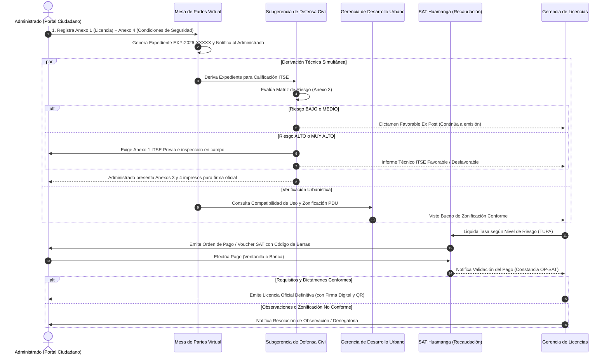

# 🏛️ Sistema de Gestión Documentaria del Trámite de Licencia de Funcionamiento
### Municipalidad Provincial de Huamanga (MuniHuamanga)
> **Propuesta de Arquitectura de Software para la Digitalización Integral del Trámite de Licencia de Funcionamiento, con Generación Automática de Formatos Oficiales en PDF (Anexos 1, 3 y 4), Wizard Ciudadano Multipaso, Firma Digital y Verificación de Licencias mediante Código QR, Desarrollada en Java 21 y PostgreSQL 15, Modelada con C4 hasta el Nivel de Componentes.**


---

## 📋 1. Resumen de la Solución

El presente proyecto implementa la arquitectura de software empresarial para digitalizar y dar trazabilidad al trámite de **Licencia de Funcionamiento** en el ámbito municipal peruano, anclado al marco normativo de la **Ley N° 28976** y su **TUO aprobado por D.S. N° 046-2017-PCM**.

### 🎯 Estado de Fases de Desarrollo

| Fase | Estado | Descripción |
|------|--------|-------------|
| **Fase 01** | ✅ Completada | Digitalización de la base de datos (45 atributos normativos), capa de dominio, máquina de estados, APIs REST y auditoría inmutable |
| **Fase 02** | ✅ Completada | Motor de generación de formatos oficiales en PDF: Anexo 1 (2 pág.), Anexo 3 Matriz ITSE (2 pág.), Anexo 4 Condiciones de Seguridad (4 pág.) |
| **Fase 03** | ✅ Completada | Frontend Wizard Multipaso (Portal Ciudadano 3 pasos), descarga inmediata de PDFs, Dashboard Interno con KPI cards y columna de Formatos PDF |
| **Fase 04** | ✅ Completada | PDF Licencia Oficial (Sprint 4-A), Notificaciones Electrónicas Email Async (Sprint 4-B), Autenticación JWT + Spring Security 6 RBAC (Sprint 4-C) y Tarifario TUPA Dinámico (Sprint 4-D) |
| **Fase 05** | ⏳ Planificada | Pruebas de integración, adaptadores externos y validación de carga (≥150 usuarios concurrentes) |

---

## 🏗️ 2. Estructura de Módulos del Repositorio

El proyecto está estructurado bajo el estilo arquitectónico de **Monolito Modular (Modular Monolith)** con un enfoque interno de **Clean Architecture (Arquitectura Limpia y Hexagonal / Ports & Adapters)**, organizado como un proyecto multi-módulo Maven (`muni-licencias-parent`):

```text
MuniHuamanga/
├── pom.xml                                  # POM Padre Multi-Módulo Maven (Java 21 / SB 3.3.4, OpenPDF, JJWT, ZXing)
├── docker-compose.yml                       # Orquestación de PostgreSQL 15 y pgAdmin 4
├── .gitignore                               # Exclusiones optimizadas para Java, Maven e IDEs
│
├── common-domain/                           # Contratos compartidos y DTOs del dominio
│   └── src/main/java/.../common/
│       ├── enums/
│       │   ├── EstadoExpediente.java       # FORMATOS_GENERADOS → DOCUMENTOS_VALIDADOS → EN_EVALUACION_FINAL → APROBADO/RECHAZADO
│       │   ├── NivelRiesgo.java           # BAJO, MEDIO, ALTO, MUY_ALTO (Matriz CENEPRED)
│       │   ├── RolUsuario.java            # ROLE_ADMIN, ROLE_EVALUADOR, ROLE_CAJERO (RBAC institucional)
│       │   ├── TipoPersona.java           # NATURAL, JURIDICA
│       │   ├── TipoDocumento.java         # DNI, RUC, CARNET_EXTRANJERIA
│       │   ├── ModalidadTramite.java      # Sección I Anexo 1 (Indeterminada, Temporal, Anuncio, etc.)
│       │   └── FuncionEdificacion.java    # Anexos 3 y 4 ITSE (Salud, Encuentro, Comercio, etc.)
│       ├── dto/                            # 14 DTOs de contrato del dominio
│       │   ├── CrearExpedienteDto.java    # Solicitud Mesa de Partes (45 campos normativos, Anexo 1 + SUNARP + Dirección)
│       │   ├── ExpedienteResponseDto.java # Payload integral (estado, plazos, tasas, desglose, licenciaQrCode)
│       │   ├── Anexo4CondicionesDto.java  # Checklist de seguridad en edificación (23 campos booleanos)
│       │   ├── ClasificacionRiesgoDto.java# Calificación ITSE (Nivel + N° Informe Técnico + Observaciones)
│       │   ├── RegistroPagoDto.java       # Validación SAT (Voucher + N° Operación Bancaria + Monto)
│       │   ├── VoucherDto.java            # Orden de pago SAT con código Code 128
│       │   ├── VerificacionLicenciaDto.java# Consulta pública ciudadana vía QR (RNF-20)
│       │   ├── ResolucionExpedienteDto.java# Dictamen final o motivo de rechazo
│       │   ├── HistorialEstadoDto.java    # Línea de tiempo de auditoría inmutable
│       │   ├── LoginRequestDto.java       # Credenciales para autenticación JWT de funcionarios
│       │   ├── LoginResponseDto.java      # Token Bearer JWT, roles, usuario y tiempo de expiración
│       │   ├── UsuarioDto.java            # Perfil público y rol del funcionario autenticado
│       │   ├── TarifaTupaDto.java         # Catálogo oficial de tasas municipales vigentes
│       │   └── ActualizarTarifaDto.java   # DTO validado para actualización en caliente de montos TUPA
│       └── exception/
│           ├── TransicionInvalidaException.java
│           └── RecursoNoEncontradoException.java
│
├── servicio-expedientes/                    # Aplicación Principal: Monolito Modular con Clean Architecture (Puerto 8081)
│   ├── src/main/java/.../expedientes/
│   │   ├── ExpedientesApplication.java      # Punto de entrada autónomo Spring Boot
│   │   ├── config/
│   │   │   ├── AsyncConfig.java             # Pool de hilos @Async para notificaciones email
│   │   │   ├── SecurityConfig.java          # Spring Security 6: filtros JWT y reglas RBAC
│   │   │   ├── DataInitializer.java          # Datos semilla de prueba (expedientes con 45 atributos)
│   │   │   └── UsuarioDataInitializer.java   # Usuarios semilla institucionales (BCrypt: admin, evaluador, cajero)
│   │   │
│   │   ├── controller/                      # Capa Web / Adaptadores de Entrega REST
│   │   │   ├── AuthController.java          # Autenticación JWT (/api/auth/login, /api/auth/me)
│   │   │   ├── ExpedienteController.java    # Ciclo de vida y gestión integral del expediente
│   │   │   ├── PublicLicenciasController.java # Endpoint público de verificación QR (RNF-20)
│   │   │   ├── TarifaTupaController.java    # CRUD y actualización en caliente del tarifario TUPA
│   │   │   ├── DocumentosFormulariosController.java # Generación y descarga directa de formatos oficiales en PDF
│   │   │   └── GlobalExceptionHandler.java  # Manejo global de errores HTTP (RFC-7807)
│   │   │
│   │   ├── integracion/                     # Bounded Context: Puertos y Adaptadores Externos (Clean Architecture)
│   │   │   ├── port/                        # Puertos de salida (Interfaces del dominio)
│   │   │   │   ├── DefensaCivilPort.java    # Puerto de integración con Defensa Civil (ITSE D.S. 002-2018-PCM)
│   │   │   │   ├── EdificacionesPort.java   # Puerto de compatibilidad de zonificación PDU
│   │   │   │   ├── FiscalizacionPort.java   # Puerto de actas de control y fiscalización posterior
│   │   │   │   └── SatPort.java             # Puerto de recaudación y conciliación de vouchers SAT
│   │   │   ├── adapter/                     # Adaptadores de infraestructura
│   │   │   │   ├── DefensaCivilAdapterService.java
│   │   │   │   ├── EdificacionesAdapterService.java
│   │   │   │   ├── FiscalizacionAdapterService.java
│   │   │   │   └── SatAdapterService.java
│   │   │   └── controller/
│   │   │       └── AdaptadorController.java # Endpoints de simulación e interoperabilidad (/api/integraciones)
│   │   │
│   │   ├── service/                         # Capa de Aplicación / Casos de Uso
│   │   │   ├── ExpedienteService.java       # Máquina de estados (5 estados), lógica y persistencia
│   │   │   ├── CalculadoraDeTasa.java       # Motor de cálculo dinámico con desglose y fallback a YAML
│   │   │   ├── TarifaTupaService.java       # Gestión transaccional de tasas municipales TUPA
│   │   │   ├── AuditoriaService.java        # Log inmutable de transiciones con sellado de tiempo
│   │   │   ├── MetricasExpedienteService.java # Micrometer/Actuator: SLAs, alertas de vencimiento
│   │   │   ├── NotificacionEmailService.java # Envío asíncrono de correos con plantillas Thymeleaf y PDF adjunto
│   │   │   ├── AuthService.java             # Lógica de login con BCrypt y emisión JWT
│   │   │   ├── DocumentoPdfService.java     # Coordinador de renderizado PDF en memoria (OpenPDF 2.0.3)
│   │   │   ├── LicenciaPdfGenerator.java    # Certificado oficial de Licencia (doble marco, escudo, QR ZXing, 6 notas)
│   │   │   ├── Anexo1PdfGenerator.java      # Generador Anexo 1 (2 páginas, Ley 28976)
│   │   │   ├── Anexo3PdfGenerator.java      # Generador Matriz ITSE (2 páginas, CENEPRED)
│   │   │   └── Anexo4PdfGenerator.java      # Generador Condiciones de Seguridad (4 páginas)
│   │   │
│   │   ├── security/                        # Capa de seguridad JWT sin estado (Stateless)
│   │   │   ├── JwtTokenProvider.java        # Firma HMAC-SHA256, generación y validación de tokens JJWT
│   │   │   ├── JwtAuthenticationFilter.java # Filtro OncePerRequest para interceptar Bearer token
│   │   │   ├── JwtAuthenticationEntryPoint.java # Manejo de error 401 Unauthorized en JSON
│   │   │   ├── JwtAccessDeniedHandler.java  # Manejo de error 403 Forbidden en JSON
│   │   │   ├── CustomUserDetails.java       # Wrapper UserDetails de Spring Security
│   │   │   └── CustomUserDetailsService.java # Carga de usuario desde base de datos
│   │   │
│   │   ├── validator/                       # Validadores de Reglas de Negocio
│   │   │   ├── EstadoExpedienteValidator.java # Precondiciones legales de aprobación
│   │   │   └── MesaPartesValidator.java      # Validación estricta de solicitud y requisitos TUPA
│   │   ├── mapper/ExpedienteMapper.java      # MapStruct: cómputo 15 días hábiles + Anexo 4
│   │   ├── model/                           # Entidades del Dominio (JPA)
│   │   │   ├── Expediente.java               # Entidad central con 45 atributos normativos
│   │   │   ├── Anexo4Condiciones.java        # Objeto embebido JPA (@Embeddable) 23 campos
│   │   │   ├── HistorialEstado.java          # Auditoría inmutable @Entity
│   │   │   ├── Usuario.java                  # Entidad JPA de usuarios con roles RBAC y BCrypt
│   │   │   └── TarifaTupa.java               # Entidad JPA de tarifario municipal con constraints
│   │   └── repository/                      # Adaptadores de Persistencia (Spring Data JPA)
│   │       ├── ExpedienteRepository.java
│   │       ├── HistorialRepository.java
│   │       ├── UsuarioRepository.java
│   │       └── TarifaTupaRepository.java
│   │
│   ├── src/main/resources/
│   │   ├── application.yml                   # Configuración Spring, JPA, Mail, JWT, Actuator
│   │   ├── application-local.yml             # Perfil local con PostgreSQL 15
│   │   ├── templates/email/                  # Plantillas Thymeleaf para notificaciones asíncronas
│   │   │   ├── email-registro.html           # Notificación de registro con N° Expediente
│   │   │   ├── email-aprobacion.html         # Notificación de aprobación con Licencia PDF adjunta
│   │   │   └── email-rechazo.html            # Notificación motivada de denegatoria
│   │   └── static/                          # Frontend Institucional Completo
│   │       ├── index.html                    # Landing page con tarjetas de acceso institucional
│   │       ├── portal-ciudadano.html         # Wizard Ciudadano Multipaso: 3 pasos + Descarga PDFs + Mesa de Ayuda
│   │       ├── portal-interno.html           # Dashboard KPI + Bandeja Formatos PDF + Login Modal + CRUD TUPA
│   │       ├── verificar-licencia.html       # Portal Público de Verificación QR (RNF-20)
│   │       ├── css/styles.css                # Sistema de diseño integral (wizard, kpi-cards, modales, alertas)
│   │       ├── js/
│   │       │   ├── portal-ciudadano.js       # Wizard logic: navegación, validaciones, fetch directo al monolito y Mesa de Ayuda
│   │       │   ├── portal-interno.js         # Sesión JWT, renderFormatosPdf(), modales y gestión TUPA
│   │       │   └── verificar-licencia.js     # Consulta QR pública en tiempo real
│   │       └── img/escudo-huamanga.png       # Escudo oficial de Huamanga
│   └── src/test/                            # 80 tests pasando al 100% (Unitarios, Integración, Clean Architecture, Concurrencia 150)
│
├── docker/
│   └── postgres/init/01-init-databases.sql # DDL: 45 columnas, índices, tablas usuarios y tarifas
│
├── tests/                                   # Pruebas de Carga y Rendimiento
│   └── load-test/
│       ├── k6-load-test.js                  # Suite k6 para simulación de ≥150 usuarios concurrentes
│       └── run-load-test-150.ps1            # Script de automatización PowerShell
│
└── docs/                                    # Documentación Técnica Oficial
    ├── arquitectura/
    │   ├── diseno-arquitectonico-monolito-modular-clean-architecture.md # Documento Maestro de Diseño
    │   └── c4-model.md                      # Modelo C4 (Contexto, Contenedores, Componentes, Dominio)
    ├── auditoria-codigo-calidad-resolucion-101-problemas.md # Auditoría de Calidad y 0 Errores
    ├── entrega-fase-01.md                   # Entrega Fase 01: Dominio, BD y APIs
    ├── entrega-fase-02.md                   # Entrega Fase 02: Motor PDF (Anexos 1, 3, 4)
    ├── entrega-fase-03.md                   # Entrega Fase 03: Frontend Wizard + Descarga PDFs
    ├── entrega-fase-04-consolidado.md       # Entrega Fase 04 Completa: Consolidado (80/80 tests)
    ├── normativa-legal.md                   # Marco Legal: Ley 28976, Anexos 1, 3 y 4 ITSE
    ├── v0.1-inventario-matriz-campos.md     # Matriz de trazabilidad campo por campo (45 atributos)
    └── scrum/                               # Product Backlogs e Historias de Usuario (Sprints 0 a 4)
```

---

## ⚙️ 3. Requisitos del Entorno

| Herramienta | Versión | Notas |
|-------------|---------|-------|
| **JDK** | 21 LTS | Eclipse Adoptium Temurin recomendado |
| **Apache Maven** | 3.9+ | Multi-módulo POM |
| **Docker Desktop** | Cualquiera con Compose v2 | Para PostgreSQL 15 |
| **Git** | 2.x+ | Control de versiones |

---

## 🚀 4. Guía Rápida de Inicio

### Paso 1: Iniciar la Base de Datos PostgreSQL
```bash
docker-compose up -d postgres
```
> **Credenciales:**
> - Host: `localhost:5432` | BD: `muni_licencias_db` | User: `muni_user` | Pass: `muni_pass123`
> - pgAdmin: http://localhost:5050 (`admin@munihuamanga.gob.pe` / `admin`)

### Paso 2: Compilar y Ejecutar Pruebas (80 tests)
```powershell
mvn clean test
# Salida esperada: BUILD SUCCESS — Tests run: 80, Failures: 0, Errors: 0
```

### Paso 3: Ejecutar el Monolito Modular
A diferencia del esquema inicial de múltiples microservicios dispersos, toda la solución se ejecuta en un **único proceso de alta eficiencia**:
```powershell
mvn spring-boot:run -pl servicio-expedientes
```
> El servicio se inicia en el puerto **`8081`**, exponiendo tanto el backend REST, el motor documental PDF, los puertos de integración y todos los portales web frontales.

### Paso 4: Acceso a los Portales Web
| Portal | URL | Descripción |
|--------|-----|-------------|
| **Landing Page** | http://localhost:8081/ | Página principal con accesos institucionales |
| **Portal Ciudadano (Wizard)** | http://localhost:8081/portal-ciudadano.html | Mesa de Partes Virtual (3 pasos) + Descarga de Anexos + Mesa de Ayuda |
| **Gestión Interna (Dashboard + RBAC)** | http://localhost:8081/portal-interno.html | Bandeja de expedientes, evaluación, emisión y tarifario TUPA |
| **Verificación QR Pública** | http://localhost:8081/verificar-licencia.html | Consulta pública ciudadana y fiscalización en tiempo real (RNF-20) |

---

## 📖 5. Documentación Interactiva de APIs (Swagger / OpenAPI)

El sistema expone la totalidad de sus contratos y servicios centralizados en una única interfaz OpenAPI 3.0:

| Servicio | URL Swagger |
|----------|-------------|
| **Monolito Modular Unificado** | http://localhost:8081/swagger-ui.html |

---

## 🔌 6. Catálogo Completo de Endpoints REST

### 6.1 Servicio de Expedientes (`servicio-expedientes` :8081)

| Método | Endpoint | Descripción | Acceso / Rol |
|--------|----------|-------------|--------------|
| `POST` | `/api/auth/login` | Autenticación de personal municipal y emisión JWT | Público |
| `POST` | `/api/expedientes` | Mesa de Partes Virtual: Registrar nueva solicitud | Público |
| `GET` | `/api/expedientes` | Listar expedientes (filtros: `?estado=&conAlerta=true`) | `ROLE_EVALUADOR`, `ROLE_ADMIN` |
| `GET` | `/api/expedientes/{id}` | Consultar expediente por UUID | `ROLE_EVALUADOR`, `ROLE_ADMIN` |
| `GET` | `/api/expedientes/tramite/{numero}` | Seguimiento ciudadano por N° trámite (EXP-2026-XXXXX) | Público |
| `GET` | `/api/expedientes/{id}/historial` | Historial cronológico de estados (auditoría) | Autenticado |
| `GET` | `/api/expedientes/{id}/desglose-tasa` | Desglose de conceptos tributarios TUPA | Público |
| `GET` | `/api/tupa/tarifas` | Listar tarifario TUPA oficial con tasas vigentes | Público / Autenticado |
| `PUT` | `/api/tupa/tarifas/{id}` | Actualización en caliente de tasa municipal TUPA | `ROLE_ADMIN` |
| `GET` | `/api/expedientes/{id}/documentos/declaracion-jurada` | 📄 PDF Anexo 1 — Declaración Jurada | Público / Autenticado |
| `GET` | `/api/expedientes/{id}/documentos/anexo1-declaracion-jurada` | 📄 PDF Anexo 1 (alternativo) | Público / Autenticado |
| `GET` | `/api/expedientes/{id}/documentos/anexo3-matriz-riesgo-itse` | 🛡️ PDF Anexo 3 — Matriz ITSE | Público / Autenticado |
| `GET` | `/api/expedientes/{id}/documentos/anexo4-condiciones-seguridad` | 🔒 PDF Anexo 4 — Condiciones Seguridad | Público / Autenticado |
| `GET` | `/api/expedientes/{id}/documentos/voucher-sat` | 🧾 PDF Voucher SAT con Code 128 | Público / Autenticado |
| `GET` | `/api/expedientes/{id}/documentos/licencia` | 📜 PDF Licencia Oficial con QR y Sello Digital | Público / Autenticado |
| `GET` | `/api/expedientes/{id}/qr` | 🔲 Imagen PNG del código QR de la licencia | Público |
| `POST` | `/api/expedientes/{id}/clasificacion-riesgo` | Defensa Civil: Registrar dictamen ITSE | `ROLE_EVALUADOR`, `ROLE_ADMIN` |
| `POST` | `/api/expedientes/{id}/voucher` | SAT: Generar orden de pago | `ROLE_CAJERO`, `ROLE_ADMIN` |
| `POST` | `/api/expedientes/{id}/pago` | SAT: Registrar constancia de pago | `ROLE_CAJERO`, `ROLE_ADMIN` |
| `POST` | `/api/expedientes/{id}/aprobar` | Gerencia Licencias: Dictamen favorable + emisión QR | `ROLE_EVALUADOR`, `ROLE_ADMIN` |
| `POST` | `/api/expedientes/{id}/rechazar` | Gerencia Licencias: Dictamen de rechazo | `ROLE_EVALUADOR`, `ROLE_ADMIN` |
| `GET` | `/api/licencias/verificar/{codigo}` | Portal público de verificación de autenticidad | Público |

### 6.2 Endpoints de Formularios y Documentos Oficiales (`/api/formularios/**`)

| Método | Endpoint | Descripción | Acceso |
|--------|----------|-------------|--------|
| `POST` | `/api/formularios/anexo1-declaracion-jurada` | Generar PDF oficial Anexo 1 (2 páginas, Ley N° 28976) | Público |
| `POST` | `/api/formularios/declaracion-jurada` | Generar PDF Anexo 1 desde DTO alternativo | Público |
| `POST` | `/api/formularios/anexo3-matriz-riesgo-itse` | Generar PDF oficial Anexo 3 (2 páginas, Matriz ITSE CENEPRED) | Público |
| `GET`  | `/api/formularios/anexo-3/{id}/pdf` | Descargar PDF oficial Anexo 3 por ID de expediente | Público |
| `POST` | `/api/formularios/anexo4-condiciones-seguridad` | Generar PDF oficial Anexo 4 (4 páginas, Condiciones de Seguridad) | Público |
| `GET`  | `/api/formularios/anexo-4/{id}/pdf` | Descargar PDF oficial Anexo 4 por ID de expediente | Público |
| `POST` | `/api/formularios/defensa-civil` | Generar PDF de Solicitud ITSE (D.S. N° 002-2018-PCM) | Público |
| `POST` | `/api/formularios/voucher-sat` | Generar PDF Voucher SAT con código de barras Code 128 | Público |
| `POST` | `/api/formularios/licencia` | Generar PDF Licencia Oficial con QR y Sello Digital | Público |

### 6.3 Puertos y Adaptadores de Integración Externa (`/api/integraciones/**`)

| Método | Endpoint | Descripción | Entidad Receptora |
|--------|----------|-------------|-------------------|
| `GET`  | `/api/integraciones/sat/validar-pago/{voucherId}` | Consulta y conciliación bancaria de tasa | SAT Huamanga (`SatPort`) |
| `POST` | `/api/integraciones/defensa-civil/simular-dictamen` | Simulación de dictamen técnico de inspección ITSE | Defensa Civil (`DefensaCivilPort`) |
| `GET`  | `/api/integraciones/edificaciones/zonificacion` | Validación de compatibilidad de uso y PDU | Desarrollo Urbano (`EdificacionesPort`) |
| `POST` | `/api/integraciones/fiscalizacion/acta` | Registro de acta de inspección posterior in situ | Fiscalización (`FiscalizacionPort`) |

---

## 🔄 7. Flujo del Sistema y Máquina de Estados

### A. Estructura de Anexos Digitalizados y Tramitación Física

```text
┌────────────────────────────────────────────────────────────────────────────────────────┐
│                                 EXPEDIENTE DE LICENCIA                                 │
└───────────────────────────────────────────┬────────────────────────────────────────────┘
                                            │
         ┌──────────────────────────────────┴──────────────────────────────────┐
         ▼                                                                     ▼
┌──────────────────────────────────────┐             ┌───────────────────────────────────┐
│     ANEXO N° 1 (Ley N° 28976)        │             │      ANEXO 4 (D.S. 002-2018)      │
│ Declaración Jurada para Licencia     │             │ DJ de Condiciones de Seguridad    │
│ de Funcionamiento (Versión 03)       │             │ (Exclusivo para Riesgo Bajo/Medio)│
└──────────────────┬───────────────────┘             └─────────────────┬─────────────────┘
                   │                                                   │
                   ▼                                                   ▼
┌──────────────────────────────────────┐             ┌───────────────────────────────────┐
│       ANEXO 3 (Defensa Civil)        │             │     ANEXO 1 ITSE / ECSE (PCM)     │
│ Reporte de Nivel de Riesgo del       │             │ Solicitud de Inspección Técnica   │
│ Establecimiento (Matriz de Riesgos)  │             │ (ITSE Previa / Posterior / ECSE)  │
└──────────────────────────────────────┘             └───────────────────────────────────┘
```

> **📌 Regla de Negocio Crítica — Tramitación de Anexos 3 y 4:**
> 1. **Generación Automática:** Al concluir el registro de la solicitud en el Portal Ciudadano, el Monolito Modular genera de forma automatizada los archivos PDF oficiales de los **Anexos 1, 3 y 4** conteniendo los datos del titular y del local.
> 2. **Descarga e Impresión Física:** El administrado descarga estos documentos para **imprimirlos físicamente**:
>    - **Anexo 3 (Matriz de Riesgo ITSE):** Debe imprimirse para acudir físicamente a la **Subgerencia de Defensa Civil (Gestión de Riesgo de Desastres)**, donde el inspector técnico acreditado CENEPRED evalúa los factores agravantes y suscribe el dictamen.
>    - **Anexo 4 (Condiciones de Seguridad):** Debe imprimirse (4 páginas) para suscripción manuscrita y huella digital del solicitante (y firma de profesional colegiado en caso de riesgo Alto/Muy Alto), presentándose en mesa de partes / ventanilla de licencias.
> 3. **Mesa de Ayuda (Asistencia al Administrado):** El portal ciudadano incorpora un módulo visual de **Mesa de Ayuda** con modales informativos que guían al administrado en el trámite y pasos de llenado. Se deja establecido que el asistente interactivo y visor dinámico paso a paso de llenado se habilitará en la etapa final de despliegue.

### B. Máquina de Estados Finitos C4

```text
   [Portal Ciudadano: Wizard 3 pasos → POST /api/expedientes]
                          │
                          ▼
             [ FORMATOS_GENERADOS ]
               ↓ Defensa Civil registra ITSE
             [ DOCUMENTOS_VALIDADOS ]
               ↓ Pago validado en SAT
             [ EN_EVALUACION_FINAL ]
               ↓                  ↓
          [ APROBADO ]       [ RECHAZADO ]
    (Licencia PDF + QR)   (Resolución de Denegatoria)
```

### C. Flujo del Wizard Ciudadano (Monolito Modular)

```text
PASO 1: Datos del Solicitante  →  PASO 2: Datos del Establecimiento  →  PASO 3: Confirmación
     (Validación en JS)              (Área m² → Riesgo ITSE)           (Resumen + DDJJ)
                                                                               │
                                                                     POST /api/expedientes
                                                                               │
                                                                    ┌──────────▼──────────┐
                                                                    │   BANNER DE ÉXITO   │
                                                                    │   EXP-2026-XXXXX    │
                                                                    │                     │
                                                                    │ 📋 Anexo 1 (GET)    │
                                                                    │ 🛡️ Anexo 3 (GET)    │
                                                                    │ 🔒 Anexo 4 (GET)    │
                                                                    │ 💡 Mesa de Ayuda    │
                                                                    └─────────────────────┘
```

### D. Diagrama de Secuencia de Derivación entre Instancias Municipales



---

## 📦 8. Comandos Git — Flujo de Trabajo del Proyecto

```powershell
# Ver estado del árbol de trabajo
git status

# Ver historial de commits (regla de oro: commit por cada cambio)
git log --oneline

# Agregar y publicar cambios
git add .
git commit -m "tipo(alcance): descripcion breve"
git push origin main
```

### Historial de Commits Principales

```
a548d65  fix(frontend/ux): permitir lectura publica de expedientes en portal interno, boton demo y cache-busting
e8fd85c  docs(arquitectura/c4): corregir errores de sintaxis Mermaid en diagramas C4 y actualizar a Fase 04
29e6beb  docs(readme): actualizar estado a Fase 04 completada, catalogo de endpoints JWT/TUPA y 80 tests passing
8adf12a  feat(fase-04/sprint4d): CRUD tarifario TUPA para gestion dinamica de tasas municipales y consolidado Fase 04
f1a0b32  feat(fase-04/sprint4c): seguridad JWT con Spring Security 6 RBAC y login modal
4f8a71c  feat(fase-04/sprint4b): notificaciones electronicas email async con Thymeleaf y JavaMailSender
148bc8a  feat(fase-04/sprint4a): generador oficial PDF de Licencia de Funcionamiento con QR y sello institucional
5330790  feat(fase-03/frontend): wizard multipaso ciudadano + descarga de anexos PDF
```

---

## 👥 9. Hoja de Ruta de Sprints y Fases de Desarrollo

| Sprint | Fase | Estado | Entregables |
|--------|------|--------|-------------|
| Sprint 1 | **Fase 01** | ✅ | BD 45 atributos, dominio JPA, APIs REST, auditoría |
| Sprint 2 | **Fase 02** | ✅ | PDFs Anexo 1 (2p), Anexo 3 (2p), Anexo 4 (4p), Voucher SAT, Licencia QR |
| Sprint 3 | **Fase 03** | ✅ | Wizard ciudadano 3 pasos, Dashboard KPI, Descarga inmediata PDF |
| Sprint 4 | **Fase 04** | ✅ | **Sprint 4-A**: PDF Licencia formato oficial municipal ✅ \| **Sprint 4-B**: Notificaciones email async (Thymeleaf + JavaMail) ✅ \| **Sprint 4-C**: JWT + Spring Security 6 RBAC ✅ \| **Sprint 4-D**: CRUD TUPA dinámico ✅ (80/80 tests passing) |
| Sprint 5 | **Fase 05** | ⏳ | Tests integración, adaptadores externos, pruebas de carga (≥150 usuarios) |

- **✅ Fase 01 (Completada):** [docs/entrega-fase-01.md](docs/entrega-fase-01.md)
- **✅ Fase 02 (Completada):** [docs/entrega-fase-02.md](docs/entrega-fase-02.md)
- **✅ Fase 03 (Completada):** [docs/entrega-fase-03.md](docs/entrega-fase-03.md)
- **✅ Fase 04 (Completada):** [docs/entrega-fase-04-consolidado.md](docs/entrega-fase-04-consolidado.md) (Detalles: [Sprint 4-A](docs/entrega-fase-04.md), [Sprint 4-B](docs/entrega-fase-04-sprint4b.md), [Sprint 4-C](docs/entrega-fase-04-sprint4c.md), [Sprint 4-D](docs/entrega-fase-04-sprint4d.md))

---

*Municipalidad Provincial de Huamanga — Gerencia de Licencias y Autorizaciones*
*Marco Legal: Ley N° 28976 / TUO D.S. N° 046-2017-PCM / D.S. N° 002-2018-PCM / D.S. N° 163-2020-PCM*
