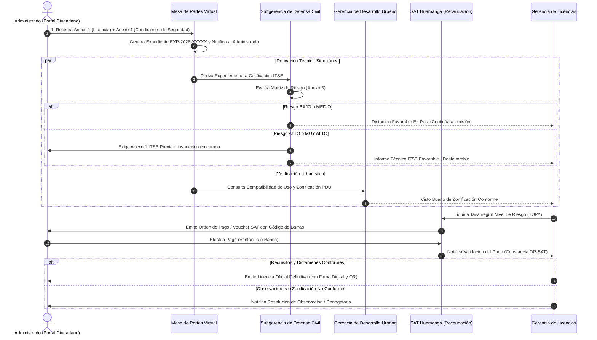

# 🏛️ Sistema de Gestión Documentaria del Trámite de Licencia de Funcionamiento
### Municipalidad Provincial de Huamanga (MuniHuamanga)
> **Propuesta de Arquitectura de Software para la Digitalización del Trámite de Licencia de Funcionamiento a cargo de la Gerencia de Licencias, con Firma Digital y Verificación de Licencias mediante Código QR, Desarrollada en Java y PostgreSQL, Modelada con C4 hasta el Nivel de Contenedores y Diseñada para su Integración Futura con Defensa Civil, Edificaciones y el SAT.**


---

## 📋 1. Resumen de la Solución

El presente proyecto implementa la arquitectura de software empresarial para digitalizar y dar trazabilidad al trámite de **Licencia de Funcionamiento** en el ámbito municipal peruano, anclado al marco normativo de la **Ley N° 28976** y su **TUO aprobado por D.S. N° 046-2017-PCM**.

### 🎯 Enfoque por Fases y Viabilidad Realista
- **Fase 1 (Alcance actual):** Digitalización del flujo a cargo de la **Gerencia de Licencias**: recepción virtual, cálculo automático de tasas según riesgo ITSE, generación de órdenes de pago, validación y dictamen final, emisión de licencia firmada digitalmente y verificación ciudadana inmediata vía **código QR único**.
- **Fase 2 (Prevista en el diseño):** Integración directa en línea con el **SAT Huamanga** (pasarela y conciliación bancaria), **Defensa Civil** (clasificación de riesgo ITSE automatizada), **Gerencia de Edificaciones** (zonificación digital) y **Fiscalización**. Mientras tanto, el sistema cuenta con un **Adaptador de Integración** desacoplado para registrar estos dictámenes sin alterar los microservicios centrales.
- **Capacidad Objetivo:** $\ge 150$ usuarios concurrentes (dimensionamiento representativo de una municipalidad provincial).

---

## 🏗️ 2. Estructura de Módulos del Repositorio

El proyecto está organizado como un repositorio multi-módulo Maven (`muni-licencias-parent`):

```text
MuniHuamanga/
├── pom.xml                                  # POM Padre Multi-Módulo Maven
├── docker-compose.yml                       # Orquestación de PostgreSQL 15 y pgAdmin 4
├── .gitignore                               # Exclusiones optimizadas para Java, Maven e IDEs
│
├── common-domain/                           # Contratos compartidos entre microservicios
│   └── src/main/java/.../common/
│       ├── enums/
│       │   ├── EstadoExpediente.java       # FORMATOS_GENERADOS, DOCUMENTOS_VALIDADOS, etc.
│       │   ├── NivelRiesgo.java           # BAJO, MEDIO, ALTO, MUY_ALTO
│       │   ├── TipoPersona.java           # NATURAL, JURIDICA
│       │   ├── TipoDocumento.java         # DNI, RUC, CARNET_EXTRANJERIA
│       │   ├── ModalidadTramite.java      # Secc. I Anexo 1 (Indeterminada, Temporal, Anuncio, etc.)
│       │   └── FuncionEdificacion.java    # Anexos 3 y 4 ITSE (Salud, Encuentro, Comercio, etc.)
│       ├── dto/
│       │   ├── CrearExpedienteDto.java    # Solicitud Mesa de Partes (Anexo 1 + SUNARP + Dirección)
│       │   ├── ExpedienteResponseDto.java # Payload integral con plazos, estados y evidencias
│       │   ├── Anexo4CondicionesDto.java  # Checklist de seguridad en edificación (Riesgo Bajo/Medio)
│       │   ├── ClasificacionRiesgoDto.java# Calificación ITSE (Nivel + N° Informe Técnico)
│       │   ├── RegistroPagoDto.java       # Validación SAT (Voucher + N° Operación Bancaria)
│       │   ├── VoucherDto.java            # Datos de orden de pago SAT con código Code 128
│       │   ├── VerificacionLicenciaDto.java# Consulta pública ciudadana vía QR
│       │   ├── ResolucionExpedienteDto.java# Dictamen final o motivo de rechazo
│       │   └── HistorialEstadoDto.java    # Línea de tiempo de auditoría inmutable
│       └── exception/
│           ├── TransicionInvalidaException.java
│           └── RecursoNoEncontradoException.java
│
├── servicio-expedientes/                    # Microservicio Núcleo del Trámite (Puerto 8081)
│   ├── src/main/java/.../expedientes/
│   │   ├── controller/ExpedienteController.java   # Endpoints REST del trámite, ITSE, SAT y licencias
│   │   ├── service/
│   │   │   ├── ExpedienteService.java            # Máquina de estados, lógica de negocio y persistencia
│   │   │   ├── CalculadoraDeTasa.java            # Tarifario TUPA según nivel de riesgo (RNF-17)
│   │   │   ├── AuditoriaService.java             # Registro inmutable de transiciones y motivos
│   │   │   └── DocumentoPdfService.java          # Renderizado de fallback para formatos oficiales
│   │   ├── validator/EstadoExpedienteValidator.java # Validador de transiciones y precondiciones legales
│   │   ├── mapper/ExpedienteMapper.java          # MapStruct con cálculo de 15 días hábiles y Anexo 4
│   │   ├── model/
│   │   │   ├── Expediente.java                   # Entidad JPA con 45 atributos normativos
│   │   │   ├── Anexo4Condiciones.java            # Objeto embebido JPA (@Embeddable) de seguridad
│   │   │   └── HistorialEstado.java              # Entidad JPA de auditoría inmutable
│   │   └── repository/ExpedienteRepository.java
│   └── src/main/resources/static/                # Interfaz Web y Portales del Sistema
│       ├── portal-ciudadano.html                 # Mesa de Partes Virtual y Seguimiento de Trámite
│       ├── portal-interno.html                   # Bandeja de Gestión (Mesa Partes, Defensa Civil, SAT)
│       ├── verificar-licencia.html               # Portal Público de Verificación de Licencias QR
│       ├── css/styles.css                        # Sistema de diseño institucional Huamanga
│       ├── js/                                   # Lógica de cliente, AJAX y validaciones
│       └── img/escudo-huamanga.png               # Escudo oficial de la Municipalidad de Huamanga
│
├── servicio-formularios/                    # Microservicio Documental y Firma (Puerto 8082)
│   └── src/main/java/.../formularios/
│       ├── controller/FormulariosController.java
│       └── service/
│           ├── GeneradorDocumentoService.java # Coordinador de generación documental
│           ├── Anexo1PdfGenerator.java        # Formato oficial Ley 28976 (2 páginas)
│           ├── Anexo3PdfGenerator.java        # Reporte Matriz de Riesgo ITSE (2 páginas)
│           └── Anexo4PdfGenerator.java        # Declaración de Condiciones de Seguridad (4 páginas)
│
├── servicio-verificacion-licencias/         # Microservicio de Códigos QR y Consulta (Puerto 8083)
│   └── src/main/java/.../verificacion/
│       ├── controller/VerificacionController.java # API pública de fiscalización ciudadana
│       └── service/QrGeneratorService.java        # Generador de QR PNG criptográfico con ZXing
│
├── adaptador-integracion/                   # Adaptador Hexagonal de Integración (Puerto 8084)
│   └── src/main/java/.../adaptador/
│       ├── controller/AdaptadorController.java    # Stubs para SAT, Defensa Civil y Zonificación
│       └── port/                                 # Puertos de salida hacia entidades externas
│
├── api-gateway/                             # Spring Cloud Gateway Perimetral (Puerto 8080)
│   └── src/main/resources/application.yml        # Enrutamiento, CORS unificado y Rate Limiting
│
├── docker/
│   └── postgres/init/01-init-databases.sql       # Script DDL (45 columnas, índices y migración en caliente)
│
└── docs/                                    # Documentación Técnica, Legal y Arquitectura
    ├── entrega-fase-01.md                       # Documento Oficial de Entrega de la Fase 01
    ├── entrega-fase-02.md                       # Documento Oficial de Entrega de la Fase 02 (Motor PDF)
    ├── normativa-legal.md                       # Marco Legal: Ley 28976, Anexos 1, 3 y 4 de ITSE
    ├── v0.1-inventario-matriz-campos.md         # Matriz de trazabilidad campo por campo
    ├── arquitectura/c4-model.md                 # Arquitectura C4 (Contexto, Contenedores, Componentes)
    └── scrum/                                   # Product Backlogs e Historias de Usuario
```

---

## ⚙️ 3. Requisitos del Entorno

Para compilar y ejecutar este proyecto localmente, necesitas tener instalado:
- **JDK 21** (Eclipse Adoptium Temurin o similar LTS).
- **Apache Maven 3.9+**
- **Docker Desktop** (con soporte Docker Compose).
- **Git**

---

## 🚀 4. Guía Rápida de Inicio

### Paso 1: Iniciar la Base de Datos PostgreSQL
En la raíz del proyecto, ejecuta Docker Compose para levantar PostgreSQL 15 con el esquema DDL y datos semilla:
```bash
docker-compose up -d postgres
```
> **Credenciales:**  
> - Host: `localhost:5432`  
> - Base de datos: `muni_licencias_db`  
> - Usuario: `muni_user`  
> - Contraseña: `muni_pass123`  
> - (Opcional) Interfaz visual pgAdmin: http://localhost:5050 (`admin@munihuamanga.gob.pe` / `admin`)

### Paso 2: Compilar y Ejecutar Pruebas Automatizadas
Compila la suite multi-módulo completa y ejecuta los tests unitarios:
```powershell
$env:JAVA_HOME="C:\Program Files\Eclipse Adoptium\jdk-21.0.12.101-hotspot"
$env:PATH="$env:JAVA_HOME\bin;C:\tools\apache-maven-3.9.16-bin\apache-maven-3.9.16\bin;$env:PATH"

mvn clean test
```

### Paso 3: Ejecutar los Microservicios
Puedes iniciar los servicios individualmente o mediante el Gateway:
```powershell
# En terminal 1 (Núcleo de Expedientes):
mvn spring-boot:run -pl servicio-expedientes

# En terminal 2 (Formularios PDF):
mvn spring-boot:run -pl servicio-formularios

# En terminal 3 (Verificación y QR):
mvn spring-boot:run -pl servicio-verificacion-licencias

# En terminal 4 (Adaptador Fase 2):
mvn spring-boot:run -pl adaptador-integracion

# En terminal 5 (API Gateway principal):
mvn spring-boot:run -pl api-gateway
```

---

## 📖 5. Documentación Interactiva de APIs (Swagger / OpenAPI)

Cada microservicio expone su documentación Swagger UI para pruebas inmediatas:
- **Servicio de Expedientes:** http://localhost:8081/swagger-ui.html
- **Servicio de Formularios:** http://localhost:8082/swagger-ui.html
- **Servicio de Verificación y QR:** http://localhost:8083/swagger-ui.html
- **Adaptador de Integración:** http://localhost:8084/swagger-ui.html
- **Entrada Perimetral (Gateway):** http://localhost:8080

---

## 🔄 6. Máquina de Estados, Anexos Normativos y Flujo de Derivación

### A. Estructura de Anexos Digitalizados del Expediente

```text
┌────────────────────────────────────────────────────────────────────────────────────────┐
│                                 EXPEDIENTE DE LICENCIA                                 │
└───────────────────────────────────────────┬────────────────────────────────────────────┘
                                            │
         ┌──────────────────────────────────┴──────────────────────────────────┐
         ▼                                                                     ▼
┌──────────────────────────────────────┐             ┌───────────────────────────────────┐
│     ANEXO N° 1 (Ley N° 28976)        │             │      ANEXO 4 (D.S. 002-2018)      │
│ Declaración Jurada para Licencia     │             │ DJ de Condiciones de Seguridad    │
│ de Funcionamiento (Versión 03)       │             │ (Exclusivo para Riesgo Bajo/Medio)│
└──────────────────┬───────────────────┘             └─────────────────┬─────────────────┘
                   │                                                   │
                   ▼                                                   ▼
┌──────────────────────────────────────┐             ┌───────────────────────────────────┐
│       ANEXO 3 (Defensa Civil)        │             │     ANEXO 1 ITSE / ECSE (PCM)     │
│ Reporte de Nivel de Riesgo del       │             │ Solicitud de Inspección Técnica   │
│ Establecimiento (Matriz de Riesgos)  │             │ (ITSE Previa / Posterior / ECSE)  │
└──────────────────────────────────────┘             └───────────────────────────────────┘
```

### B. Máquina de Estados Finitos C4

```text
[ Ingreso de Solicitud ]
           │
           ▼
 [ FORMATOS_GENERADOS ]  ──(Defensa Civil registra clasificación ITSE)──► [ DOCUMENTOS_VALIDADOS ]
                                                                                   │
                                                                       (Pago validado en SAT)
                                                                                   │
                                                                                   ▼
                                                                        [ EN_EVALUACION_FINAL ]
                                                                          │               │
                                              (Favorable: Emisión con QR) │               │ (Desfavorable)
                                                                          ▼               ▼
                                                                     [ APROBADO ]   [ RECHAZADO ]
```

### C. Diagrama de Secuencia de Derivación entre Instancias Municipales



---

## 📦 7. Cómo Subir este Proyecto a tu Repositorio de GitHub

El repositorio Git ya se encuentra inicializado localmente. Para publicarlo en tu cuenta de GitHub, sigue estos pasos:

1. Crea un repositorio vacío en tu cuenta de GitHub (ejemplo: `muni-huamanga-licencias`).
2. En tu terminal dentro de la carpeta `d:\ArqSoftware\MuniHuamanga`, ejecuta:

```powershell
# 1. Verificar estado de archivos modificados e incorporados
git status

# 2. Agregar todos los cambios de Fase 01
git add .

# 3. Realizar el commit oficial de la Fase 01
git commit -m "feat(fase-01): digitalizacion de modelos, anexos normativos 1-3-4 y esquema de base de datos"

# 4. Asignar la rama principal (si no está asignada)
git branch -M main

# 5. Subir los cambios a GitHub
git push -u origin main
```

---

## 👥 8. Hoja de Ruta de Sprints y Fases de Desarrollo

- **✅ Fase 01 (Completada):** Digitalización de formularios normativos de Huamanga (Anexo 1 Declaración Jurada v03, Anexo 3 Matriz de Riesgo ITSE, Anexo 4 Condiciones de Seguridad en Edificación, Solicitud ITSE). Enums de identidad (`TipoPersona`, `TipoDocumento`), `ModalidadTramite`, `FuncionEdificacion`, DTOs completos, objeto embebible JPA `Anexo4Condiciones`, DDL/migraciones PostgreSQL y auditoría de derivaciones externas (SAT y Defensa Civil). Consulta el detalle en [docs/entrega-fase-01.md](file:///d:/ArqSoftware/MuniHuamanga/docs/entrega-fase-01.md).
- **⏳ Fase 02 (En planificación):** Motor de renderizado PDF estándar de alta fidelidad para impresión física y digital de los Anexos 1, 3 y 4 conforme al formato estándar de la municipalidad.
- **⏳ Fase 03:** Modernización del Frontend (Portal Ciudadano con Wizard Anexo 1 + Anexo 4 interactivo y Portal Interno con bandejas para Mesa de Partes, Defensa Civil y SAT).
- **⏳ Fase 04:** Dictamen final, emisión de Licencia con QR Criptográfico y firma digital institucional.
- **⏳ Fase 05:** Pruebas de integración, adaptadores y validación de carga ($\ge 150$ usuarios concurrentes).

---
*Municipalidad Provincial de Huamanga — Gerencia de Licencias y Autorizaciones*
