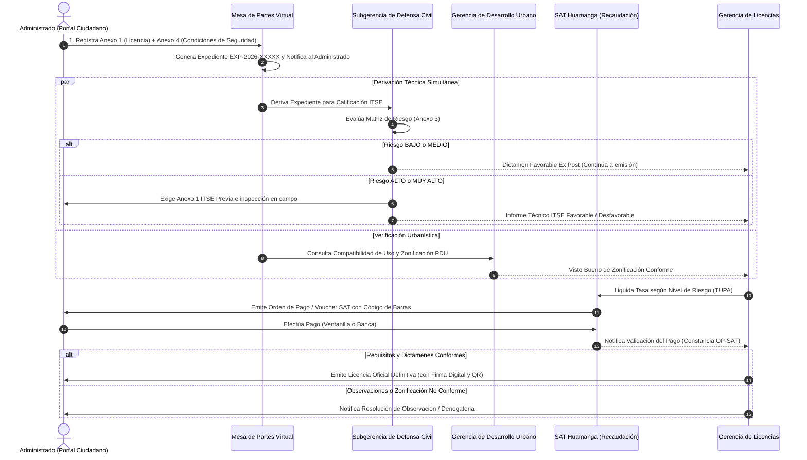

# 🏛️ Sistema de Gestión Documentaria del Trámite de Licencia de Funcionamiento
### Municipalidad Provincial de Huamanga (MuniHuamanga)
> **Propuesta de Arquitectura de Software para la Digitalización Integral del Trámite de Licencia de Funcionamiento, con Generación Automática de Formatos Oficiales en PDF (Anexos 1, 3 y 4), Wizard Ciudadano Multipaso, Firma Digital y Verificación de Licencias mediante Código QR, Desarrollada en Java 21 y PostgreSQL 15, Modelada con C4 hasta el Nivel de Componentes.**


---

## 📋 1. Resumen de la Solución

El presente proyecto implementa la arquitectura de software empresarial para digitalizar y dar trazabilidad al trámite de **Licencia de Funcionamiento** en el ámbito municipal peruano, anclado al marco normativo de la **Ley N° 28976** y su **TUO aprobado por D.S. N° 046-2017-PCM**.

### 🎯 Estado de Fases de Desarrollo

| Fase | Estado | Descripción |
|------|--------|-------------|
| **Fase 01** | ✅ Completada | Digitalización de la base de datos (45 atributos normativos), capa de dominio, máquina de estados, APIs REST y auditoría inmutable |
| **Fase 02** | ✅ Completada | Motor de generación de formatos oficiales en PDF: Anexo 1 (2 pág.), Anexo 3 Matriz ITSE (2 pág.), Anexo 4 Condiciones de Seguridad (4 pág.) |
| **Fase 03** | ✅ Completada | Frontend Wizard Multipaso (Portal Ciudadano 3 pasos), descarga inmediata de PDFs, Dashboard Interno con KPI cards y columna de Formatos PDF |
| **Fase 04** | ✅ Completada | PDF Licencia Oficial (Sprint 4-A), Notificaciones Electrónicas Email Async (Sprint 4-B), Autenticación JWT + Spring Security 6 RBAC (Sprint 4-C) y Tarifario TUPA Dinámico (Sprint 4-D) |
| **Fase 05** | ⏳ Planificada | Pruebas de integración, adaptadores externos y validación de carga (≥150 usuarios concurrentes) |

---

## 🏗️ 2. Estructura de Módulos del Repositorio

El proyecto está organizado como un repositorio multi-módulo Maven (`muni-licencias-parent`):

```text
MuniHuamanga/
├── pom.xml                                  # POM Padre Multi-Módulo Maven (Java 21 / SB 3.3.4)
├── docker-compose.yml                       # Orquestación de PostgreSQL 15 y pgAdmin 4
├── .gitignore                               # Exclusiones optimizadas para Java, Maven e IDEs
│
├── common-domain/                           # Contratos compartidos entre microservicios
│   └── src/main/java/.../common/
│       ├── enums/
│       │   ├── EstadoExpediente.java       # FORMATOS_GENERADOS → DOCUMENTOS_VALIDADOS → EN_EVALUACION_FINAL → APROBADO/RECHAZADO
│       │   ├── NivelRiesgo.java           # BAJO, MEDIO, ALTO, MUY_ALTO (Matriz CENEPRED)
│       │   ├── TipoPersona.java           # NATURAL, JURIDICA
│       │   ├── TipoDocumento.java         # DNI, RUC, CARNET_EXTRANJERIA
│       │   ├── ModalidadTramite.java      # Sección I Anexo 1 (Indeterminada, Temporal, Anuncio, etc.)
│       │   └── FuncionEdificacion.java    # Anexos 3 y 4 ITSE (Salud, Encuentro, Comercio, etc.)
│       ├── dto/                            # 9 DTOs de contrato inter-servicio
│       │   ├── CrearExpedienteDto.java    # Solicitud Mesa de Partes (45 campos, Anexo 1 + SUNARP + Dirección)
│       │   ├── ExpedienteResponseDto.java # Payload integral (estado, plazos, tasas, licenciaQrCode)
│       │   ├── Anexo4CondicionesDto.java  # Checklist de seguridad en edificación (23 campos booleanos)
│       │   ├── ClasificacionRiesgoDto.java# Calificación ITSE (Nivel + N° Informe Técnico + Observaciones)
│       │   ├── RegistroPagoDto.java       # Validación SAT (Voucher + N° Operación Bancaria + Monto)
│       │   ├── VoucherDto.java            # Orden de pago SAT con código Code 128
│       │   ├── VerificacionLicenciaDto.java# Consulta pública ciudadana vía QR (RNF-20)
│       │   ├── ResolucionExpedienteDto.java# Dictamen final o motivo de rechazo
│       │   └── HistorialEstadoDto.java    # Línea de tiempo de auditoría inmutable
│       └── exception/
│           ├── TransicionInvalidaException.java
│           └── RecursoNoEncontradoException.java
│
├── servicio-expedientes/                    # Microservicio Núcleo del Trámite (Puerto 8081)
│   ├── src/main/java/.../expedientes/
│   │   ├── ExpedientesApplication.java
│   │   ├── config/DataInitializer.java          # Datos semilla de prueba (expedientes demo)
│   │   ├── controller/
│   │   │   ├── ExpedienteController.java        # 18 endpoints REST del trámite
│   │   │   ├── PublicLicenciasController.java   # Endpoint público de verificación QR (RNF-20)
│   │   │   └── GlobalExceptionHandler.java      # Manejo global de errores HTTP
│   │   ├── service/
│   │   │   ├── ExpedienteService.java           # Máquina de estados (467 líneas), lógica y persistencia
│   │   │   ├── CalculadoraDeTasa.java           # Tarifario TUPA por nivel de riesgo ITSE
│   │   │   ├── AuditoriaService.java            # Log inmutable de transiciones con sellado de tiempo
│   │   │   ├── MetricasExpedienteService.java   # Micrometer: SLAs, alertas de vencimiento
│   │   │   ├── DocumentoPdfService.java         # Motor PDF local (Anexo 1, 3, 4, Voucher, Licencia)
│   │   │   ├── Anexo1PdfGenerator.java          # Generador Anexo 1 (2 páginas, Ley 28976)
│   │   │   ├── Anexo3PdfGenerator.java          # Generador Matriz ITSE (2 páginas, CENEPRED)
│   │   │   └── Anexo4PdfGenerator.java          # Generador Condiciones de Seguridad (4 páginas)
│   │   ├── validator/EstadoExpedienteValidator.java # Precondiciones legales de aprobación
│   │   ├── mapper/ExpedienteMapper.java          # MapStruct: cómputo 15 días hábiles + Anexo 4
│   │   ├── model/
│   │   │   ├── Expediente.java                   # Entidad JPA con 45 atributos normativos
│   │   │   ├── Anexo4Condiciones.java            # Objeto embebido JPA (@Embeddable) 23 campos
│   │   │   └── HistorialEstado.java              # Auditoría inmutable @Entity
│   │   └── repository/
│   │       ├── ExpedienteRepository.java
│   │       └── HistorialRepository.java
│   └── src/main/resources/
│       ├── application.yml                       # Configuración Spring, JPA, Swagger
│       ├── application-local.yml                 # Perfil local con PostgreSQL
│       └── static/                              # Frontend Institucional (Fase 3)
│           ├── index.html                        # Landing page con 4 tarjetas de acceso
│           ├── portal-ciudadano.html             # 🆕 Wizard Multipaso: 3 pasos + Descarga PDFs
│           ├── portal-interno.html               # 🆕 Dashboard KPI + Bandeja con Formatos PDF
│           ├── verificar-licencia.html           # Portal Público de Verificación QR (RNF-20)
│           ├── css/styles.css                    # 🆕 Sistema de diseño (820 líneas): wizard, doc-cards, kpi-v2
│           ├── js/
│           │   ├── portal-ciudadano.js           # 🆕 Wizard logic: navegación, validaciones, fetch+blob
│           │   ├── portal-interno.js             # 🆕 renderFormatosPdf(), descargarFormatoInterno()
│           │   └── verificar-licencia.js         # Consulta QR pública
│           └── img/escudo-huamanga.png           # Escudo oficial de Huamanga
│
├── servicio-formularios/                    # Microservicio de Generación Documental PDF (Puerto 8082)
│   └── src/main/java/.../formularios/
│       ├── FormulariosApplication.java
│       ├── controller/FormulariosController.java # 7 endpoints POST de generación PDF
│       └── service/
│           ├── GeneradorDocumentoService.java    # Coordinador: delega a generadores especializados
│           ├── Anexo1PdfGenerator.java           # Formato Ley 28976 con escudo (2 páginas)
│           ├── Anexo3PdfGenerator.java           # Matriz ITSE CENEPRED, colores oficiales (2 páginas)
│           └── Anexo4PdfGenerator.java           # Declaración Condiciones de Seguridad (4 páginas)
│
├── servicio-verificacion-licencias/         # Microservicio de Verificación QR (Puerto 8083)
│   └── src/main/java/.../verificacion/
│       ├── controller/VerificacionController.java
│       └── service/QrGeneratorService.java       # ZXing 3.5.3: QR PNG criptográfico
│
├── adaptador-integracion/                   # Adaptador Hexagonal SAT/DefensaCivil (Puerto 8084)
│   └── src/main/java/.../adaptador/
│       └── [Stubs y puertos de integración externa]
│
├── api-gateway/                             # Spring Cloud Gateway Perimetral (Puerto 8080)
│   └── src/main/resources/application.yml  # Enrutamiento reactivo, CORS, Rate Limiting
│
├── docker/
│   └── postgres/init/01-init-databases.sql # DDL: 45 columnas, índices, migración en caliente
│
└── docs/                                    # Documentación Técnica Oficial
    ├── entrega-fase-01.md                   # Entrega Fase 01: Dominio, BD y APIs
    ├── entrega-fase-02.md                   # Entrega Fase 02: Motor PDF (Anexos 1, 3, 4)
    ├── entrega-fase-03.md                   # 🆕 Entrega Fase 03: Frontend Wizard + Descarga PDFs
    ├── normativa-legal.md                   # Marco Legal: Ley 28976, Anexos 1, 3 y 4 ITSE
    ├── v0.1-inventario-matriz-campos.md     # Matriz de trazabilidad campo por campo (45 atributos)
    ├── arquitectura/c4-model.md             # Modelo C4 actualizado (Contexto, Contenedores, Componentes)
    └── scrum/                               # Product Backlogs e Historias de Usuario
```

---

## ⚙️ 3. Requisitos del Entorno

| Herramienta | Versión | Notas |
|-------------|---------|-------|
| **JDK** | 21 LTS | Eclipse Adoptium Temurin recomendado |
| **Apache Maven** | 3.9+ | Multi-módulo POM |
| **Docker Desktop** | Cualquiera con Compose v2 | Para PostgreSQL 15 |
| **Git** | 2.x+ | |

---

## 🚀 4. Guía Rápida de Inicio

### Paso 1: Iniciar la Base de Datos PostgreSQL
```bash
docker-compose up -d postgres
```
> **Credenciales:**
> - Host: `localhost:5432` | BD: `muni_licencias_db` | User: `muni_user` | Pass: `muni_pass123`
> - pgAdmin: http://localhost:5050 (`admin@munihuamanga.gob.pe` / `admin`)

### Paso 2: Compilar y Ejecutar Pruebas (80 tests)
```powershell
$env:JAVA_HOME="C:\Program Files\Eclipse Adoptium\jdk-21.0.12.101-hotspot"
$env:PATH="$env:JAVA_HOME\bin;C:\tools\apache-maven-3.9.16-bin\apache-maven-3.9.16\bin;$env:PATH"

mvn clean test
# Expected: BUILD SUCCESS — Tests run: 80, Failures: 0, Errors: 0
```

### Paso 3: Ejecutar los Microservicios
```powershell
# Terminal 1 — Expedientes + Frontend (Portal Ciudadano, Interno, Verificación)
mvn spring-boot:run -pl servicio-expedientes

# Terminal 2 — Generación de PDF Oficiales (Anexos 1, 3, 4, Voucher, Licencia)
mvn spring-boot:run -pl servicio-formularios

# Terminal 3 — Verificación QR Pública
mvn spring-boot:run -pl servicio-verificacion-licencias

# Terminal 4 — Adaptador SAT/Defensa Civil
mvn spring-boot:run -pl adaptador-integracion

# Terminal 5 — API Gateway (punto único de entrada)
mvn spring-boot:run -pl api-gateway
```

### Paso 4: Acceso a los Portales
| Portal | URL |
|--------|-----|
| **Landing Page** | http://localhost:8081/ |
| **Portal Ciudadano (Wizard)** | http://localhost:8081/portal-ciudadano.html |
| **Gestión Interna (Dashboard + RBAC)** | http://localhost:8081/portal-interno.html |
| **Verificación QR Pública** | http://localhost:8081/verificar-licencia.html |

---

## 📖 5. Documentación Interactiva de APIs (Swagger / OpenAPI)

| Servicio | URL Swagger |
|----------|-------------|
| Servicio de Expedientes | http://localhost:8081/swagger-ui.html |
| Servicio de Formularios | http://localhost:8082/swagger-ui.html |
| Servicio de Verificación | http://localhost:8083/swagger-ui.html |
| Adaptador de Integración | http://localhost:8084/swagger-ui.html |
| API Gateway (entrada) | http://localhost:8080 |

---

## 🔌 6. Catálogo Completo de Endpoints REST

### 6.1 Servicio de Expedientes (`servicio-expedientes` :8081)

| Método | Endpoint | Descripción | Acceso / Rol |
|--------|----------|-------------|--------------|
| `POST` | `/api/auth/login` | Autenticación de personal municipal y emisión JWT | Público |
| `POST` | `/api/expedientes` | Mesa de Partes Virtual: Registrar nueva solicitud | Público |
| `GET` | `/api/expedientes` | Listar expedientes (filtros: `?estado=&conAlerta=true`) | `ROLE_EVALUADOR`, `ROLE_ADMIN` |
| `GET` | `/api/expedientes/{id}` | Consultar expediente por UUID | `ROLE_EVALUADOR`, `ROLE_ADMIN` |
| `GET` | `/api/expedientes/tramite/{numero}` | Seguimiento ciudadano por N° trámite (EXP-2026-XXXXX) | Público |
| `GET` | `/api/expedientes/{id}/historial` | Historial cronológico de estados (auditoría) | Autenticado |
| `GET` | `/api/expedientes/{id}/desglose-tasa` | Desglose de conceptos tributarios TUPA | Público |
| `GET` | `/api/tupa/tarifas` | Listar tarifario TUPA oficial con tasas vigentes | Público / Autenticado |
| `PUT` | `/api/tupa/tarifas/{id}` | Actualización en caliente de tasa municipal TUPA | `ROLE_ADMIN` |
| `GET` | `/api/expedientes/{id}/documentos/declaracion-jurada` | 📄 PDF Anexo 1 — Declaración Jurada | Público / Autenticado |
| `GET` | `/api/expedientes/{id}/documentos/anexo1-declaracion-jurada` | 📄 PDF Anexo 1 (alternativo) | Público / Autenticado |
| `GET` | `/api/expedientes/{id}/documentos/anexo3-matriz-riesgo-itse` | 🛡️ PDF Anexo 3 — Matriz ITSE | Público / Autenticado |
| `GET` | `/api/expedientes/{id}/documentos/anexo4-condiciones-seguridad` | 🔒 PDF Anexo 4 — Condiciones Seguridad | Público / Autenticado |
| `GET` | `/api/expedientes/{id}/documentos/voucher-sat` | 🧾 PDF Voucher SAT con Code 128 | Público / Autenticado |
| `GET` | `/api/expedientes/{id}/documentos/licencia` | 📜 PDF Licencia Oficial con QR y Sello Digital | Público / Autenticado |
| `GET` | `/api/expedientes/{id}/qr` | 🔲 Imagen PNG del código QR de la licencia | Público |
| `POST` | `/api/expedientes/{id}/clasificacion-riesgo` | Defensa Civil: Registrar dictamen ITSE | `ROLE_EVALUADOR`, `ROLE_ADMIN` |
| `POST` | `/api/expedientes/{id}/voucher` | SAT: Generar orden de pago | `ROLE_CAJERO`, `ROLE_ADMIN` |
| `POST` | `/api/expedientes/{id}/pago` | SAT: Registrar constancia de pago | `ROLE_CAJERO`, `ROLE_ADMIN` |
| `POST` | `/api/expedientes/{id}/aprobar` | Gerencia Licencias: Dictamen favorable + emisión QR | `ROLE_EVALUADOR`, `ROLE_ADMIN` |
| `POST` | `/api/expedientes/{id}/rechazar` | Gerencia Licencias: Dictamen de rechazo | `ROLE_EVALUADOR`, `ROLE_ADMIN` |
| `GET` | `/api/licencias/verificar/{codigo}` | Portal público de verificación de autenticidad | Público |

### 6.2 Servicio de Formularios (`servicio-formularios` :8082)

| Método | Endpoint | Descripción |
|--------|----------|-------------|
| `POST` | `/api/formularios/declaracion-jurada` | PDF Anexo 1 desde payload ExpedienteResponseDto |
| `POST` | `/api/formularios/anexo1-declaracion-jurada` | PDF Anexo 1 (2 páginas, Ley 28976) |
| `POST` | `/api/formularios/anexo3-matriz-riesgo-itse` | PDF Anexo 3 (2 páginas, Matriz ITSE CENEPRED) |
| `POST` | `/api/formularios/anexo4-condiciones-seguridad` | PDF Anexo 4 (4 páginas, Condiciones Seguridad) |
| `POST` | `/api/formularios/defensa-civil` | PDF Solicitud ITSE (D.S. N° 002-2018-PCM) |
| `POST` | `/api/formularios/voucher-sat` | PDF Voucher SAT con código de barras Code 128 |
| `POST` | `/api/formularios/licencia` | PDF Licencia Oficial con QR y Sello Digital |

---

## 🔄 7. Flujo del Sistema y Máquina de Estados

### A. Estructura de Anexos Digitalizados

```text
┌────────────────────────────────────────────────────────────────────────────────────────┐
│                                 EXPEDIENTE DE LICENCIA                                 │
└───────────────────────────────────────────┬────────────────────────────────────────────┘
                                            │
         ┌──────────────────────────────────┴──────────────────────────────────┐
         ▼                                                                     ▼
┌──────────────────────────────────────┐             ┌───────────────────────────────────┐
│     ANEXO N° 1 (Ley N° 28976)        │             │      ANEXO 4 (D.S. 002-2018)      │
│ Declaración Jurada para Licencia     │             │ DJ de Condiciones de Seguridad    │
│ de Funcionamiento (Versión 03)       │             │ (Exclusivo para Riesgo Bajo/Medio)│
└──────────────────┬───────────────────┘             └─────────────────┬─────────────────┘
                   │                                                   │
                   ▼                                                   ▼
┌──────────────────────────────────────┐             ┌───────────────────────────────────┐
│       ANEXO 3 (Defensa Civil)        │             │     ANEXO 1 ITSE / ECSE (PCM)     │
│ Reporte de Nivel de Riesgo del       │             │ Solicitud de Inspección Técnica   │
│ Establecimiento (Matriz de Riesgos)  │             │ (ITSE Previa / Posterior / ECSE)  │
└──────────────────────────────────────┘             └───────────────────────────────────┘
```

### B. Máquina de Estados Finitos C4

```text
   [Portal Ciudadano: Wizard 3 pasos → POST /api/expedientes]
                          │
                          ▼
             [ FORMATOS_GENERADOS ]
               ↓ Defensa Civil registra ITSE
             [ DOCUMENTOS_VALIDADOS ]
               ↓ Pago validado en SAT
             [ EN_EVALUACION_FINAL ]
               ↓                  ↓
          [ APROBADO ]       [ RECHAZADO ]
    (Licencia PDF + QR)   (Resolución de Denegatoria)
```

### C. Flujo del Wizard Ciudadano (Fase 3)

```text
PASO 1: Datos del Solicitante  →  PASO 2: Datos del Establecimiento  →  PASO 3: Confirmación
     (Validación en JS)              (Área m² → Riesgo ITSE)           (Resumen + DDJJ)
                                                                               │
                                                                     POST /api/expedientes
                                                                               │
                                                                    ┌──────────▼──────────┐
                                                                    │   BANNER DE ÉXITO   │
                                                                    │   EXP-2026-XXXXX    │
                                                                    │                     │
                                                                    │ 📋 Anexo 1 (GET)    │
                                                                    │ 🛡️ Anexo 3 (POST)   │
                                                                    │ 🔒 Anexo 4 (POST)   │
                                                                    └─────────────────────┘
```

### D. Diagrama de Secuencia de Derivación entre Instancias Municipales



---

## 📦 8. Comandos Git — Flujo de Trabajo del Proyecto

```powershell
# Ver estado del árbol de trabajo
git status

# Ver historial de commits (regla de oro: commit por cada cambio)
git log --oneline

# Agregar y publicar cambios
git add .
git commit -m "tipo(alcance): descripcion breve"
git push origin main
```

### Historial de Commits Principales

```
5330790  feat(fase-03/frontend): wizard multipaso ciudadano + descarga de anexos PDF
9cabbcb  docs(fase-02): documentar motor de generacion de formatos estandar y endpoints pdf
6d906d7  feat(fase-02): digitalizar formato oficial de anexo 4 declaracion jurada
bbb242c  feat(fase-02): digitalizar formato oficial de anexo 3 matriz de riesgo itse
d2295ca  feat(fase-02): digitalizar formato oficial de anexo 1 declaracion jurada
```

---

## 👥 9. Hoja de Ruta de Sprints y Fases de Desarrollo

| Sprint | Fase | Estado | Entregables |
|--------|------|--------|-------------|
| Sprint 1 | **Fase 01** | ✅ | BD 45 atributos, dominio JPA, APIs REST, auditoría |
| Sprint 2 | **Fase 02** | ✅ | PDFs Anexo 1 (2p), Anexo 3 (2p), Anexo 4 (4p), Voucher SAT, Licencia QR |
| Sprint 3 | **Fase 03** | ✅ | Wizard ciudadano 3 pasos, Dashboard KPI, Descarga inmediata PDF |
| Sprint 4 | **Fase 04** | 🔄 En progreso | **Sprint 4-A**: PDF Licencia formato oficial municipal ✅ \| Notificaciones email (SMTP) \| JWT + Spring Security \| CRUD TUPA |
| Sprint 5 | **Fase 05** | ⏳ | Tests integración, adaptadores externos, pruebas de carga |

- **✅ Fase 01 (Completada):** [docs/entrega-fase-01.md](docs/entrega-fase-01.md)
- **✅ Fase 02 (Completada):** [docs/entrega-fase-02.md](docs/entrega-fase-02.md)
- **✅ Fase 03 (Completada):** [docs/entrega-fase-03.md](docs/entrega-fase-03.md)
- **🔄 Fase 04 (En progreso):** Sprint 4-A — PDF Licencia formato oficial ✅ (40 tests passing)

---

*Municipalidad Provincial de Huamanga — Gerencia de Licencias y Autorizaciones*
*Marco Legal: Ley N° 28976 / TUO D.S. N° 046-2017-PCM / D.S. N° 002-2018-PCM / D.S. N° 163-2020-PCM*
