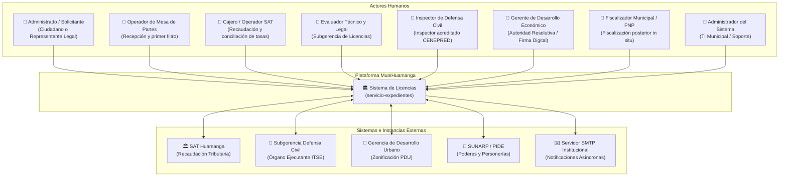

# 01. Actores del Sistema
## Sistema de Gestión Documentaria de Licencia de Funcionamiento
### Municipalidad Provincial de Huamanga (Ayacucho, Perú)

> **Marco Normativo:** Ley N° 28976 / TUO D.S. N° 046-2017-PCM / D.S. N° 002-2018-PCM / Ley N° 27444  
> **Ubicación:** `docs/analisis-de-sistema/01-actores.md`

---

## 1. Introducción

En el marco del procedimiento administrativo para el otorgamiento de **Licencias de Funcionamiento** e **Inspecciones Técnicas de Seguridad en Edificaciones (ITSE)** en la Municipalidad Provincial de Huamanga, intervienen actores humanos (ciudadanos, funcionarios y servidores públicos) así como entidades y sistemas externos que interoperan con la plataforma.

A continuación, se define el inventario exhaustivo de actores, sus responsabilidades, roles de seguridad en el sistema (RBAC) y canales de interacción.

---

## 2. Diagrama General de Actores

---

## 3. Catálogo Detallado de Actores Humanos

### 3.1. Administrado / Solicitante (Ciudadano / Contribuyente)
* **Descripción:** Persona natural (comerciante independiente, emprendedor) o representante legal de una persona jurídica (empresa, asociación, sociedad) domiciliada en la provincia de Huamanga que solicita el inicio del trámite de Licencia de Funcionamiento.
* **Canal de Acceso:** Portal Web Ciudadano (`portal-ciudadano.html`) - Acceso público sin requerir usuario previo.
* **Responsabilidades:**
  1. Completar verazmente el formulario multipaso (Wizard 3 pasos) con los 45 campos normativos requeridos por el Anexo 1 (Ley 28976).
  2. Declarar bajo juramento el cumplimiento de condiciones de seguridad (Anexo 4) para establecimientos de riesgo Bajo y Medio.
  3. Descargar inmediatamente los formatos oficiales generados en PDF (Anexos 1, 3 y 4) y la Orden de Pago SAT (Voucher).
  4. Realizar el abono de la tasa TUPA correspondiente ante el SAT Huamanga.
  5. Acudir presencialmente a la Subgerencia de Defensa Civil con los Anexos 3 y 4 impresos y suscritos para la validación física en campo.
  6. Consultar el estado de su trámite mediante su código de expediente (`EXP-2026-XXXXX`).
  7. Descargar su Certificado Oficial de Licencia de Funcionamiento una vez aprobado.

### 3.2. Operador de Mesa de Partes Virtual
* **Descripción:** Servidor municipal adscrito a la Unidad de Trámite Documentario y Atención al Ciudadano de la Municipalidad Provincial de Huamanga.
* **Canal de Acceso:** Portal Interno de Gestión (`portal-interno.html`).
* **Rol RBAC:** `ROLE_MESA_PARTES` / `ROLE_EVALUADOR`.
* **Responsabilidades:**
  1. Verificar preliminarmente que la solicitud contenga los requisitos de admisibilidad estipulados en el TUPA.
  2. Corroborar la consistencia entre los datos de identidad (DNI/RUC) y el giro comercial solicitado.
  3. Derivar formalmente el expediente hacia el área de evaluación técnica o emitir observaciones de admisibilidad si corresponde.

### 3.3. Cajero / Operador de Recaudación SAT Huamanga
* **Descripción:** Funcionario del Servicio de Administración Tributaria de Huamanga (SAT) responsable del cobro de derechos y tasas administrativas municipales.
* **Canal de Acceso:** Módulo SAT en Portal Interno (`/api/expedientes/{id}/pago`).
* **Rol RBAC:** `ROLE_CAJERO`.
* **Responsabilidades:**
  1. Identificar la orden de pago o voucher emitido por el sistema (`VCH-2026-XXXXXX`).
  2. Recaudar el monto dinerario exacto liquidado según el tarifario TUPA dinámico.
  3. Registrar en el sistema la confirmación del pago, número de operación bancaria y fecha de abono.
  4. Habilitar la transición automática del expediente al estado `DOCUMENTOS_VALIDADOS`.

### 3.4. Evaluador Técnico y Legal (Subgerencia de Licencias)
* **Descripción:** Profesional técnico de la Subgerencia de Licencias y Autorizaciones Comerciales de la Municipalidad Provincial de Huamanga.
* **Canal de Acceso:** Bandeja de Gestión en Portal Interno (`portal-interno.html`).
* **Rol RBAC:** `ROLE_EVALUADOR`.
* **Responsabilidades:**
  1. Evaluar la procedencia técnica y zonificación comercial del establecimiento según el Plano de Zonificación Urbana (PDU).
  2. Verificar la concordancia entre el código CIIU y las actividades autorizadas en el sector.
  3. Validar el cumplimiento de autorizaciones sectoriales sectorizadas (MINSA, DIGESA, MINCETUR, MINEDU) si el giro lo requiere.
  4. Registrar dictamen técnico favorable u observaciones justificadas con plazo de subsanación de hasta 5 días hábiles.
  5. Remitir el expediente al Gerente para la emisión formal de la resolución.

### 3.5. Inspector de Defensa Civil (CENEPRED)
* **Descripción:** Ingeniero o arquitecto colegiado y acreditado por el Centro Nacional de Estimación, Prevención y Reducción del Riesgo de Desastres (CENEPRED), adscrito a la Subgerencia de Gestión del Riesgo de Desastres (Defensa Civil).
* **Canal de Acceso:** Módulo ITSE en Portal Interno y revisión presencial de Anexos 3 y 4.
* **Rol RBAC:** `ROLE_EVALUADOR` (Especialidad ITSE).
* **Responsabilidades:**
  1. Evaluar el Reporte de Nivel de Riesgo (Anexo 3) y verificar la función de edificación, aforo, área y materiales inflamables.
  2. Para riesgo **Alto** o **Muy Alto**: Realizar la Inspección Técnica de Seguridad en Edificaciones **Previa** in situ en el local comercial antes de emitir la licencia.
  3. Para riesgo **Bajo** o **Medio**: Programar y ejecutar la ITSE **Posterior** conforme al plazo legal (hasta 30 días calendario post-emisión).
  4. Revisar la Declaración Jurada de Condiciones de Seguridad (Anexo 4) firmada físicamente por el administrado y profesional técnico.
  5. Registrar el informe técnico de inspección con dictamen `FAVORABLE` o `DESFAVORABLE` en el sistema.

### 3.6. Gerente de Desarrollo Económico y Licencias (Autoridad Resolutiva)
* **Descripción:** Funcionario titular de la Gerencia de Desarrollo Económico o Subgerencia de Licencias con facultades delegadas para resolver y emitir actos administrativos.
* **Canal de Acceso:** Portal Interno de Gestión (`portal-interno.html`).
* **Rol RBAC:** `ROLE_ADMIN` / `ROLE_GERENTE`.
* **Responsabilidades:**
  1. Revisar los dictámenes consolidados técnicos, legales y de Defensa Civil.
  2. Emitir la resolución de aprobación definitiva del expediente.
  3. Generar y suscribir digitalmente el Certificado Oficial de Licencia de Funcionamiento con código QR y número correlativo oficial (`LIC-2026-XXXXX`).
  4. Resolver los recursos de reconsideración o apelación presentados por los administrados.

### 3.7. Fiscalizador Municipal / Policía Nacional del Perú
* **Descripción:** Personal de la Subgerencia de Fiscalización y Control Municipal o miembros de la PNP que realizan inspecciones operativas en la vía pública y locales comerciales de Huamanga.
* **Canal de Acceso:** Portal Público de Verificación (`portal-verificacion.html`) desde dispositivos móviles escaneando el código QR impreso en la licencia.
* **Rol RBAC:** Acceso público de solo lectura (sin token de autenticación).
* **Responsabilidades:**
  1. Escanear el código QR adherido al Certificado Oficial de Licencia exhibido en el local comercial.
  2. Contrastar en tiempo real que los datos físicos exhibidos coincidan con la base de datos municipal: titular, RUC, dirección, giro autorizado, área y vigencia.
  3. Levantar actas de fiscalización o clausura temporal en caso de giros no autorizados, ampliaciones indebidas o licencias apócrifas/revocadas.

### 3.8. Administrador del Sistema (TI Municipal)
* **Descripción:** Personal de la Oficina de Tecnologías de la Información y Transformación Digital de la Municipalidad Provincial de Huamanga.
* **Canal de Acceso:** Consola de Administración y APIs protegidas del sistema.
* **Rol RBAC:** `ROLE_ADMIN`.
* **Responsabilidades:**
  1. Gestionar usuarios institucionales, credenciales y asignación de roles RBAC.
  2. Mantenimiento y actualización en caliente del Tarifario TUPA Dinámico (`PUT /api/tupa/tarifas/{id}`) ante cambios en ordenanzas municipales.
  3. Monitorear logs de auditoría inmutable, SLAs de atención y métricas de desempeño mediante Spring Actuator.
  4. Configurar plantillas de correo electrónico institucional y conexión SMTP.
  5. Supervisar la base de datos PostgreSQL y los respaldos periódicos.

---

## 4. Catálogo de Actores y Sistemas Externos

| Sistema Externo | Tipo | Protocolo / Integración | Responsabilidad e Interacción |
|---|---|---|---|
| **SAT Huamanga** | Sistema Municipal | REST / `SatPort` & `SatAdapterService` | Recaudación y liquidación de comprobantes de pago por derechos TUPA; conciliación bancaria de vouchers. |
| **Subgerencia de Defensa Civil** | Órgano Interno | Módulo Web / `DefensaCivilPort` | Programación, ejecución y calificación de inspecciones técnicas ITSE/ECSE según D.S. N° 002-2018-PCM. |
| **Gerencia de Desarrollo Urbano** | Dependencia Municipal | Puertos de Integración / `EdificacionesPort` | Verificación de planos de zonificación urbana y compatibilidad de uso del suelo. |
| **SUNARP / Plataforma PIDE** | Entidad Estatal | Web Services / Interoperabilidad PIDE | Consulta y validación de vigencia de poderes de representantes legales y personerías jurídicas inscritas. |
| **Servidor SMTP Institucional** | Infraestructura TI | SMTP / JavaMailSender asíncrono | Despacho automático de notificaciones por correo electrónico al administrado en eventos de registro, aprobación y rechazo. |

---

## 5. Matriz de Control de Acceso Basado en Roles (RBAC)

| Módulo / Acción en el Sistema | Administrado (Público) | Cajero (`ROLE_CAJERO`) | Evaluador (`ROLE_EVALUADOR`) | Administrador (`ROLE_ADMIN`) | Fiscalizador (Público QR) |
|---|:---:|:---:|:---:|:---:|:---:|
| **Registro de Solicitud (Wizard 3 pasos)** | ✅ | ❌ | ❌ | ✅ | ❌ |
| **Descarga de Anexos 1, 3, 4 y Voucher** | ✅ | ❌ | ✅ | ✅ | ❌ |
| **Consulta de Estado / Seguimiento** | ✅ | ✅ | ✅ | ✅ | ❌ |
| **Registro y Validación de Pago SAT** | ❌ | ✅ | ❌ | ✅ | ❌ |
| **Evaluación Técnica / Dictamen ITSE** | ❌ | ❌ | ✅ | ✅ | ❌ |
| **Aprobación y Emisión de Licencia con QR** | ❌ | ❌ | ✅ | ✅ | ❌ |
| **Descarga de Certificado Oficial Licencia** | ✅ (Aprobada) | ❌ | ✅ | ✅ | ❌ |
| **Verificación Pública QR (RNF-20)** | ✅ | ✅ | ✅ | ✅ | ✅ |
| **Mantenimiento en Caliente TUPA** | ❌ | ❌ | ❌ | ✅ | ❌ |
| **Consulta de Auditoría Inmutable** | ❌ | ❌ | ❌ | ✅ | ❌ |

---

## 6. Conclusión

La correcta delimitación de los **Actores del Sistema** permite estructurar los casos de uso, las políticas de seguridad en la capa de presentación (Spring Security 6) y los canales de comunicación asíncronos y presenciales, asegurando que cada participante cumpla con su función específica dentro del marco de la Ley N° 28976.
