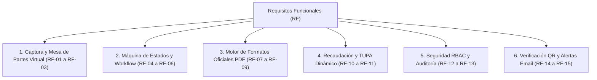
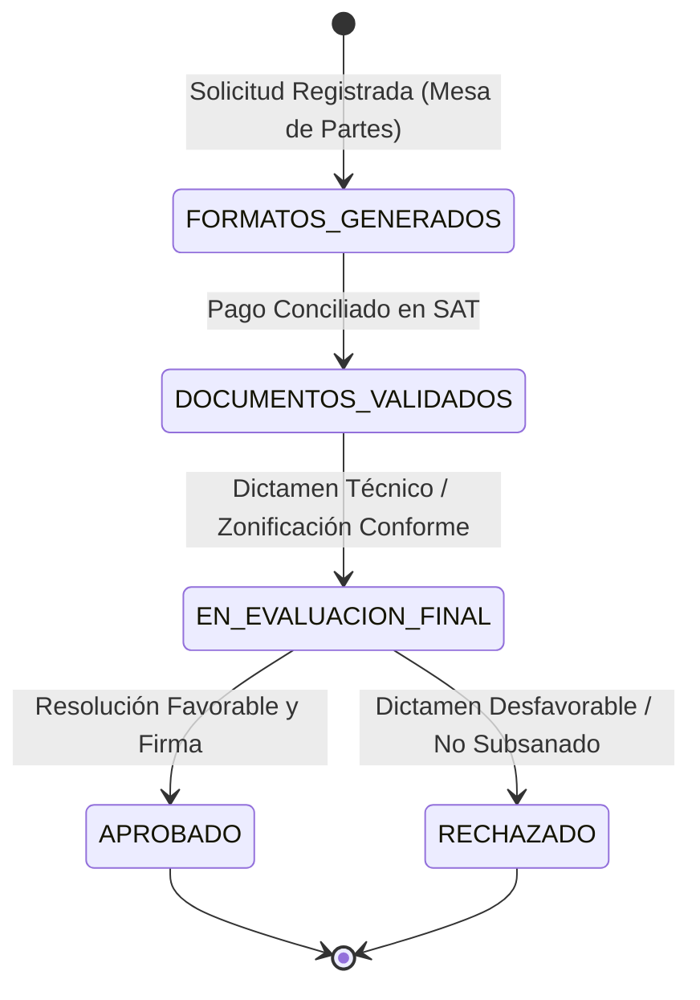

# 03. Requisitos Funcionales (RF)
## Sistema de Gestión Documentaria de Licencia de Funcionamiento
### Municipalidad Provincial de Huamanga (Ayacucho, Perú)

> **Marco Normativo:** Ley N° 28976 / TUO D.S. N° 046-2017-PCM / D.S. N° 002-2018-PCM / D.S. N° 163-2020-PCM  
> **Ubicación:** `docs/analisis-de-sistema/03-requisitos-funcionales.md`

---

## 1. Introducción y Alcance Funcional

Los **Requisitos Funcionales (RF)** definen las capacidades operativas, reglas de cálculo, transiciones de estado, servicios de entrega documental y comportamientos específicos que el sistema de software debe ejecutar obligatoriamente para satisfacer los mandatos de la **Ley Marco de Licencia de Funcionamiento (Ley N° 28976)** y los procedimientos del **TUPA de la Municipalidad Provincial de Huamanga**.

---

## 2. Clasificación General de Requisitos Funcionales

---

## 3. Catálogo Detallado de Requisitos Funcionales

### Módulo 1: Captura de Datos y Mesa de Partes Virtual

#### RF-01: Registro Multipaso de la Solicitud (Wizard 3 Pasos)
* **Descripción:** El sistema debe proveer una interfaz ciudadana asistida de tres etapas consecutivas para el registro de solicitudes de licencia de funcionamiento.
  - **Paso 1 (Datos del Administrado):** Tipo de persona (`NATURAL` o `JURIDICA`), tipo de documento (`DNI`, `RUC`, `CARNET_EXTRANJERIA`), número de documento, nombres/razón social, teléfonos, correo de notificación electrónica y domicilio fiscal. En caso de persona jurídica: datos del representante legal y número de partida electrónica en SUNARP.
  - **Paso 2 (Datos del Establecimiento y Giro):** Nombre comercial, dirección física completa (distrito, zona, avenida/jirón, número, manzana, lote), código de zonificación urbana, código CIIU principal y secundario, actividad comercial detallada, área ocupada total ($m^2$) y aforo estimado.
  - **Paso 3 (Confirmación y Declaración Jurada):** Aceptación explícita de condiciones de veracidad legal (Ley 27444), confirmación de datos y despacho del formulario.
* **Entradas:** Payload JSON conforme a `CrearExpedienteDto` (45 campos normativos).
* **Salidas:** Código correlativo de expediente `EXP-2026-XXXXX`, número de trámite correlativo, código de seguimiento seguro y código de orden de pago `VCH-2026-XXXXXX`.
* **Regla de Negocio:** No se admiten DNI con longitud distinta a 8 dígitos ni RUC con longitud distinta a 11 dígitos.

#### RF-02: Calificación Determinista del Nivel de Riesgo ITSE
* **Descripción:** El sistema debe computar y asignar automáticamente el nivel de riesgo del local conforme a la Matriz de Riesgo ITSE (D.S. N° 002-2018-PCM y lineamientos CENEPRED).
* **Entradas:** Área del establecimiento, aforo, función de la edificación (`Salud`, `Encuentro`, `Hospedaje`, `Educación`, `Industrial`, `Comercio`, `Almacén`), almacenamiento de combustibles o gas licuado (GLP), presencia de calderas.
* **Salidas:** Valor del enum `NivelRiesgo` (`BAJO`, `MEDIO`, `ALTO`, `MUY_ALTO`) y tipo de inspección aplicable (`ITSE_POSTERIOR` para Bajo/Medio; `ITSE_PREVIA` para Alto/Muy Alto).

#### RF-03: Seguimiento y Consulta Ciudadana del Trámite
* **Descripción:** El administrado debe poder consultar el estado actual de su expediente en cualquier momento ingresando su número de expediente o código de seguimiento en el portal web.
* **Salidas:** Estado actual del ciclo de vida, fecha de recepción, monto a pagar, estado del pago, observaciones técnicas (si las hubiera) y enlaces de descarga directa de los documentos generados.

---

### Módulo 2: Máquina de Estados y Workflow del Expediente

#### RF-04: Gestión Finita del Ciclo de Vida del Expediente
* **Descripción:** El sistema debe gobernar las mutaciones de estado del expediente mediante una máquina de estados finita estricta, impidiendo transiciones inválidas o saltos de fases no autorizados.
* **Diagrama de Transiciones de Estado:**

* **Matriz de Transiciones Válidas:**

| Estado Origen | Estado Destino Permitido | Condición de Negocio / Actor |
|---|---|---|
| `FORMATOS_GENERADOS` | `DOCUMENTOS_VALIDADOS` | Pago verificado en SAT (`ROLE_CAJERO` o `ROLE_ADMIN`). |
| `DOCUMENTOS_VALIDADOS` | `EN_EVALUACION_FINAL` | Zonificación aprobada y dictamen ITSE favorable (`ROLE_EVALUADOR`). |
| `EN_EVALUACION_FINAL` | `APROBADO` | Autorización emitida por Gerencia (`ROLE_ADMIN` / `ROLE_EVALUADOR`). |
| `EN_EVALUACION_FINAL` | `RECHAZADO` | Causal insubsanable o inspección ITSE desfavorable motivada. |

* **Regla de Negocio:** Si se intenta una transición prohibida (por ejemplo, de `FORMATOS_GENERADOS` directamente a `APROBADO`), el sistema debe lanzar una excepción `TransicionInvalidaException` y responder con HTTP `400 Bad Request`.

#### RF-05: Control de Plazos y Alertas de Vencimiento Legal
* **Descripción:** El sistema debe registrar la fecha límite de atención calculada automáticamente según el tipo de procedimiento legal:
  - Riesgo Bajo y Medio (Aprobación automática con ITSE Posterior): Emisión de licencia inmediata o máximo 1 día hábil.
  - Riesgo Alto y Muy Alto (Con ITSE Previa): Plazo máximo de 15 días hábiles conforme al Art. 8° de la Ley N° 28976.
* **Salidas:** Flag de advertencia de vencimiento en el Dashboard Interno para priorizar expedientes próximos al límite del silencio administrativo positivo.

#### RF-06: Gestión de Observaciones y Subsanaciones
* **Descripción:** El evaluador municipal debe poder registrar observaciones técnicas o documentales fundamentadas, otorgando al administrado un plazo de subsanación de hasta cinco (5) días hábiles conforme a la Ley N° 27444.

---

### Módulo 3: Motor de Generación de Formatos Oficiales en PDF

#### RF-07: Generación en Memoria del Anexo 1 (Declaración Jurada)
* **Descripción:** El sistema debe renderizar en memoria (sin escribir archivos en disco duro) el formulario oficial del Anexo 1 aprobado por D.S. N° 163-2020-PCM, en exactamente dos (2) páginas A4, conteniendo los 45 campos del expediente distribuidos en sus 6 secciones normativas.
* **Endpoint:** `GET /api/expedientes/{id}/documentos/anexo1-declaracion-jurada`.

#### RF-08: Generación en Memoria de Anexos ITSE (Anexo 3 y Anexo 4)
* **Descripción:** El sistema debe generar los documentos técnicos de Defensa Civil:
  - **Anexo 3 (Reporte de Nivel de Riesgo):** Documento técnico de 2 páginas con la clasificación por función de edificación, factores de riesgo y matriz CENEPRED.
  - **Anexo 4 (Declaración Jurada de Condiciones de Seguridad):** Formato ministerial de 4 páginas con la matriz completa de 23 ítems técnicos (rutas de evacuación, extintores, pozo a tierra, tablero eléctrico, luces de emergencia) prellenado para suscripción del administrado.
* **Endpoints:** 
  - `GET /api/expedientes/{id}/documentos/anexo3-matriz-riesgo-itse`
  - `GET /api/expedientes/{id}/documentos/anexo4-condiciones-seguridad`

#### RF-09: Generación del Certificado Oficial de Licencia de Funcionamiento con QR
* **Descripción:** Tras la aprobación del expediente, el sistema debe renderizar el Certificado Oficial de Licencia de Funcionamiento con las siguientes especificaciones de diseño institucional:
  - Doble borde ornamental perimetral (azul `#1A365D` y dorado `#C69214`).
  - Escudo provincial oficial de Huamanga y marca de agua de seguridad tenue.
  - Número de resolución correlativo oficial (`LIC-2026-XXXXX`).
  - Código QR de alta resolución generado mediante ZXing incrustado en el documento.
  - Bloque normativo de las seis (6) notas legales institucionales.
  - Vigencia indeterminada estipulada expresamente según el Art. 3° de la Ley N° 28976.
* **Endpoint:** `GET /api/expedientes/{id}/documentos/licencia-oficial-pdf`.

---

### Módulo 4: Recaudación Tributaria y Tarifario TUPA Dinámico

#### RF-10: Motor de Cálculo y Desglose de Tasas TUPA
* **Descripción:** Computar la tasa administrativa total desglosando los conceptos de derecho de trámite e inspección técnica según el nivel de riesgo ITSE.
* **Salidas:** Total en soles (PEN), desglose por concepto y número de cuenta de recaudación del SAT.

#### RF-11: Mantenimiento CRUD en Caliente del Tarifario TUPA
* **Descripción:** El sistema debe permitir a los usuarios con rol `ROLE_ADMIN` listar y modificar en tiempo real los montos de las tasas TUPA en la base de datos sin requerir recompilación ni reinicio del servicio backend.
* **Endpoints:**
  - `GET /api/tupa/tarifas` (Público/Interno para consulta de catálogo).
  - `PUT /api/tupa/tarifas/{id}` (Protegido con `@PreAuthorize("hasRole('ADMIN')")`).

---

### Módulo 5: Seguridad, Control de Acceso (RBAC) y Auditoría

#### RF-12: Autenticación Stateless con Tokens JWT y Roles RBAC
* **Descripción:** El sistema debe proteger las operaciones del personal municipal mediante tokens criptográficos JWT (HMAC-SHA256).
* **Roles del Sistema:**
  - `ROLE_ADMIN`: Acceso irrestricto, configuración TUPA, auditoría total.
  - `ROLE_EVALUADOR`: Evaluación técnica, registro ITSE, aprobación y rechazo de licencias.
  - `ROLE_CAJERO`: Registro y conciliación de vouchers de pago SAT.
* **Endpoints de Seguridad:**
  - `POST /api/auth/login` (Recepción de credenciales, validación BCrypt y retorno de Bearer Token).
  - `GET /api/auth/me` (Datos y roles del usuario en sesión).

#### RF-13: Registro Inmutable de Auditoría
* **Descripción:** Toda transición de estado del expediente debe quedar registrada en la tabla `auditoria_expedientes` con sellado de tiempo UTC, usuario responsable, dirección IP de origen, estado previo, estado nuevo y motivación técnica.

---

### Módulo 6: Verificación Pública y Notificaciones Asíncronas

#### RF-14: Verificación Pública de Licencias mediante Escaneo QR (RNF-20)
* **Descripción:** El sistema debe exponer un endpoint de alta velocidad y libre acceso que retorne la información pública de una licencia a partir del código QR escaneado.
* **Endpoint:** `GET /api/public/licencias/{codigoQr}`.
* **Respuesta JSON:** Número de licencia, número de expediente, titular/razón social, RUC/DNI, nombre comercial, dirección del establecimiento, giro autorizado, nivel de riesgo, estado de vigencia y fecha de expedición.

#### RF-15: Notificaciones Asíncronas por Correo Electrónico
* **Descripción:** El sistema debe despachar alertas automáticas por correo electrónico mediante un pool de hilos independiente (`@Async`) ante eventos clave:
  1. **Confirmación de Registro:** Notificación de ingreso con número de expediente y voucher adjunto.
  2. **Notificación de Aprobación:** Mensaje formal de felicitación con el **Certificado Oficial de Licencia adjunto en PDF**.
  3. **Notificación de Rechazo u Observación:** Detalle motivado de las observaciones técnicas para su subsanación.

---

## 4. Matriz de los 45 Atributos Normativos Digitalizados

| Sección del Formato Anexo 1 | Atributos Digitalizados en la Entidad `Expediente` |
|---|---|
| **I. Identificación General** | `numeroExpediente`, `numeroTramite`, `codigoSeguimiento`, `fechaRecepcion`, `estadoActual`, `modalidadTramite` |
| **II. Datos del Solicitante** | `tipoPersona`, `tipoDocumento`, `numeroDocumento`, `nombresRazonSocial`, `telefono`, `correoElectronico`, `domicilioFiscal` |
| **III. Representante Legal** | `dniRepresentante`, `nombresRepresentante`, `partidaElectronicaSunarp`, `asientoInscripcionSunarp` |
| **IV. Establecimiento y Local** | `nombreComercial`, `direccionEstablecimiento`, `distrito`, `zonaUrbana`, `manzana`, `lote`, `numeroPuerta`, `codigoZonificacion`, `croquisReferencial` |
| **V. Actividad Económica** | `giroComercial`, `codigoCiiuPrincipal`, `codigoCiiuSecundario`, `descripcionActividad`, `areaOcupadaM2`, `aforoTotal` |
| **VI. ITSE y Seguridad** | `nivelRiesgo`, `funcionEdificacion`, `tipoInspeccionItse`, `almacenaMaterialInflamable`, `capacidadGlpGalones`, `cuentaConCaldera` |
| **VII. Liquidación y Pago** | `costoTramite`, `desgloseTasa`, `codigoVoucher`, `fechaPago`, `numeroOperacionSat`, `canalPago` |
| **VIII. Licencia y Emisión** | `numeroLicencia`, `fechaEmisionLicencia`, `licenciaQrCode`, `codigoQrContenido`, `vigenciaIndeterminada` |

---

## 5. Conclusión

Los Requisitos Funcionales documentados garantizan que el sistema responda con exactitud matemática, técnica y jurídica a cada una de las disposiciones de la Ley N° 28976, eliminando la discrecionalidad administrativa y ofreciendo un servicio ágil y transparente a la ciudadanía de Huamanga.
