# 04. Atributos de Calidad (Requisitos No Funcionales)
## Sistema de Gestión Documentaria de Licencia de Funcionamiento
### Municipalidad Provincial de Huamanga (Ayacucho, Perú)

> **Estándar de Calidad:** ISO/IEC 25010 (System and Software Quality Models)  
> **Metodología de Escenarios:** Software Engineering Institute (SEI / ATAM)  
> **Ubicación:** `docs/analisis-de-sistema/04-atributos-de-calidad.md`

---

## 1. Introducción

Los **Atributos de Calidad** (o Requisitos No Funcionales - RNF) establecen los criterios objetivos con los cuales se juzga la operación, robustez, eficiencia y elegancia del sistema, más allá de sus funciones específicas.

Para el Sistema de Licencias de Funcionamiento de la Municipalidad Provincial de Huamanga, los atributos de calidad han sido categorizados bajo el estándar internacional **ISO/IEC 25010**, priorizando el rendimiento, la seguridad, la mantenibilidad y la fiabilidad.

```mermaid
graph TD
    ISO["ISO/IEC 25010: Modelo de Calidad del Sistema"]
    ISO --> PE["1. Eficiencia de Desempeño (Performance)"]
    ISO --> SE["2. Seguridad (Security)"]
    ISO --> MA["3. Mantenibilidad (Maintainability)"]
    ISO --> RE["4. Fiabilidad (Reliability)"]
    ISO --> US["5. Usabilidad (Usability)"]
    ISO --> OP["6. Portabilidad y Operabilidad (Portability)"]

    PE --> PE1["Latencia P95 ≤ 200 ms en Verificación QR"]
    PE --> PE2["Concurrencia ≥ 150 transacciones simultáneas"]
    PE --> PE3["Renderizado PDF en memoria ≤ 500 ms"]

    SE --> SE1["JWT Stateless HMAC-SHA256"]
    SE --> SE2["RBAC en APIs internas con Spring Security 6"]
    SE --> SE3["Contraseñas con BCrypt"]
    SE --> SE4["Auditoría inmutable"]

    MA --> MA1["Clean Architecture + Bounded Contexts"]
    MA --> MA2["TUPA Dinámico en caliente (sin redeploy)"]
    MA --> MA3["Batería de 80 tests automatizados"]

    RE --> RE1["Transacciones locales ACID en PostgreSQL"]
    RE --> RE2["Fallback resiliente de tasas a YAML"]

    US --> US1["Wizard 3 pasos intuitivo"]
    US --> US2["Mesa de ayuda contextual"]

    OP --> OP1["Despliegue en 1 solo JAR / Docker Compose"]
```

---

## 2. Catálogo de Atributos de Calidad según ISO/IEC 25010

### 2.1. Eficiencia de Desempeño (Performance Efficiency)

* **RNF-01 (Latencia del Endpoint de Verificación QR - RNF-20):**
  - *Métrica:* El endpoint público `GET /api/public/licencias/{codigoQr}` debe procesar la consulta y responder en un percentil $P_{95} \le 200\text{ ms}$ bajo condiciones normales y de carga moderada.
  - *Justificación:* Los fiscalizadores municipales y la PNP escanean códigos QR en la vía pública con conectividad móvil variable; una respuesta inmediata previene cuellos de botella en los operativos.
* **RNF-02 (Capacidad de Concurrencia Simultánea):**
  - *Métrica:* El backend debe soportar un mínimo de **150 transacciones o usuarios concurrentes** sostenidos sin degradación del servicio, sin incremento exponencial de la latencia ni bloqueos muertos (*deadlocks*) en la base de datos.
  - *Validación:* Verificado mediante la prueba automatizada `Concurrencia150UsuariosTest` utilizando un pool de conexiones optimizado con HikariCP.
* **RNF-03 (Velocidad de Renderizado Documental PDF):**
  - *Métrica:* La generación en memoria de cualquier formato oficial (Anexo 1, 3, 4 o Licencia Oficial) debe completarse en menos de $500\text{ ms}$ por documento mediante OpenPDF 2.0.3, evitando lecturas o escrituras intermedias en disco.

---

### 2.2. Seguridad (Security)

* **RNF-04 (Autenticación Criptográfica Stateless):**
  - *Métrica:* La autenticación de funcionarios municipales debe implementarse mediante JSON Web Tokens (JWT) firmados con algoritmo criptográfico **HMAC-SHA256**, con expiración configurable (24 horas) y sin almacenamiento de sesiones en memoria del servidor (Stateless).
* **RNF-05 (Control de Acceso Basado en Roles - RBAC):**
  - *Métrica:* Spring Security 6 debe interceptar y validar los privilegios en cada endpoint de mutación:
    - Registro de pagos SAT restringido a `ROLE_CAJERO` y `ROLE_ADMIN`.
    - Dictámenes técnicos y resoluciones restringidos a `ROLE_EVALUADOR` y `ROLE_ADMIN`.
    - Mantenimiento del tarifario restringido exclusivamente a `ROLE_ADMIN`.
* **RNF-06 (Protección de Credenciales):**
  - *Métrica:* Ninguna contraseña debe almacenarse en texto plano. Todas las credenciales deben procesarse con el algoritmo de derivación de claves **BCrypt** con un factor de costo no menor a 10.
* **RNF-07 (Minimización de Datos en Endpoints Públicos):**
  - *Métrica:* El endpoint público de verificación no debe exponer datos personales sensibles protegidos por la Ley N° 29733 (Ley de Protección de Datos Personales), tales como correo electrónico personal, teléfonos privados o montos desglosados de tasas pagadas.
* **RNF-08 (Inmutabilidad de la Auditoría):**
  - *Métrica:* Cada mutación en el ciclo de vida del expediente debe registrarse en la tabla `auditoria_expedientes` con fecha y hora, IP de origen, usuario y motivo técnico. Dicha tabla solo permite operaciones de inserción (`INSERT`), prohibiendo actualizaciones (`UPDATE`) o eliminaciones (`DELETE`).

---

### 2.3. Mantenibilidad (Maintainability)

* **RNF-09 (Modularidad y Bajo Acoplamiento):**
  - *Métrica:* El código debe estar organizado en Bounded Contexts independientes (`expedientes`, `documentos`, `tupa`, `verificacion`, `integracion`, `seguridad`) respetando la regla de dependencias unidireccionales de Clean Architecture.
* **RNF-10 (Modificabilidad en Caliente del Tarifario TUPA - RNF-17):**
  - *Métrica:* La actualización de las tasas administrativas del TUPA ante una nueva ordenanza municipal debe realizarse mediante API REST en caliente (`PUT /api/tupa/tarifas/{id}`) sin exigir nuevo despliegue ni reinicio de servicios.
* **RNF-11 (Testeabilidad y Cobertura Automatizada):**
  - *Métrica:* El repositorio debe mantener una suite automatizada de pruebas con **80 tests en verde** que cubran pruebas unitarias de dominio, pruebas de integración MockMvc, seguridad JWT, generación documental y concurrencia.

---

### 2.4. Fiabilidad (Reliability)

* **RNF-12 (Integridad Transaccional ACID):**
  - *Métrica:* Toda operación que muta el estado de un expediente, calcula tarifas o actualiza la auditoría debe ejecutarse bajo una transacción atómica relacional gestionada por Spring Data JPA y PostgreSQL 15, garantizando que ante cualquier error se realice un rollback completo.
* **RNF-13 (Resiliencia y Tolerancia a Fallos por Fallback):**
  - *Métrica:* La `CalculadoraDeTasa` debe incluir un mecanismo de contingencia automática que, en caso de fallo temporal de la base de datos de tarifas, recurra a los valores predeterminados cargados en el archivo `application.yml`, evitando la detención de la mesa de partes.
* **RNF-14 (Disponibilidad Operativa):**
  - *Métrica:* El sistema debe asegurar una disponibilidad mínima del **99.5%** durante los días y horarios hábiles de atención al público.

---

### 2.5. Usabilidad (Usability)

* **RNF-15 (Facilidad de Uso en la Mesa de Partes Virtual):**
  - *Métrica:* El registro de solicitud debe estructurarse en un Wizard de 3 pasos con validación sintáctica en tiempo real en el navegador, reduciendo los errores de tipeo y la tasa de abandono en más de un 50%.
* **RNF-16 (Asistencia Contextual - Mesa de Ayuda):**
  - *Métrica:* Cada pantalla de descarga de formatos debe incluir botones de ayuda interactiva (`💡 Mesa de Ayuda`) con instrucciones claras sobre la suscripción física de los Anexos 3 y 4 y su presentación presencial en Defensa Civil.

---

### 2.6. Portabilidad y Operabilidad (Portability & Operability)

* **RNF-17 (Despliegue Autónomo y Contenedorizado):**
  - *Métrica:* El sistema debe poder desplegarse como un único contenedor Docker o ejecutarse de forma autónoma con el comando `java -jar servicio-expedientes.jar` en cualquier entorno compatible con Java 21 LTS (Linux o Windows Server) sin dependencias nativas de terceros.

---

## 3. Escenarios de Atributos de Calidad (Formato SEI / ATAM)

A continuación, se documentan los escenarios formales según la metodología del Software Engineering Institute:

### Escenario 1: Latencia en Verificación Pública de Licencia (Eficiencia de Desempeño)
* **Fuente del Estímulo:** Fiscalizador Municipal desde teléfono móvil o ciudadano general.
* **Estímulo:** Escaneo del código QR que realiza una solicitud `GET /api/public/licencias/{codigoQr}`.
* **Entorno:** Operación normal en horario laboral, con 100 usuarios activos concurrentes.
* **Artefacto Afectado:** `PublicLicenciasController`, `ExpedienteRepository`.
* **Respuesta del Sistema:** El sistema busca el expediente por código QR o número de licencia y retorna el payload JSON con los datos autorizados.
* **Medida de Respuesta:** La respuesta completa se emite en un tiempo inferior a **200 ms** en el percentil 95 ($P_{95}$).

### Escenario 2: Protección de Operación Financiera (Seguridad)
* **Fuente del Estímulo:** Usuario malicioso o usuario no autorizado con rol `ROLE_EVALUADOR`.
* **Estímulo:** Envío de una petición `PUT /api/expedientes/{id}/pago` intentando marcar un expediente como pagado sin comprobante.
* **Entorno:** Sistema en producción con seguridad activa.
* **Artefacto Afectado:** `JwtAuthenticationFilter`, `SecurityConfig`, `ExpedienteController`.
* **Respuesta del Sistema:** Spring Security intercepta el Bearer Token, comprueba que el usuario carece de la autoridad `ROLE_CAJERO` o `ROLE_ADMIN` y aborta la petición.
* **Medida de Respuesta:** Se retorna inmediatamente un código HTTP `403 Forbidden` en formato JSON RFC-7807 sin alterar el estado del expediente.

### Escenario 3: Actualización de Tasas Municipales en Caliente (Mantenibilidad)
* **Fuente del Estímulo:** Administrador de TI Municipal (`ROLE_ADMIN`).
* **Estímulo:** Publicación de una nueva Ordenanza Municipal que actualiza la tasa de Riesgo Medio a S/. 225.00.
* **Entorno:** Sistema en producción atendiendo trámites simultáneamente.
* **Artefacto Afectado:** `TarifaTupaController`, `TarifaTupaService`, `TarifaTupaRepository`.
* **Respuesta del Sistema:** Se envía `PUT /api/tupa/tarifas/{id}`, se actualiza el registro en base de datos y la `CalculadoraDeTasa` refleja el nuevo valor en la siguiente solicitud.
* **Medida de Respuesta:** Tiempo de actualización inferior a **1 segundo**, con **0 segundos de indisponibilidad** y sin reinicio de servidores.

### Escenario 4: Alta Demanda Simultánea (Concurrencia y Fiabilidad)
* **Fuente del Estímulo:** 150 usuarios interactuando simultáneamente (registros, consultas, pagos y descargas de PDF).
* **Estímulo:** 150 hilos ejecutando transacciones concurrentes en un intervalo de 5 segundos.
* **Entorno:** Servidor backend bajo carga intensiva.
* **Artefacto Afectado:** Pool HikariCP, `ExpedienteService`, PostgreSQL 15.
* **Respuesta del Sistema:** El gestor de conexiones atiende todas las peticiones dentro de los límites de timeout sin lanzar excepciones de conexión ni provocar bloqueos muertos en base de datos.
* **Medida de Respuesta:** 100% de transacciones procesadas con éxito (0 transacciones fallidas) y tiempo medio de respuesta menor a 800 ms.

---

## 4. Conclusión

El estricto cumplimiento de los **Atributos de Calidad ISO/IEC 25010** confiere a la plataforma de la Municipalidad Provincial de Huamanga una arquitectura elástica, segura, auditable y mantenible en el tiempo, respaldada por métricas verificables y pruebas automatizadas continuas.
