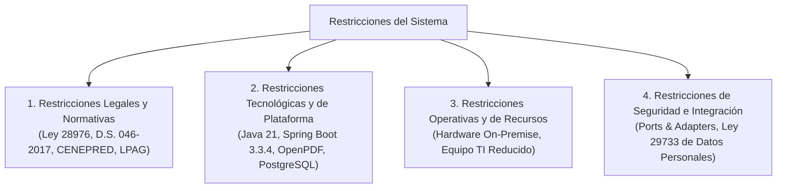

# 05. Restricciones del Sistema
## Sistema de Gestión Documentaria de Licencia de Funcionamiento
### Municipalidad Provincial de Huamanga (Ayacucho, Perú)

> **Marco Normativo:** Ley N° 28976 / TUO D.S. N° 046-2017-PCM / D.S. N° 002-2018-PCM / Ley N° 27444  
> **Ubicación:** `docs/analisis-de-sistema/05-restricciones.md`

---

## 1. Introducción

Las **Restricciones** representan las limitaciones no negociables impuestas al diseño, desarrollo, implementación y operación del software. A diferencia de los requisitos funcionales o atributos de calidad (que pueden ajustarse o priorizarse), las restricciones actúan como fronteras rígidas dictadas por el marco legal peruano, los estándares de interoperabilidad del Estado, las capacidades de infraestructura de la Municipalidad Provincial de Huamanga y los recursos operativos disponibles.

---

## 2. Restricciones Legales y Normativas

### 2.1. Cumplimiento Estricto del TUO de la Ley Marco de Licencias (Ley N° 28976 / D.S. N° 046-2017-PCM)
- **Vigencia Indeterminada Obligatoria:** De conformidad con el Artículo 3° de la Ley N° 28976, toda licencia de funcionamiento emitida con carácter definitivo tiene **vigencia indeterminada**. Queda expresamente prohibido que el software introduzca mecanismos de caducidad anual o fechas de vencimiento forzadas para licencias estándar. En el certificado impreso, el campo "VENCE" debe figurar taxativamente como `**/**/****`.
- **Plazos Máximos de Resolución:**
  - Para establecimientos clasificados con nivel de riesgo **Bajo** o **Medio**: La licencia se otorga en el mismo día o de forma inmediata (con ITSE posterior), sin exceder 1 día hábil.
  - Para establecimientos clasificados con nivel de riesgo **Alto** o **Muy Alto**: El plazo máximo improrrogable para emitir la resolución y licencia es de **hasta quince (15) días hábiles** (Art. 8° Ley 28976). El sistema debe alertar antes de alcanzar dicho plazo.
- **Inalterabilidad de Formatos Oficiales:** El diseño y contenido de los Anexos 1, 3 y 4 en PDF no pueden alterarse arbitrariamente. Deben replicar al 100% la estructura aprobada por los decretos ministeriales (D.S. N° 163-2020-PCM y D.S. N° 002-2018-PCM).

### 2.2. Restricción del Procedimiento de Inspección Física (Defensa Civil - CENEPRED)
- **Suscripción Manuscrita y Presentación Física de Anexos 3 y 4:**
  - Aunque el sistema digitaliza el 100% de la captura de datos y renderiza los formatos en PDF, la normativa nacional de Inspecciones Técnicas de Seguridad en Edificaciones (D.S. N° 002-2018-PCM) exige que el administrado imprima físicamente los **Anexos 3 y 4**, los suscriba de puño y letra (adjuntando firma de profesional colegiado donde corresponda) y los presente presencialmente en la ventanilla de la **Subgerencia de Gestión del Riesgo de Desastres (Defensa Civil)** para la ejecución de la inspección técnica ocular en el local comercial.
  - El sistema no puede asumir una aprobación 100% digitalizada del dictamen de seguridad hasta que el inspector CENEPRED registre formalmente el resultado de dicha inspección presencial en el portal interno.

### 2.3. Ley del Procedimiento Administrativo General (Ley N° 27444)
- **Presunción de Veracidad (Art. IV):** La información declarada por el ciudadano en el formulario se asume verídica sujeta a fiscalización posterior.
- **Plazo de Subsanación Obligatorio:** En caso de observaciones documentales o técnicas, el sistema debe otorgar un plazo legal no menor a **cinco (5) días hábiles** antes de declarar la improcedencia o rechazo del trámite.
- **Notificación Electrónica Válida (Art. 20.4):** Las notificaciones por correo electrónico enviadas por el sistema tienen valor legal siempre que se deje constancia en la auditoría del acuse de despacho técnico.

---

## 3. Restricciones Tecnológicas y de Plataforma

### 3.1. Ecosistema de Desarrollo y Lenguaje
- **Runtime:** Exclusivamente **Java 21 LTS (Long-Term Support)**. No se permite el uso de versiones obsoletas (Java 8 o 11) ni versiones no LTS intermedias.
- **Framework Base:** **Spring Boot 3.3.4** sobre Spring Framework 6.x y Spring Data JPA con Hibernate 6.x.
- **Gestor de Construcción:** **Apache Maven** multi-módulo (`muni-licencias-parent`), asegurando la compilación unificada de `common-domain` y `servicio-expedientes`.

### 3.2. Restricciones de Generación Documental y Gráfica
- **Librería de Renderizado PDF:** Uso estricto de **OpenPDF 2.0.3** (software libre con licencia LGPL/MPL). Queda prohibido el uso de herramientas dependientes de binarios nativos del sistema operativo (tales como `wkhtmltopdf` o `PhantomJS`), garantizando la total portabilidad entre Windows y Linux.
- **Generación de Códigos QR y Barras:** Uso estricto de **ZXing 3.5.3** procesado enteramente en memoria volátil de la JVM (`BufferedImage` / `ByteArrayOutputStream`), sin escritura de archivos temporales en el disco del servidor.

### 3.3. Restricciones de Base de Datos y Persistencia
- **Motor Relacional:** **PostgreSQL 15** para entornos de producción y contenedores Docker; y base de datos **H2** en memoria exclusivamente para ejecución de pruebas automatizadas durante la fase de integración continua (`mvn test`).
- **Garantía Transaccional:** Prohibición de esquemas de consistencia eventual en el flujo transaccional principal del expediente. Toda mutación debe ejecutarse bajo transacciones locales ACID.

### 3.4. Restricción de Arquitectura Distribuida
- **Prohibición de Microservicios Dispersos:** Para este proyecto está vetada la fragmentación prematura en múltiples microservicios independientes que requieran orquestadores de red (Kubernetes, Consul, Eureka, API Gateways externos). El sistema debe operar bajo el estilo **Monolito Modular** en un único proceso ejecutable.

---

## 4. Restricciones Operativas y de Infraestructura Municipal

### 4.1. Hardware y Servidores On-Premise
- El sistema debe ser capaz de operar eficientemente en un servidor local municipal con recursos moderados:
  - **Memoria RAM disponible:** 4 GB a 8 GB totales en el servidor (el proceso JVM del backend no debe exceder los 1024 MB de Heap asignado).
  - **CPU:** 2 a 4 núcleos virtuales.
  - **Almacenamiento:** Mínimo consumo de espacio en disco gracias a la renderización dinámica en memoria de documentos PDF.

### 4.2. Equipo de TI Municipal Reducido
- La solución debe presentar **cero sobrecarga operativa de despliegue**:
  - Un único comando para iniciar el sistema: `java -jar servicio-expedientes.jar` o `docker compose up -d`.
  - Sin necesidad de configurar mallas de servicios (*service meshes*) ni brokers de mensajería externos complejos (Kafka o RabbitMQ) para el flujo básico.

### 4.3. Conectividad y Resiliencia con Entidades Externas
- Dada la inestabilidad ocasional de la conectividad entre sedes municipales dispersas (Palacio Municipal en Plaza Mayor, local del SAT en Jr. Arequipa y Defensa Civil en el terminal terrestre):
  - Todas las integraciones deben pasar por **Puertos y Adaptadores (Clean Architecture)** con capacidad de operar en modo simulación/stub o contingencia si la red interinstitucional se interrumpe.
  - El Tarifario TUPA debe contar con fallback automático a archivo de configuración YAML si la base de datos de tarifas no responde.

---

## 5. Restricciones de Seguridad y Protección de Datos

- **Ley N° 29733 (Ley de Protección de Datos Personales):**
  - El endpoint público de verificación por código QR (`/api/public/licencias/{id}`) no debe revelar información confidencial del ciudadano (domicilio personal privado, correo electrónico o teléfono celular), exponiendo únicamente los datos inherentes a la autorización comercial pública.
- **Seguridad en Reposo y en Tránsito:**
  - Todas las contraseñas deben cifrarse con **BCrypt**.
  - Los tokens de sesión administrativa deben firmarse criptográficamente con **HMAC-SHA256 (JJWT 0.12.6)** con una clave secreta institucional de longitud no menor a 256 bits.

---

## 6. Conclusión

Las restricciones expuestas definen el marco de viabilidad legal y técnica del proyecto. El diseño del **Monolito Modular con Clean Architecture** fue seleccionado precisamente porque cumple a cabalidad con cada una de estas limitaciones legales, de hardware y de operatividad institucional.
