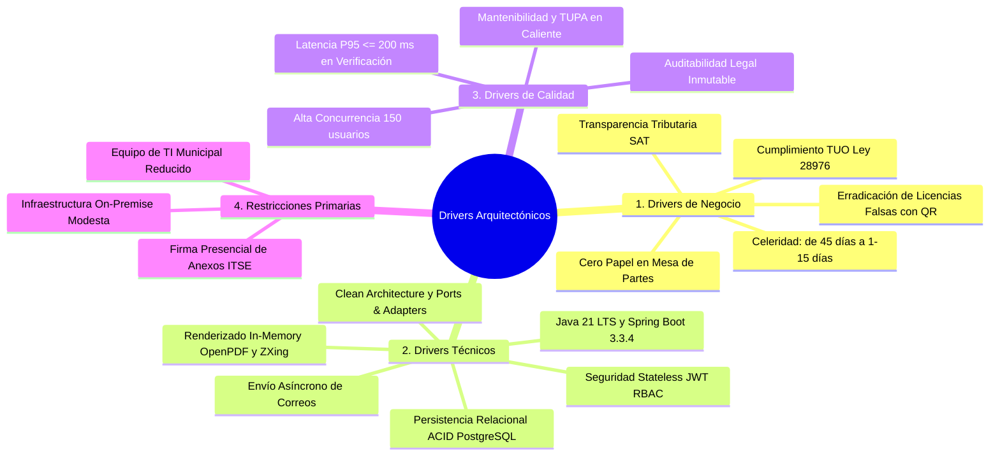

# 06. Drivers Arquitectónicos (Architectural Drivers)
## Sistema de Gestión Documentaria de Licencia de Funcionamiento
### Municipalidad Provincial de Huamanga (Ayacucho, Perú)

> **Marco Metodológico:** ADD (Attribute-Driven Design - SEI) / ISO/IEC 25010  
> **Ubicación:** `docs/analisis-de-sistema/06-driver-arquitectonicos.md`

---

## 1. Introducción y Concepto

Los **Drivers Arquitectónicos** (o Fuerzas Arquitectónicas) son los factores clave que condicionan, moldean y justifican las decisiones de diseño estructural del sistema de software. 

Un driver arquitectónico no es simplemente un requisito más; es un requisito funcional, atributo de calidad, objetivo de negocio o restricción técnica que tiene un **impacto desproporcionado en la arquitectura**, de modo que cambiarlo obligaría a rediseñar componentes estructurales del sistema.

En el Sistema de Licencias de la Municipalidad Provincial de Huamanga, los drivers arquitectónicos se estructuran en cuatro dimensiones interconectadas:



---

## 2. Clasificación Exhaustiva de Drivers Arquitectónicos

### 2.1. Drivers de Negocio (Business Drivers)

| ID | Driver de Negocio | Descripción y Motivación | Impacto en la Arquitectura |
|---|---|---|---|
| **DB-01** | **Cumplimiento Vinculante de la Ley N° 28976 y D.S. N° 046-2017-PCM** | La municipalidad debe emitir licencias estandarizadas a nivel nacional con vigencia indeterminada y bajo plazos no negociables. | Modela el ciclo de vida del expediente mediante una máquina de estados finita que hace cumplir los plazos máximos por ley (1 a 15 días hábiles). |
| **DB-02** | **Cero Papel y Digitalización Ciudadana** | Sustituir las colas físicas en mesa de partes por una experiencia virtual accesible desde cualquier dispositivo. | Diseño de un Wizard ciudadano de 3 pasos y renderizado automático de los formatos PDF oficiales prellenados. |
| **DB-03** | **Erradicación de Falsificaciones de Licencias** | En la provincia de Huamanga existía un alto índice de licencias apócrifas o adulteradas en locales de alto riesgo. | Incorporación obligatoria de código QR de alta resolución con validación pública en tiempo real (`GET /api/public/licencias/{id}`). |
| **DB-04** | **Transparencia Tributaria y Liquidación SAT** | Asegurar que ningún expediente avance a la fase de inspección o emisión sin haber conciliado el pago exacto de la tasa TUPA. | Integración desacoplada con el SAT mediante el puerto `SatPort` y transición automática condicionada al pago. |

---

### 2.2. Drivers Técnicos (Technical Drivers)

| ID | Driver Técnico | Justificación Técnica | Decisión Arquitectónica Asociada |
|---|---|---|---|
| **DT-01** | **Ecosistema Java 21 LTS y Spring Boot 3.3.4** | Soporte de largo plazo, rendimiento mejorado de la máquina virtual (JVM), Virtual Threads preparados y librerías empresariales estables. | Estandarización de todo el backend sobre Java 21 y Spring Boot 3.3.4 empaquetado con Maven multi-módulo. |
| **DT-02** | **Desacoplamiento mediante Clean Architecture y Hexagonal** | Las reglas del negocio municipal no deben depender de librerías externas ni de sistemas de otras gerencias (SAT, Defensa Civil). | Separación estricta en 4 capas concéntricas con regla de dependencias unidireccionales y puertos de salida (`*Port`). |
| **DT-03** | **Renderizado Documental In-Memory sin I/O en Disco** | Guardar archivos temporales en disco generaría cuellos de botella de I/O, fragmentación y riesgos de seguridad. | Uso de OpenPDF 2.0.3 y ZXing trabajando enteramente con streams de bytes en memoria volátil de la JVM. |
| **DT-04** | **Transaccionalidad ACID en PostgreSQL 15** | El expediente y sus tablas anexas (pagos, tasas y auditoría) deben mantener consistencia absoluta en todo momento. | Persistencia relacional con Spring Data JPA y transacciones locales relacionales (`@Transactional`). |
| **DT-05** | **Seguridad Stateless mediante JJWT y Spring Security 6** | Evitar almacenamiento de sesiones en memoria del servidor para facilitar escalabilidad y consumo por clientes heterogéneos. | Autenticación basada en Bearer Tokens JWT firmados con HMAC-SHA256 y roles RBAC estrictos. |

---

### 2.3. Drivers de Calidad (Quality Attribute Drivers - ISO/IEC 25010)

| ID | Atributo de Calidad | Meta / Medida Cuantitativa | Decisión Arquitectónica Asociada |
|---|---|---|---|
| **DQ-01** | **Eficiencia de Desempeño (Latencia QR)** | $P_{95} \le 200\text{ ms}$ en la consulta pública de autenticidad. | Endpoint público optimizado de solo lectura con consulta indexada por código QR o número de licencia. |
| **DQ-02** | **Concurrencia Simultánea** | Soportar $\ge 150$ peticiones simultáneas sin bloqueos ni caídas. | Configuración afinada del pool de conexiones HikariCP y eliminación de saltos de red interservicios (Monolito Modular). |
| **DQ-03** | **Mantenibilidad y Modificabilidad (TUPA en Caliente)** | Actualizar tarifas municipales en menos de 1 segundo sin reiniciar el backend. | Entidad `TarifaTupa` con CRUD REST (`PUT /api/tupa/tarifas/{id}`) y fallback de seguridad en `application.yml`. |
| **DQ-04** | **Auditabilidad Legal Inmutable** | Registro del 100% de las mutaciones de estado con timestamp, IP y usuario. | Tabla `auditoria_expedientes` con política exclusiva de inserción gobernada por `AuditoriaService`. |

---

### 2.4. Restricciones y Supuestos Operativos (Constraints)

| ID | Restricción / Supuesto | Realidad Operativa Municipal | Impacto en el Diseño |
|---|---|---|---|
| **CO-01** | **Infraestructura de Servidores Modesta** | La municipalidad dispone de servidores on-premise con recursos moderados (4 a 8 GB RAM totales). | Descarte de arquitecturas pesadas de múltiples microservicios; adopción de **Monolito Modular** en un solo proceso JVM (< 500 MB RAM). |
| **CO-02** | **Equipo de TI Municipal Reducido** | El equipo de sistemas de la municipalidad es compacto y no cuenta con especialistas dedicados en orquestación de Kubernetes. | Despliegue en un único archivo ejecutable (`servicio-expedientes.jar`) con scripts Docker Compose simples. |
| **CO-03** | **Firma y Revisión Presencial de Anexos ITSE** | Exigencia legal de presentar físicamente los Anexos 3 y 4 suscritos ante Defensa Civil para inspección ocular. | Generación digital inmediata para descarga e impresión, acompañada de un módulo de "Mesa de Ayuda" instructivo en el portal web. |

---

## 3. Matriz de Impacto de Drivers sobre Decisiones Arquitectónicas

La siguiente matriz cruza los principales drivers con las decisiones técnicas adoptadas en la arquitectura:

```text
┌────────────────────────────────────────┬─────────────────────────────────────────────────────────────┐
│ DRIVER ARQUITECTÓNICO                  │ DECISIÓN ARQUITECTÓNICA RESULTANTE                          │
├────────────────────────────────────────┼─────────────────────────────────────────────────────────────┤
│ CO-01 (Hardware Modesto) +             │ Adopción de MONOLITO MODULAR en lugar de microservicios     │
│ DQ-01 (Latencia < 200 ms)              │ dispersos, eliminando la sobrecarga de red y procesos JVM.   │
├────────────────────────────────────────┼─────────────────────────────────────────────────────────────┤
│ DT-02 (Desacoplamiento) +              │ Implementación de CLEAN ARCHITECTURE y PUERTOS HEXAGONALES   │
│ DB-04 (Interoperabilidad SAT/DC)       │ (SatPort, DefensaCivilPort, EdificacionesPort).             │
├────────────────────────────────────────┼─────────────────────────────────────────────────────────────┤
│ DT-03 (Generación rápida de PDFs) +    │ Renderizado in-memory con OpenPDF y ZXing QR, sin persistir │
│ DB-02 (Cero Papel)                     │ archivos en disco ni depender de utilitarios nativos del SO.│
├────────────────────────────────────────┼─────────────────────────────────────────────────────────────┤
│ DQ-03 (Mantenibilidad TUPA) +          │ Servicio de TARIFARIO DINÁMICO en base de datos con         │
│ DB-01 (Cumplimiento de Tasas)          │ endpoints protegidos y fallback a archivo YAML.             │
├────────────────────────────────────────┼─────────────────────────────────────────────────────────────┤
│ DT-05 (Seguridad Stateless) +          │ SPRING SECURITY 6 con JJWT y RBAC estricto                  │
│ DQ-04 (Auditabilidad Inmutable)        │ (ROLE_ADMIN, ROLE_EVALUADOR, ROLE_CAJERO) + AuditoriaService│
└────────────────────────────────────────┴─────────────────────────────────────────────────────────────┘
```

---

## 4. Conclusión

Los **Drivers Arquitectónicos** han sido el hilo conductor para definir una arquitectura sólida, pragmática y plenamente ajustada a la realidad de la Municipalidad Provincial de Huamanga. Gracias a ellos, el sistema no solo cumple con las exigencias del marco legal, sino que optimiza el consumo de recursos de infraestructura y garantiza un rendimiento sobresaliente para el administrado.
