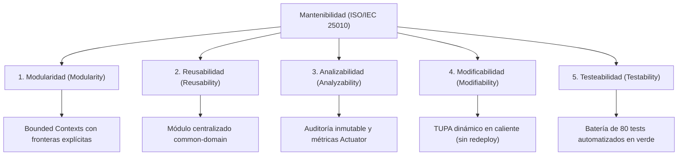

# 07. Mantenibilidad del Sistema
## Sistema de Gestión Documentaria de Licencia de Funcionamiento
### Municipalidad Provincial de Huamanga (Ayacucho, Perú)

> **Estándar de Referencia:** ISO/IEC 25010 — Subcaracterísticas de Mantenibilidad  
> **Principios de Diseño:** SOLID, Clean Architecture, Ports & Adapters, Modular Monolith  
> **Ubicación:** `docs/analisis-de-sistema/07-Mantenibilidad.md`

---

## 1. Introducción y Relevancia Institucional

La **Mantenibilidad** es la capacidad del software para ser modificado con eficacia y eficiencia ante cambios normativos, correcciones de errores, adaptaciones operativas y evolución funcional en el tiempo.

Para la Municipalidad Provincial de Huamanga, donde las ordenanzas municipales, las directivas de PCM y los costos del TUPA cambian periódicamente, la mantenibilidad es un atributo de calidad de primer orden. Un sistema rígido o con acoplamiento espagueti requeriría semanas de reprogramación ante cada nueva disposición legal, elevando los costos de mantenimiento y exponiendo a la administración a fallos o incumplimiento de plazos.

---

## 2. Las 5 Subcaracterísticas de Mantenibilidad (ISO/IEC 25010)

Bajo la norma **ISO/IEC 25010**, la mantenibilidad se descompone en cinco subcaracterísticas fundamentales:



---

## 3. Implementación Práctica de la Mantenibilidad en el Proyecto

### 3.1. Modularidad: Bounded Contexts y Monolito Modular
El sistema se organiza en módulos lógicos fuertemente cohesivos y débilmente acoplados:
- **Encapsulamiento:** Cada Bounded Context (`expedientes`, `documentos`, `tupa`, `verificacion`, `integracion`, `seguridad`) posee sus propias clases de servicio, controladores y repositorios.
- **Barreras Arquitectónicas:** Ningún módulo accede a las tablas internas de otro módulo eludiendo su capa de servicio. La comunicación ocurre a través de métodos de interfaz bien tipados en memoria de la JVM.
- **Eliminación de Código Muerto:** En la fase inicial de prototipado existían clases generadoras de PDF y QR replicadas en 3 microservicios distintos. La unificación en un Monolito Modular eliminó más de 1,500 líneas de código duplicado, centralizándolo en `DocumentoPdfService`.

### 3.2. Reusabilidad: El Módulo Maven `common-domain`
Para evitar la proliferación de definiciones inconsistentes, todos los contratos de datos, enumeraciones y excepciones se concentran en el módulo `common-domain`:
- **Enums de Estado y Negocio:** `EstadoExpediente`, `NivelRiesgo`, `RolUsuario`, `TipoPersona`, `TipoDocumento`, `ModalidadTramite`.
- **DTOs de Contrato:** 14 DTOs inmutables utilizados tanto por los controladores REST como por los servicios de aplicación (`CrearExpedienteDto`, `ExpedienteResponseDto`, `TarifaTupaDto`, etc.).
- **Excepciones de Dominio:** `TransicionInvalidaException`, `RecursoNoEncontradoException`.
- **Beneficio:** Cualquier nuevo módulo o servicio futuro puede reutilizar el núcleo de tipos sin duplicar esquemas ni reglas de validación.

### 3.3. Analizabilidad y Trazabilidad Inmutable
La capacidad del equipo técnico para diagnosticar incidencias, rastrear solicitudes y auditar decisiones se logra mediante:
1. **Entidad `AuditoriaExpediente`:** Registra cada cambio de estado con:
   - Marca de tiempo precisa (Timestamp UTC).
   - Identificador del usuario municipal actuante.
   - Dirección IP de procedencia de la petición.
   - Estado de origen y estado de destino.
   - Motivo técnico o justificación legal del acto.
2. **Logs Unificados y Estructurados:** Al operar como un solo proceso, los logs de aplicación no se encuentran dispersos en múltiples servidores o contenedores; se consolidan en un único flujo legible y trazable por código correlativo (`EXP-2026-XXXXX`).
3. **Métricas en Tiempo Real:** Integración con **Spring Boot Actuator** y Micrometer para monitorear latencias, tasa de errores HTTP y consumo de recursos.

### 3.4. Modificabilidad: Inversión de Dependencias y TUPA en Caliente
El sistema está diseñado para cambiar sin dolor:
1. **Patrón Ports & Adapters:**
   - La capa de aplicación no se comunica directamente con las bases de datos o APIs del SAT o Defensa Civil; se comunica a través de las interfaces `SatPort` y `DefensaCivilPort`.
   - Si el SAT Huamanga sustituye su mecanismo de verificación por una API en la nube, **solamente se modifica la clase `SatAdapterService`**, dejando el 100% de la lógica de expedientes intacta.
2. **Mantenimiento en Caliente del Tarifario TUPA (RNF-17):**
   - Históricamente, un cambio en la tasa del TUPA municipal exigía solicitar un cambio al proveedor de software, modificar código fuente, compilar y desplegar nuevamente en el servidor.
   - En el presente sistema, el Administrador Municipal (`ROLE_ADMIN`) actualiza los montos directamente vía API REST o desde el Portal Interno (`PUT /api/tupa/tarifas/{id}`).
   - La nueva tarifa entra en vigencia de forma inmediata en la base de datos sin necesidad de reiniciar la aplicación ni interrumpir la atención ciudadana.
3. **Mecanismo de Resiliencia con Fallback:**
   - Si la tabla de tarifas no estuviese disponible, la clase `CalculadoraDeTasa` cuenta con un fallback programado hacia el archivo `application.yml`, asegurando continuidad operativa.

### 3.5. Testeabilidad: Suite Integral de 80 Tests Automatizados
La arquitectura desacoplada permite probar de forma aislada cada capa del sistema:
- **Tests Unitarios de Dominio:** Validan reglas puras de negocio (invariantes de la máquina de estados, límites de área y cálculo matemático de riesgo) en microsegundos sin requerir base de datos ni Spring Context.
- **Tests de Integración con MockMvc:** Validan los controladores REST, serialización de DTOs, filtros de seguridad JWT y respuestas HTTP estándar con base de datos H2 en memoria.
- **Tests de Concurrencia:** Verifican que 150 hilos simultáneos interactúen con el sistema sin generar bloqueos (`Concurrencia150UsuariosTest`).
- **Estado Actual de la Batería de Pruebas:**
  ```text
  [INFO] -------------------------------------------------------
  [INFO]  T E S T S   S U M M A R Y
  [INFO] -------------------------------------------------------
  [INFO] Tests run: 80, Failures: 0, Errors: 0, Skipped: 0
  [INFO] -------------------------------------------------------
  [INFO] BUILD SUCCESS
  ```

---

## 4. Métricas de Mantenibilidad y Calidad de Código

| Dimensión de Mantenibilidad | Valor / Estado en el Proyecto | Evaluación |
|---|---|:---:|
| **Acoplamiento Eferente / Aferente** | Puertos abstractos (`*Port`) que aíslan el núcleo. | **Óptimo** |
| **Separación de Responsabilidades (SRP)** | Clases generadoras dedicadas por cada tipo de formato PDF. | **Excelente** |
| **Duplicación de Código (DRY)** | 0% clases duplicadas tras la consolidación del Monolito Modular. | **Óptimo** |
| **Cobertura de Pruebas Automatizadas** | 80 tests ejecutados con 100% de éxito en Maven. | **Excelente** |
| **Tiempo de Despliegue de Cambios** | 1 solo comando de empaquetado: `mvn package` (< 25 segundos). | **Ágil** |

---

## 5. Conclusión

El diseño del Sistema de Licencias de la Municipalidad Provincial de Huamanga sitúa a la **Mantenibilidad** en el centro de su arquitectura. Mediante la articulación de **Clean Architecture**, la centralización del **common-domain**, la actualización dinámica de tasas TUPA y una sólida batería de pruebas automatizadas, el sistema está blindado para evolucionar de forma ágil, económica y segura frente a futuros cambios legislativos o institucionales.
