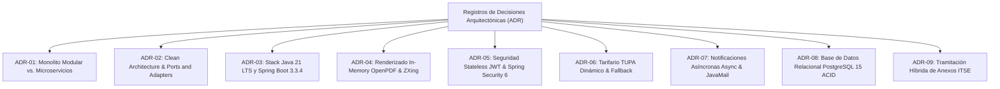

# 08. Decisiones Arquitectónicas (Architectural Decision Records - ADR)
## Sistema de Gestión Documentaria de Licencia de Funcionamiento
### Municipalidad Provincial de Huamanga (Ayacucho, Perú)

> **Formato Estándar:** MADR (Markdown Architectural Decision Records) / Michael Nygard  
> **Ubicación:** `docs/analisis-de-sistema/08-Decisiones Arquitectónicas.md`

---

## 1. Introducción y Registro de Decisiones

Los **Architectural Decision Records (ADR)** documentan formalmente las decisiones técnicas y estructurales más trascendentales adoptadas a lo largo del ciclo de vida del proyecto. Cada registro detalla el contexto del problema, las alternativas analizadas, la justificación de la decisión tomada y los trade-offs (consecuencias positivas y negativas) resultantes.

---

## ADR-01: Adopción de Monolito Modular frente a Microservicios Distribuidos

* **Estado:** ✅ **Aceptado / Implementado**
* **Contexto:**
  El prototipo inicial se estructuró en 5 microservicios independientes (`api-gateway`, `servicio-expedientes`, `servicio-formularios`, `servicio-verificacion-licencias`, `adaptador-integracion`). Esta dispersión generaba un sobrecosto de red severo (+200 ms de latencia interservicios), duplicación masiva de código en generadores de PDF, pérdida de transaccionalidad ACID y un consumo de memoria superior a 2.5 GB RAM, inviable para los servidores de la municipalidad.
* **Decisión:**
  Consolidar todos los microservicios en un único artefacto de ejecución bajo el estilo **Monolito Modular (Modular Monolith)** (`servicio-expedientes.jar`), manteniendo Bounded Contexts independientes con modularización estricta por paquetes.
* **Consecuencias:**
  - *Positivas:* Llamadas inter-contextos en memoria JVM (< 0.05 ms); transacciones ACID locales sin Sagas; reducción del consumo de RAM a ~400 MB; eliminación de código muerto duplicado; despliegue en un solo artefacto ejecutable.
  - *Trade-offs / Negativas:* Todo el sistema comparte el mismo ciclo de vida de despliegue.
  - *Mitigación:* Se diseñaron interfaces de módulos tan desacopladas que, si en el futuro se requiriese extraer algún servicio (como Verificación QR), la separación podrá realizarse en horas.

---

## ADR-02: Enfoque de Clean Architecture y Puertos Hexagonales (Ports & Adapters)

* **Estado:** ✅ **Aceptado / Implementado**
* **Contexto:**
  El sistema interactúa con normas legales que cambian frecuentemente y con dependencias externas municipales (SAT Huamanga, Defensa Civil, Gerencia de Desarrollo Urbano). Un acoplamiento directo entre las entidades de negocio y las bases de datos o servicios externos haría que cualquier cambio externo rompiera la lógica de expedientes.
* **Decisión:**
  Adoptar **Clean Architecture** estructurada en 4 capas concéntricas con regla de dependencias unidireccionales hacia el Dominio, y el patrón **Ports & Adapters (Hexagonal)** para aislar la persistencia y la interoperabilidad mediante interfaces puras (`SatPort`, `DefensaCivilPort`, `EdificacionesPort`, `FiscalizacionPort`).
* **Consecuencias:**
  - *Positivas:* Lógica de negocio 100% independiente de frameworks; alta testeabilidad unitaria con Mocks sin base de datos; capacidad de reemplazar adaptadores externos sin afectar el núcleo.
  - *Trade-offs:* Mayor cantidad inicial de interfaces y clases de mapeo (DTOs).
  - *Mitigación:* Centralización de DTOs y tipos en el módulo compartido `common-domain`.

---

## ADR-03: Estandarización en Java 21 LTS y Spring Boot 3.3.4

* **Estado:** ✅ **Aceptado / Implementado**
* **Contexto:**
  Se requería una plataforma tecnológica empresarial con soporte extendido a largo plazo (LTS), alta robustez, comunidad madura y excelente soporte para transaccionalidad y seguridad gubernamental.
* **Decisión:**
  Estandarizar el backend en **Java 21 LTS** y el framework **Spring Boot 3.3.4**, sobre Spring Framework 6.x y Hibernate 6.x.
* **Consecuencias:**
  - *Positivas:* Acceso a características modernas del lenguaje (Pattern Matching, Records, Virtual Threads); compatibilidad nativa con Spring Security 6 y Jakarta EE 10; soporte corporativo hasta la próxima década.
  - *Trade-offs:* Requerimiento de actualizar runtimes antiguos en los servidores de la municipalidad.
  - *Mitigación:* Se empaqueta en contenedor Docker oficial `eclipse-temurin:21-jre-alpine` para garantizar portabilidad absoluta.

---

## ADR-04: Renderizado Documental In-Memory con OpenPDF y ZXing

* **Estado:** ✅ **Aceptado / Implementado**
* **Contexto:**
  El trámite requiere emitir Anexos 1, 3, 4 y Licencias oficiales en formato PDF idénticos a los formatos físicos ministeriales, incluyendo códigos de barras Code 128 y códigos QR de verificación. Generar estos archivos escribiéndolos en el disco duro del servidor degradaría la velocidad, consumiría espacio y generaría riesgos de concurrencia y seguridad.
* **Decisión:**
  Utilizar la librería de código abierto **OpenPDF 2.0.3** y **ZXing 3.5.3**, construyendo todos los documentos enteramente en memoria volátil (`ByteArrayOutputStream`) y retornándolos directamente en la respuesta HTTP (`application/pdf`).
* **Consecuencias:**
  - *Positivas:* Cero operaciones de I/O en disco; generación en menos de 500 ms; sin dependencias nativas externas (como `wkhtmltopdf`); total independencia del sistema operativo anfitrión.
  - *Trade-offs:* Consumo temporal de memoria Heap durante la generación concurrente de documentos pesados.
  - *Mitigación:* Los objetos de renderizado se liberan inmediatamente tras el envío al cliente y se validó en tests con 150 usuarios concurrentes sin problemas de memoria.

---

## ADR-05: Seguridad Stateless con Spring Security 6 y JJWT (RBAC)

* **Estado:** ✅ **Aceptado / Implementado**
* **Contexto:**
  Los operadores municipales (cajeros, evaluadores, inspectores, administradores) requieren autenticación segura, mientras que el portal ciudadano y la verificación QR deben ser de libre acceso. Las sesiones tradicionales basadas en `HttpSession` acoplan el estado al servidor e impiden escalabilidad limpia.
* **Decisión:**
  Implementar seguridad sin estado (**Stateless**) mediante **Spring Security 6** y **JJWT 0.12.6**, utilizando tokens JWT firmados con **HMAC-SHA256** y control de acceso basado en roles (RBAC: `ROLE_ADMIN`, `ROLE_EVALUADOR`, `ROLE_CAJERO`).
* **Consecuencias:**
  - *Positivas:* Sesión desacoplada del servidor; validación en microsegundos mediante filtro `OncePerRequestFilter`; roles claramente delimitados por anotaciones `@PreAuthorize`.
  - *Trade-offs:* Imposibilidad de revocación instantánea del token antes de su expiración sin una lista de bloqueo.
  - *Mitigación:* Tiempo de vida del token acotado a 24 horas y credenciales hasheadas con BCrypt.

---

## ADR-06: Tarifario TUPA Dinámico con Persistencia Relacional y Fallback

* **Estado:** ✅ **Aceptado / Implementado**
* **Contexto:**
  Las tasas municipales cambian por nuevas ordenanzas aprobadas por el Concejo Provincial. En los sistemas tradicionales, modificar una tasa requería cambiar código fuente, recompilar y desplegar nuevamente, generando retrasos administrativos.
* **Decisión:**
  Crear la entidad `TarifaTupa` y el servicio `TarifaTupaService` con mantenimiento CRUD en caliente protegido para administradores (`PUT /api/tupa/tarifas/{id}`), complementado con un mecanismo de fallback resiliente hacia el archivo `application.yml` en la clase `CalculadoraDeTasa`.
* **Consecuencias:**
  - *Positivas:* Actualización de tasas en caliente en menos de 1 segundo sin interrumpir el servicio ni requerir intervención de programadores; alta resiliencia si la base de datos de tarifas no responde.
  - *Trade-offs:* Requiere gestión de roles rigurosa para que solo usuarios autorizados (`ROLE_ADMIN`) puedan alterar las tarifas.

---

## ADR-07: Notificaciones Asíncronas por Correo Electrónico

* **Estado:** ✅ **Aceptado / Implementado**
* **Contexto:**
  El envío de correos electrónicos mediante SMTP introduce una latencia externa de entre 1 y 4 segundos por mensaje. Si este envío fuera síncrono, el ciudadano experimentaría demoras al registrar su solicitud o el funcionario al aprobar la licencia.
* **Decisión:**
  Implementar el servicio `NotificacionEmailService` utilizando la anotación `@Async("emailExecutor")` de Spring y un thread pool dedicado configurado en `AsyncConfig`, empleando plantillas HTML estilizadas con Thymeleaf y adjuntando el PDF de la licencia generado en memoria.
* **Consecuencias:**
  - *Positivas:* El endpoint HTTP responde inmediatamente al usuario (< 100 ms) mientras el correo se despacha en segundo plano; el ciudadano recibe constancia formal con valor probatorio.
  - *Trade-offs:* Los fallos en el servidor SMTP externo no son percibidos inmediatamente por el usuario en la interfaz web.
  - *Mitigación:* Se implementó captura de excepciones con registro en el log de auditoría del sistema.

---

## ADR-08: Base de Datos Relacional PostgreSQL 15 con Transacciones ACID

* **Estado:** ✅ **Aceptado / Implementado**
* **Contexto:**
  El trámite de licencia involucra datos estructurados normativos (45 atributos), recaudación económica de tasas, auditoría legal inmutable y estados estrictos.
* **Decisión:**
  Adoptar **PostgreSQL 15** como motor relacional primario de base de datos para entornos de desarrollo y producción, complementado con **H2 in-memory** exclusivamente para la ejecución veloz de pruebas automatizadas en integración continua.
* **Consecuencias:**
  - *Positivas:* Soporte total de transacciones ACID (`@Transactional`); integridad referencial estricta; soporte robusto de tipos JSONB para metadatos flexibles si fuera necesario; excelente rendimiento y costo cero de licencias.

---

## ADR-09: Tramitación Híbrida de Anexos ITSE (Digitalización + Presentación Física)

* **Estado:** ✅ **Aceptado / Implementado**
* **Contexto:**
  Aunque el sistema tiene la capacidad técnica de procesar todo digitalmente, la normativa nacional de Inspecciones Técnicas de Seguridad en Edificaciones (D.S. N° 002-2018-PCM) exige que el administrado suscriba físicamente los Anexos 3 y 4 de puño y letra y los presente en la Subgerencia de Defensa Civil para la inspección ocular en el local comercial.
* **Decisión:**
  Adoptar un modelo híbrido: el sistema captura los datos en el Wizard, genera y descarga inmediatamente los Anexos 3 y 4 prellenados en PDF, y ofrece un módulo de **Mesa de Ayuda** en el portal para guiar al ciudadano en la suscripción e inspección presencial ante Defensa Civil. Una vez emitido el dictamen por el inspector acreditado CENEPRED, este se registra en el sistema para desbloquear la aprobación final.
* **Consecuencias:**
  - *Positivas:* 100% de cumplimiento con la normativa física de Defensa Civil sin forzar cambios legales extemporáneos; el ciudadano ahorra tiempo recibiendo sus documentos prellenados listos para imprimir; la municipalidad mantiene la trazabilidad digital completa del proceso.

---

## 2. Resumen de Decisiones y Estado de Implementación

| ADR | Decisión Principal | Estado | Impacto Clave |
|---|---|:---:|---|
| **ADR-01** | Monolito Modular vs. Microservicios | ✅ Completado | Despliegue en 1 JAR, latencia < 0.05 ms in-memory, transacciones ACID. |
| **ADR-02** | Clean Architecture & Ports & Adapters | ✅ Completado | Desacoplamiento total de dependencias externas (SAT, Defensa Civil). |
| **ADR-03** | Java 21 LTS + Spring Boot 3.3.4 | ✅ Completado | Rendimiento moderno, soporte a largo plazo y Virtual Threads listos. |
| **ADR-04** | OpenPDF 2.0.3 & ZXing In-Memory | ✅ Completado | Renderizado < 500 ms sin tocar disco, códigos QR de alta resolución. |
| **ADR-05** | Spring Security 6 + JJWT Stateless | ✅ Completado | RBAC institucional seguro (ADMIN, EVALUADOR, CAJERO) sin sesiones en servidor. |
| **ADR-06** | Tarifario TUPA Dinámico + Fallback | ✅ Completado | Actualización en caliente sin redeploy; resiliencia operativa garantizada. |
| **ADR-07** | Notificaciones Email Asíncronas | ✅ Completado | Alertas automáticas sin bloquear la experiencia de usuario web. |
| **ADR-08** | PostgreSQL 15 Transaccional | ✅ Completado | Consistencia relacional absoluta y pruebas rápidas con H2. |
| **ADR-09** | Flujo Híbrido Anexos ITSE + Mesa de Ayuda | ✅ Completado | Cumplimiento estricto de la exigencia física presencial de CENEPRED. |

---

## 3. Conclusión

El conjunto de las 9 Decisiones Arquitectónicas documentadas respalda la estabilidad, rendimiento y viabilidad legal de la plataforma, sirviendo como guía permanente para el equipo de desarrollo y los futuros mantenedores del sistema.
