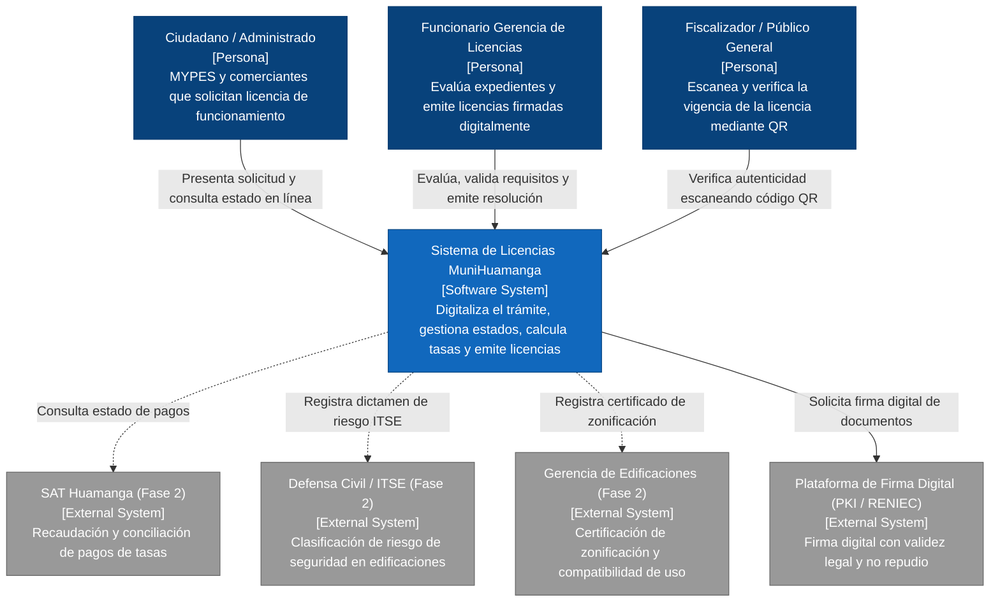
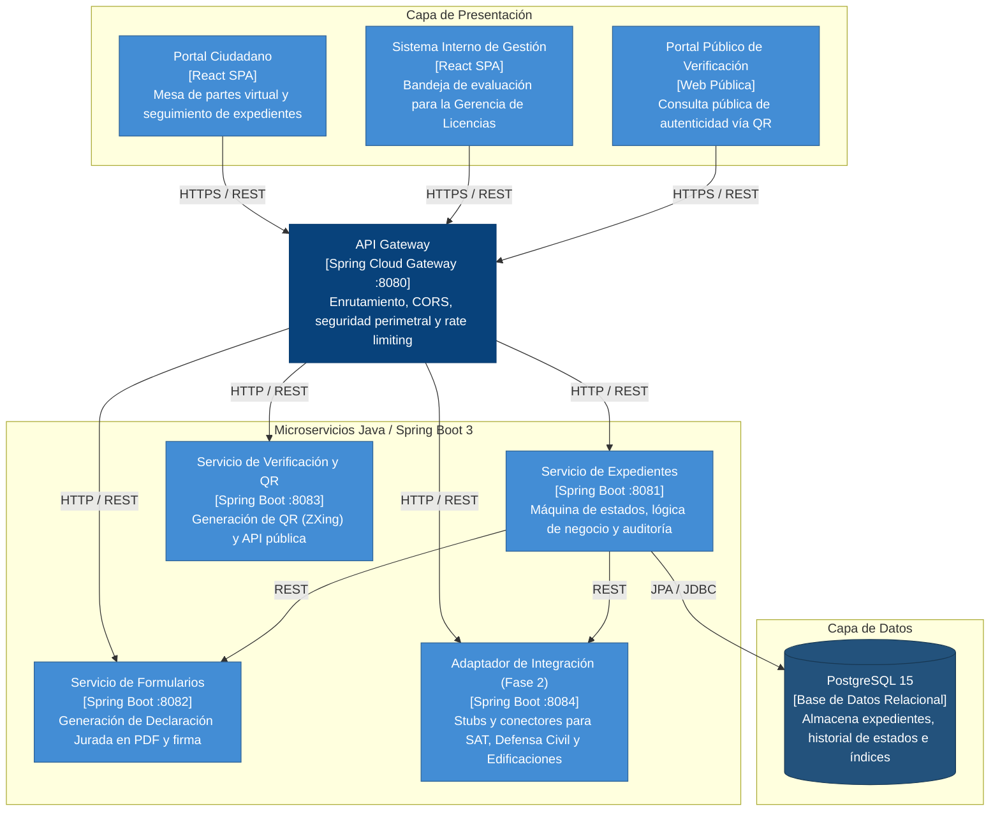
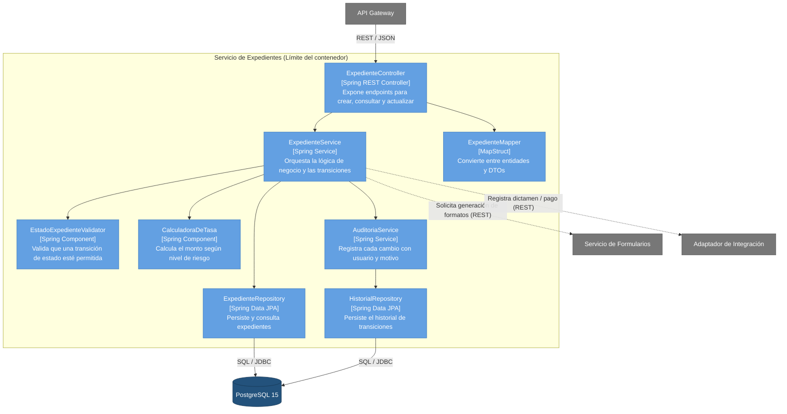
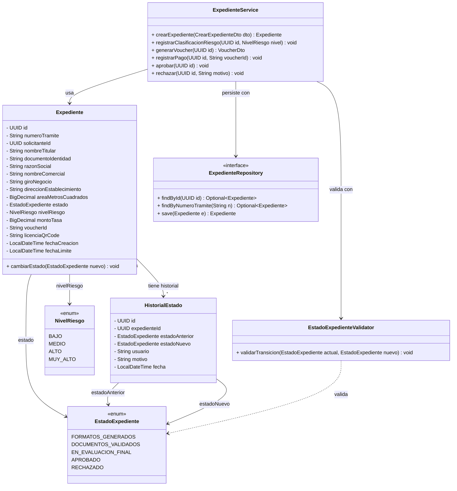

# Modelo de Arquitectura C4 — Sistema de Gestión de Licencias
### Municipalidad Provincial de Huamanga

---

## 1. Nivel 1 — Diagrama de Contexto del Sistema

---

## 2. Nivel 2 — Diagrama de Contenedores

---

## 3. Nivel 3 — Diagrama de Componentes: Servicio de Expedientes

*(Basado en la arquitectura C4 Nivel 3 proporcionada en el documento)*

---

## 4. Diagrama de Clases del Dominio de Expedientes

*(Basado en el diseño estructural del modelo C4)*

