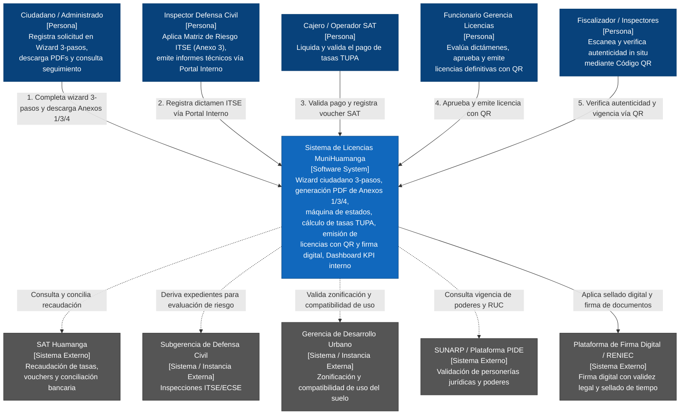
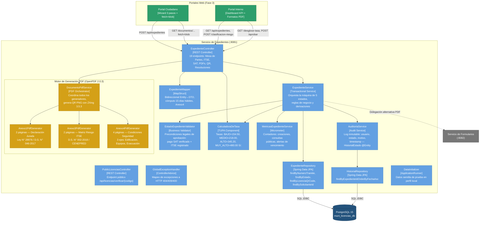
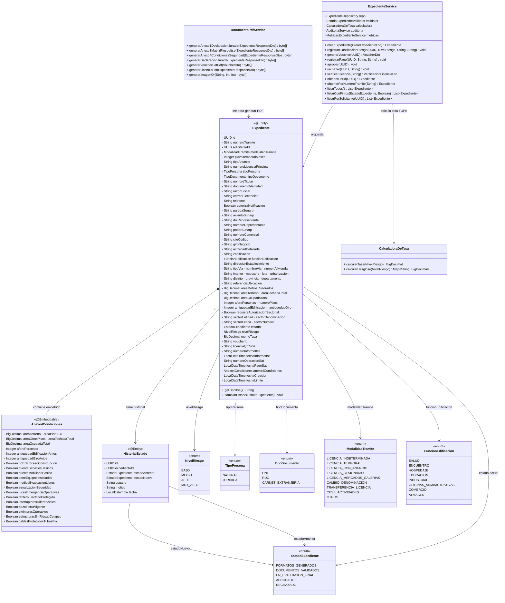

# Modelo de Arquitectura C4 — Sistema de Gestión de Licencias de Funcionamiento
### Municipalidad Provincial de Huamanga (MuniHuamanga)
> **Marco Normativo:** Ley N° 28976 / TUO D.S. N° 046-2017-PCM / D.S. N° 002-2018-PCM / D.S. N° 163-2020-PCM
> **Versión de Arquitectura:** Fase 03 Completada — Wizard Frontend + PDFs integrados
> **Modelo:** C4 Model (Contexto, Contenedores, Componentes y Diagrama de Clases de Dominio)

---

## 1. Nivel 1 — Diagrama de Contexto del Sistema

Describe la interacción del sistema con los usuarios clave de la municipalidad y las entidades/instancias externas del ecosistema municipal:

```mermaid
graph TD
    classDef person fill:#08427b,stroke:#073b6f,color:#fff;
    classDef system fill:#1168bd,stroke:#0b4884,color:#fff;
    classDef extSystem fill:#555555,stroke:#333333,color:#fff;

    solicitante["Ciudadano / Administrado<br>[Persona]<br>Registra solicitud en Wizard 3-pasos,<br>descarga PDFs y consulta seguimiento"]:::person
    inspectorItse["Inspector Defensa Civil<br>[Persona]<br>Aplica Matriz de Riesgo ITSE (Anexo 3),<br>emite informes técnicos vía Portal Interno"]:::person
    cajeroSat["Cajero / Operador SAT<br>[Persona]<br>Liquida y valida el pago de tasas TUPA"]:::person
    funcionarioGL["Funcionario Gerencia Licencias<br>[Persona]<br>Evalúa dictámenes, aprueba y emite<br>licencias definitivas con QR"]:::person
    fiscalizador["Fiscalizador / Inspectores<br>[Persona]<br>Escanea y verifica autenticidad in situ<br>mediante Código QR"]:::person

    sistema["Sistema de Licencias MuniHuamanga<br>[Software System]<br>Wizard ciudadano 3-pasos, generación PDF de Anexos 1/3/4,<br>máquina de estados, cálculo de tasas TUPA, emisión de<br>licencias con QR y firma digital, Dashboard KPI interno"]:::system

    sat["SAT Huamanga<br>[Sistema Externo]<br>Recaudación de tasas,<br>vouchers y conciliación bancaria"]:::extSystem
    defensaCivil["Subgerencia de Defensa Civil<br>[Sistema / Instancia Externa]<br>Inspecciones ITSE/ECSE"]:::extSystem
    desarrolloUrbano["Gerencia de Desarrollo Urbano<br>[Sistema / Instancia Externa]<br>Zonificación y compatibilidad de uso del suelo"]:::extSystem
    sunarp["SUNARP / Plataforma PIDE<br>[Sistema Externo]<br>Validación de personerías jurídicas y poderes"]:::extSystem
    reniecPki["Plataforma de Firma Digital / RENIEC<br>[Sistema Externo]<br>Firma digital con validez legal y sellado de tiempo"]:::extSystem

    solicitante -->|1. Completa wizard 3-pasos y descarga Anexos 1/3/4| sistema
    inspectorItse -->|2. Registra dictamen ITSE vía Portal Interno| sistema
    cajeroSat -->|3. Valida pago y registra voucher SAT| sistema
    funcionarioGL -->|4. Aprueba y emite licencia con QR| sistema
    fiscalizador -->|5. Verifica autenticidad y vigencia vía QR| sistema

    sistema -.->|Consulta y concilia recaudación| sat
    sistema -.->|Deriva expedientes para evaluación de riesgo| defensaCivil
    sistema -.->|Valida zonificación y compatibilidad de uso| desarrolloUrbano
    sistema -.->|Consulta vigencia de poderes y RUC| sunarp
    sistema -->|Aplica sellado digital y firma de documentos| reniecPki
```

---

## 2. Nivel 2 — Diagrama de Contenedores

Ilustra la separación entre las aplicaciones web cliente (Fase 3), el API Gateway perimetral, los microservicios especializados del backend y el almacén de datos relacional:

```mermaid
graph TD
    classDef container fill:#438dd5,stroke:#2e6295,color:#fff;
    classDef db fill:#23527c,stroke:#173752,color:#fff;
    classDef gateway fill:#08427b,stroke:#073b6f,color:#fff;
    classDef frontend fill:#63a0e2,stroke:#3b7abf,color:#fff;

    subgraph CapaPresentacion ["Capa de Presentación (Frontend Institucional — Fase 3)"]
        portalCiudadano["Portal Ciudadano<br>[HTML5 / CSS3 / Vanilla JS]<br>Wizard 3-pasos: Solicitante → Establecimiento → Confirmación<br>Descarga inmediata: Anexo 1, 3 y 4 (fetch+blob)<br>Seguimiento con timeline visual"]:::frontend
        portalInterno["Sistema Interno de Gestión<br>[HTML5 / CSS3 / Vanilla JS]<br>Dashboard KPI con iconos (kpi-card-v2)<br>Bandeja con columna Formatos PDF (Anexo 1/3/4/Voucher)<br>Modales: ITSE, Pago SAT, Rechazo, Trazabilidad"]:::frontend
        portalVerificacion["Portal Público de Verificación<br>[HTML5 / CSS3 / Vanilla JS]<br>Consulta pública de licencias vía QR (RNF-20)"]:::frontend
        landing["Landing Page<br>[HTML5 / CSS3]<br>Acceso a los 4 portales del sistema"]:::frontend
    end

    gateway["API Gateway Perimetral<br>[Spring Cloud Gateway :8080]<br>Enrutamiento reactivo, CORS unificado,<br>Rate Limiting y control de concurrencia"]:::gateway

    subgraph Backend ["Ecosistema de Microservicios — Java 21 / Spring Boot 3.3.4"]
        servicioExpedientes["Servicio de Expedientes<br>[Spring Boot :8081]<br>Máquina de estados (5 estados),<br>19 endpoints REST, cálculo TUPA,<br>auditoría inmutable, motor PDF integrado"]:::container
        servicioFormularios["Servicio de Formularios PDF<br>[Spring Boot :8082]<br>7 endpoints POST de generación documental<br>OpenPDF 2.0.3: Anexo 1 (2p), Anexo 3 (2p),<br>Anexo 4 (4p), Voucher SAT, Licencia QR"]:::container
        servicioVerificacion["Servicio de Verificación QR<br>[Spring Boot :8083]<br>ZXing 3.5.3: PNG criptográfico<br>API pública de consulta (RNF-20)"]:::container
        adaptadorIntegracion["Adaptador de Integración Hexagonal<br>[Spring Boot :8084]<br>Puertos y stubs para SAT,<br>Defensa Civil y Zonificación Urbana"]:::container
    end

    subgraph Persistencia ["Capa de Datos Relacional"]
        postgres[("PostgreSQL 15<br>[muni_licencias_db :5432]<br>Expedientes (45 atributos normativos),<br>historial de auditoría inmutable e índices")]:::db
    end

    portalCiudadano -->|REST JSON — Wizard registro + descarga PDFs| servicioExpedientes
    portalCiudadano -->|POST fetch+blob — Anexo 3/4 directo| servicioFormularios
    portalInterno -->|REST JSON — Bandeja, ITSE, SAT, Aprobación| servicioExpedientes
    portalInterno -->|POST fetch+blob — Formatos PDF internos| servicioFormularios
    portalVerificacion -->|GET verificar/{codigo}| servicioExpedientes
    landing -->|Navegación| portalCiudadano

    gateway -->|/api/expedientes/**| servicioExpedientes
    gateway -->|/api/formularios/**| servicioFormularios
    gateway -->|/api/verificacion/**| servicioVerificacion
    gateway -->|/api/adaptador/**| adaptadorIntegracion

    servicioExpedientes -->|Spring Data JPA / JDBC| postgres
    servicioExpedientes -.->|Delegación PDF si necesario| servicioFormularios
    servicioExpedientes -.->|Notificaciones| adaptadorIntegracion
```

---

## 3. Nivel 3 — Diagrama de Componentes: Servicio de Expedientes (:8081)

Detalla la arquitectura interna del microservicio central, mostrando la separación de controladores, servicios de dominio, validadores, generadores PDF y persistencia:

```mermaid
graph TD
    classDef comp fill:#63a0e2,stroke:#3b7abf,color:#fff;
    classDef pdf fill:#d4a017,stroke:#a07812,color:#fff;
    classDef db fill:#23527c,stroke:#173752,color:#fff;
    classDef ext fill:#777777,stroke:#555555,color:#fff;
    classDef frontend fill:#2d9e6b,stroke:#1f7048,color:#fff;

    subgraph Frontend ["Portales Web (Fase 3)"]
        wizardCiudadano["Portal Ciudadano<br>[Wizard 3 pasos + fetch+blob]"]:::frontend
        dashboardInterno["Portal Interno<br>[Dashboard KPI + Formatos PDF]"]:::frontend
    end

    subgraph ServicioExpedientes ["Servicio de Expedientes (:8081)"]
        controller["ExpedienteController<br>[REST Controller]<br>19 endpoints: Mesa de Partes, ITSE,<br>SAT, PDFs, QR, Resoluciones"]:::comp
        publicController["PublicLicenciasController<br>[REST Controller]<br>Endpoint público /api/licencias/verificar/{codigo}"]:::comp
        exceptionHandler["GlobalExceptionHandler<br>[ControllerAdvice]<br>Mapeo de excepciones a HTTP 404/409/400"]:::comp

        service["ExpedienteService<br>[Transactional Service]<br>Orquesta la máquina de 5 estados,<br>reglas de negocio y derivaciones"]:::comp
        validator["EstadoExpedienteValidator<br>[Business Validator]<br>Precondiciones legales de aprobación:<br>pago SAT verificado + ITSE registrado"]:::comp
        calculadora["CalculadoraDeTasa<br>[TUPA Component]<br>Tasas: BAJO=154.50, MEDIO=218.00,<br>ALTO=345.20, MUY_ALTO=480.00 S/."]:::comp
        auditoria["AuditoriaService<br>[Audit Service]<br>Log inmutable: usuario, estado, motivo,<br>timestamp — HistorialEstado @Entity"]:::comp
        metricas["MetricasExpedienteService<br>[Micrometer]<br>Contadores: creaciones, consultas<br>públicas, alertas de vencimiento"]:::comp

        mapper["ExpedienteMapper<br>[MapStruct]<br>Bidireccional Entity↔DTO,<br>cómputo 15 días hábiles, Anexo4"]:::comp

        subgraph PDFEngine ["Motor de Generación PDF (OpenPDF 2.0.3)"]
            pdfService["DocumentoPdfService<br>[PDF Orchestrator]<br>Coordina todos los generadores,<br>genera QR PNG con ZXing 3.5.3"]:::pdf
            anexo1Gen["Anexo1PdfGenerator<br>2 páginas — Declaración Jurada<br>Ley N° 28976 / D.S. N° 046-2017"]:::pdf
            anexo3Gen["Anexo3PdfGenerator<br>2 páginas — Matriz Riesgo ITSE<br>D.S. N° 002-2018 / CENEPRED"]:::pdf
            anexo4Gen["Anexo4PdfGenerator<br>4 páginas — Condiciones Seguridad<br>3 ejes: Edificación, Equipos, Evacuación"]:::pdf
        end

        expedienteRepo["ExpedienteRepository<br>[Spring Data JPA]<br>findByNumeroTramite, findByEstado,<br>findByLicenciaQrCode, findBySolicitanteId"]:::comp
        historialRepo["HistorialRepository<br>[Spring Data JPA]<br>findByExpedienteIdOrderByFechaAsc"]:::comp
        dataInit["DataInitializer<br>[ApplicationRunner]<br>Datos semilla de prueba en perfil local"]:::comp
    end

    servicioFormularios["Servicio de Formularios<br>(:8082)"]:::ext
    postgres[("PostgreSQL 15<br>muni_licencias_db")]:::db

    wizardCiudadano -->|POST /api/expedientes| controller
    wizardCiudadano -->|GET /documentos/... fetch+blob| controller
    dashboardInterno -->|GET /api/expedientes, POST /clasificacion-riesgo| controller
    dashboardInterno -->|GET /desglose-tasa, POST /aprobar| controller

    controller --> service
    controller --> mapper
    controller --> pdfService
    controller --> calculadora

    service --> validator
    service --> calculadora
    service --> auditoria
    service --> metricas
    service --> expedienteRepo

    auditoria --> historialRepo

    pdfService --> anexo1Gen
    pdfService --> anexo3Gen
    pdfService --> anexo4Gen

    service -.->|Delegación alternativa PDF| servicioFormularios

    expedienteRepo -->|SQL JDBC| postgres
    historialRepo -->|SQL JDBC| postgres
```

---

## 4. Nivel 3 — Diagrama de Componentes: Servicio de Formularios (:8082)

```mermaid
graph TD
    classDef comp fill:#438dd5,stroke:#2e6295,color:#fff;
    classDef pdf fill:#d4a017,stroke:#a07812,color:#fff;
    classDef ext fill:#777777,stroke:#555555,color:#fff;

    portalCiudadano["Portal Ciudadano<br>[POST fetch+blob]"]:::ext
    portalInterno["Portal Interno<br>[descargarFormatoInterno()]"]:::ext
    servicioExpedientes["Servicio de Expedientes<br>(:8081)"]:::ext

    subgraph ServicioFormularios ["Servicio de Formularios (:8082)"]
        controller["FormulariosController<br>[REST Controller]<br>7 endpoints POST que reciben<br>ExpedienteResponseDto o VoucherDto<br>y retornan byte[] PDF"]:::comp

        genService["GeneradorDocumentoService<br>[Service Orchestrator]<br>Coordina todos los generadores<br>de documentos oficiales"]:::comp

        subgraph Generadores ["Generadores OpenPDF 2.0.3"]
            a1["Anexo1PdfGenerator<br>2 páginas | Ley 28976<br>Declaración Jurada Licencia"]:::pdf
            a3["Anexo3PdfGenerator<br>2 páginas | CENEPRED<br>Matriz Riesgo ITSE<br>Colores: BAJO=verde, MEDIO=amarillo,<br>ALTO=naranja, MUY_ALTO=rojo"]:::pdf
            a4["Anexo4PdfGenerator<br>4 páginas | D.S. 002-2018<br>Condiciones de Seguridad<br>3 ejes: Edificación/Equipos/Evacuación"]:::pdf
            dj["DeclaracionJuradaGenerator<br>Formato DJ estándar"]:::pdf
            voucher["VoucherSatGenerator<br>Code 128 barcode<br>Código SAT + monto + vigencia"]:::pdf
            licencia["LicenciaGenerator<br>Certificado oficial con QR ZXing<br>y datos de la resolución"]:::pdf
        end
    end

    portalCiudadano -->|POST /api/formularios/anexo3-matriz-riesgo-itse| controller
    portalCiudadano -->|POST /api/formularios/anexo4-condiciones-seguridad| controller
    portalInterno -->|POST /api/formularios/{tipo}| controller
    servicioExpedientes -.->|Delegación documental| controller

    controller --> genService
    genService --> a1
    genService --> a3
    genService --> a4
    genService --> dj
    genService --> voucher
    genService --> licencia
```

---

## 5. Diagrama de Clases del Dominio — Actualizado Fase 03

Estructura completa de entidades JPA, objetos embebidos (`@Embeddable`), enums normativos, DTOs, servicios y sus relaciones:

```mermaid
classDiagram
    class Expediente {
        <<@Entity>>
        - UUID id
        - String numeroTramite
        - UUID solicitanteId
        - ModalidadTramite modalidadTramite
        - Integer plazoTemporalMeses
        - String tipoAnuncio
        - String numeroLicenciaPrincipal
        - TipoPersona tipoPersona
        - TipoDocumento tipoDocumento
        - String nombreTitular
        - String documentoIdentidad
        - String razonSocial
        - String correoElectronico
        - String telefono
        - Boolean autorizaNotificacion
        - String partidaSunarp
        - String asientoSunarp
        - String dniRepresentante
        - String nombreRepresentante
        - String poderSunarp
        - String nombreComercial
        - String ciiuCodigo
        - String giroNegocio
        - String actividadDetallada
        - String zonificacion
        - FuncionEdificacion funcionEdificacion
        - String direccionEstablecimiento
        - String tipoVia · nombreVia · numeroVivienda
        - String interior · manzana · lote · urbanizacion
        - String distrito · provincia · departamento
        - String referenciaUbicacion
        - BigDecimal areaMetrosCuadrados
        - BigDecimal areaTerreno · areaTechadaTotal
        - BigDecimal areaOcupadaTotal
        - Integer aforoPersonas · numeroPisos
        - Integer antiguedadEdificacion · antiguedadGiro
        - Boolean requiereAutorizacionSectorial
        - String sectorEntidad · sectorDenominacion
        - String sectorFecha · sectorNumero
        - EstadoExpediente estado
        - NivelRiesgo nivelRiesgo
        - BigDecimal montoTasa
        - String voucherId
        - String licenciaQrCode
        - String numeroInformeItse
        - LocalDateTime fechaInformeItse
        - String numeroOperacionSat
        - LocalDateTime fechaPagoSat
        - Anexo4Condiciones anexo4Condiciones
        - LocalDateTime fechaCreacion
        - LocalDateTime fechaLimite
        + getTipoItse() String
        + cambiarEstado(EstadoExpediente) void
    }

    class Anexo4Condiciones {
        <<@Embeddable>>
        - BigDecimal areaTerreno · areaPiso1..4
        - BigDecimal areaOtrosPisos · areaTechadaTotal
        - BigDecimal areaOcupadaTotal
        - Integer aforoPersonas
        - Integer antiguedadEdificacionAnios
        - Integer antiguedadGiroAnios
        - Boolean noEnProcesoConstruccion
        - Boolean cuentaServiciosBasicos
        - Boolean cuentaMobiliarioBasico
        - Boolean tieneEquiposInstalados
        - Boolean mediosEvacuacionLibres
        - Boolean senalizacionSeguridad
        - Boolean lucesEmergenciaOperativas
        - Boolean tableroElectricoProtegido
        - Boolean interruptoresDiferenciales
        - Boolean pozoTierraVigente
        - Boolean extintoresOperativos
        - Boolean estructurasSinRiesgoColapso
        - Boolean cablesProtegidosTubosPvc
    }

    class HistorialEstado {
        <<@Entity>>
        - UUID id
        - UUID expedienteId
        - EstadoExpediente estadoAnterior
        - EstadoExpediente estadoNuevo
        - String usuario
        - String motivo
        - LocalDateTime fecha
    }

    class EstadoExpediente {
        <<enum>>
        FORMATOS_GENERADOS
        DOCUMENTOS_VALIDADOS
        EN_EVALUACION_FINAL
        APROBADO
        RECHAZADO
    }

    class NivelRiesgo {
        <<enum>>
        BAJO
        MEDIO
        ALTO
        MUY_ALTO
    }

    class TipoPersona {
        <<enum>>
        NATURAL
        JURIDICA
    }

    class TipoDocumento {
        <<enum>>
        DNI
        RUC
        CARNET_EXTRANJERIA
    }

    class ModalidadTramite {
        <<enum>>
        LICENCIA_INDETERMINADA
        LICENCIA_TEMPORAL
        LICENCIA_CON_ANUNCIO
        LICENCIA_CESIONARIO
        LICENCIA_MERCADOS_GALERIAS
        CAMBIO_DENOMINACION
        TRANSFERENCIA_LICENCIA
        CESE_ACTIVIDADES
        OTROS
    }

    class FuncionEdificacion {
        <<enum>>
        SALUD
        ENCUENTRO
        HOSPEDAJE
        EDUCACION
        INDUSTRIAL
        OFICINAS_ADMINISTRATIVAS
        COMERCIO
        ALMACEN
    }

    class ExpedienteService {
        - ExpedienteRepository repo
        - EstadoExpedienteValidator validator
        - CalculadoraDeTasa calculadora
        - AuditoriaService auditoria
        - MetricasExpedienteService metricas
        + crearExpediente(CrearExpedienteDto) Expediente
        + registrarClasificacionRiesgo(UUID, NivelRiesgo, String, String) void
        + generarVoucher(UUID) VoucherDto
        + registrarPago(UUID, String, String) void
        + aprobar(UUID) void
        + rechazar(UUID, String) void
        + verificarLicencia(String) VerificacionLicenciaDto
        + obtenerPorId(UUID) Expediente
        + obtenerPorNumeroTramite(String) Expediente
        + listarTodos() List~Expediente~
        + listarConFiltros(EstadoExpediente, Boolean) List~Expediente~
        + listarPorSolicitante(UUID) List~Expediente~
    }

    class CalculadoraDeTasa {
        + calcularTasa(NivelRiesgo) BigDecimal
        + calcularDesglose(NivelRiesgo) Map~String, BigDecimal~
    }

    class DocumentoPdfService {
        + generarAnexo1DeclaracionJurada(ExpedienteResponseDto) byte[]
        + generarAnexo3MatrizRiesgoItse(ExpedienteResponseDto) byte[]
        + generarAnexo4CondicionesSeguridad(ExpedienteResponseDto) byte[]
        + generarDeclaracionJurada(ExpedienteResponseDto) byte[]
        + generarVoucherSatPdf(VoucherDto) byte[]
        + generarLicenciaPdf(ExpedienteResponseDto) byte[]
        + generarImagenQr(String, int, int) byte[]
    }

    ExpedienteService --> Expediente : orquesta
    ExpedienteService --> CalculadoraDeTasa : calcula tasa TUPA
    Expediente *-- Anexo4Condiciones : contiene embebido
    Expediente --> EstadoExpediente : estado actual
    Expediente --> NivelRiesgo : nivelRiesgo
    Expediente --> TipoPersona : tipoPersona
    Expediente --> TipoDocumento : tipoDocumento
    Expediente --> ModalidadTramite : modalidadTramite
    Expediente --> FuncionEdificacion : funcionEdificacion
    Expediente "1" --> "*" HistorialEstado : tiene historial
    HistorialEstado --> EstadoExpediente : estadoAnterior
    HistorialEstado --> EstadoExpediente : estadoNuevo
    DocumentoPdfService ..> Expediente : lee para generar PDF
```

---

## 6. Máquina de Estados — Normativa, Actores y Documentos

| Estado C4 | Actor Responsable | Documentos Generados | Precondición Legal para Transicionar |
|-----------|-------------------|----------------------|--------------------------------------|
| **`FORMATOS_GENERADOS`** | Administrado → Mesa de Partes | Anexo 1 (DJ) + Anexo 4 (Cond. Seguridad) + Anexo 3 (Riesgo) | Validación DNI/RUC y presunción de veracidad (Ley N° 27444 Art. 42°) |
| **`DOCUMENTOS_VALIDADOS`** | Subgerencia de Defensa Civil | Dictamen ITSE + Informe Técnico Nro. | Clasificación de riesgo asignada; tasa TUPA calculada automáticamente |
| **`EN_EVALUACION_FINAL`** | SAT Huamanga / Tesorería | Voucher SAT con Code 128 | Constancia de pago registrada con número de operación bancaria |
| **`APROBADO`** | Gerencia de Licencias | Certificado Oficial con QR + Firma Digital | Dictámenes ITSE y zonificación favorables; pago verificado |
| **`RECHAZADO`** | Gerencia de Licencias | Resolución de Denegatoria | Dictamen desfavorable o zonificación no compatible |

---

## 7. Diagrama de Flujo del Wizard Ciudadano (Fase 3)

```mermaid
graph TD
    A["Ciudadano accede a<br>portal-ciudadano.html"] --> B

    subgraph Wizard ["Wizard 3 Pasos — Mesa de Partes Virtual"]
        B["PASO 1: Datos del Solicitante<br>• Nombre Titular<br>• DNI/RUC (regex validado)<br>• Teléfono celular 9XXXXXXXX<br>• Correo electrónico"] --> |irPaso(2) — validarPaso(1)| C
        C["PASO 2: Datos del Establecimiento<br>• Nombre comercial + Giro (CIIU)<br>• Dirección completa<br>• Área m² (determina riesgo ITSE)<br>• N° de pisos"] --> |irPaso(3) — validarPaso(2)| D
        D["PASO 3: Confirmación<br>• Resumen de 10 campos<br>• Declaración Jurada (checkbox)<br>• Botón Enviar con spinner"] --> |registrarSolicitud() — POST /api/expedientes| E
    end

    E["✅ Banner de Éxito<br>EXP-2026-XXXXX generado"] --> F
    E --> G
    E --> H

    F["📋 Descargar Anexo 1<br>GET /api/expedientes/{id}/documentos/declaracion-jurada"]
    G["🛡️ Descargar Anexo 3<br>POST /api/formularios/anexo3-matriz-riesgo-itse"]
    H["🔒 Descargar Anexo 4<br>POST /api/formularios/anexo4-condiciones-seguridad"]

    E --> I["🔍 Ir a Seguimiento<br>Consultar estado por N° trámite"]
```

---

## 8. Stack Tecnológico Completo

| Capa | Tecnología | Versión | Justificación |
|------|-----------|---------|---------------|
| **Lenguaje** | Java | 21 LTS | Records, sealed classes, virtual threads |
| **Framework Backend** | Spring Boot | 3.3.4 | Estabilidad enterprise, soporte largo plazo |
| **ORM / Persistencia** | Spring Data JPA + Hibernate | 6.5 | Portabilidad, validaciones de integridad |
| **Base de Datos** | PostgreSQL | 15 | Confiabilidad, soporte JSON, índices GIN |
| **Generación PDF** | OpenPDF (LibrePDF fork) | 2.0.3 | Open source, sin restricciones, API madura |
| **Códigos QR** | ZXing | 3.5.3 | Estándar de facto para QR/Code128 |
| **Mapeo DTO↔Entity** | MapStruct | 1.5.5 | Generación en tiempo de compilación |
| **Reducción boilerplate** | Lombok | Latest SB | Builders, getters, @Slf4j |
| **API Docs** | SpringDoc OpenAPI (Swagger UI) | 2.6.0 | Integración nativa Spring Boot 3 |
| **Gateway** | Spring Cloud Gateway | 2023.0.3 | Enrutamiento reactivo, filtros |
| **Frontend** | HTML5 + CSS3 + Vanilla JS | — | Sin dependencias: máxima portabilidad |
| **Contenedores** | Docker + Docker Compose | v2 | Reproducibilidad del entorno |
| **CI/CD** | GitHub (repositorio) | — | Control de versiones + ramas |

---

*Versión del Documento: Fase 03 — Completada el 2026-09-29*
*Municipalidad Provincial de Huamanga — Gerencia de Licencias y Autorizaciones*
