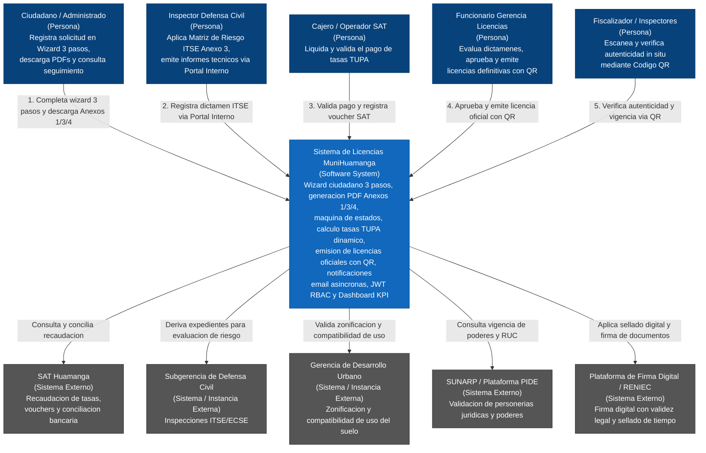
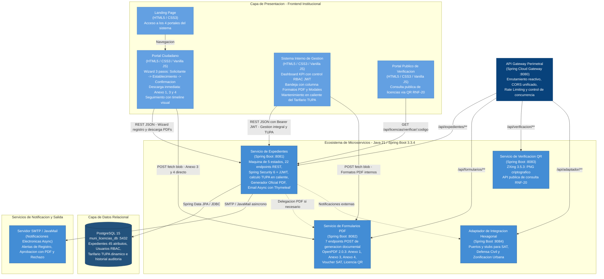
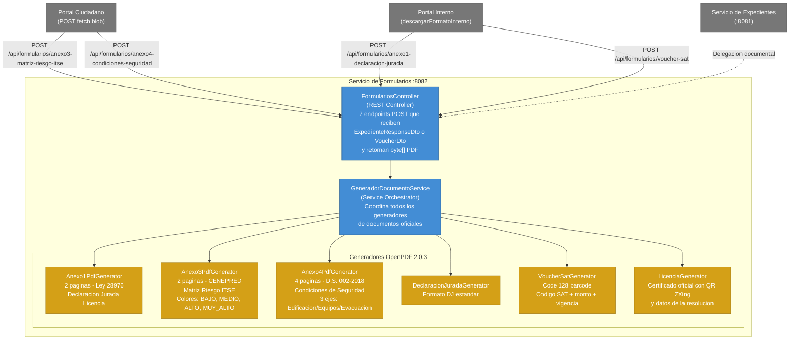
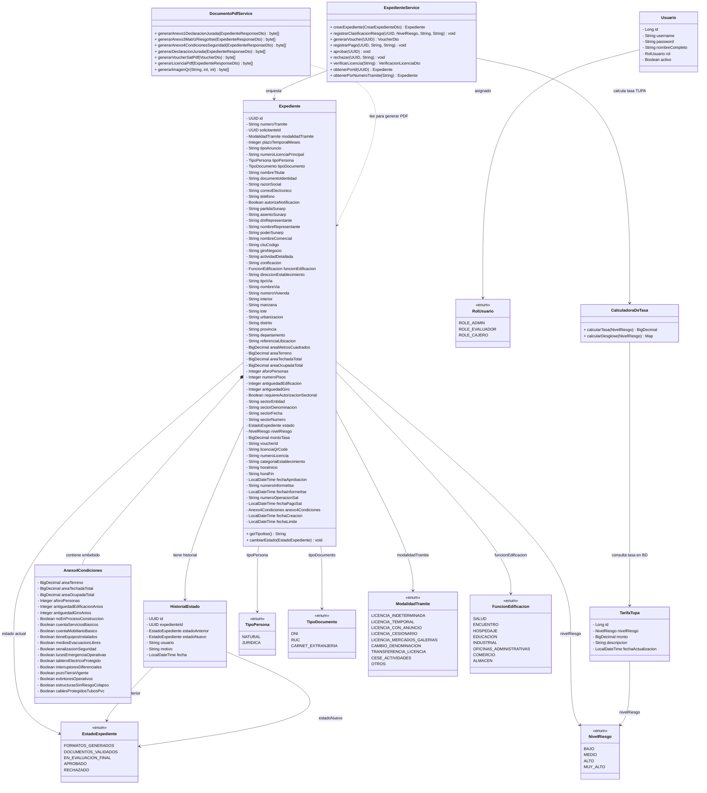
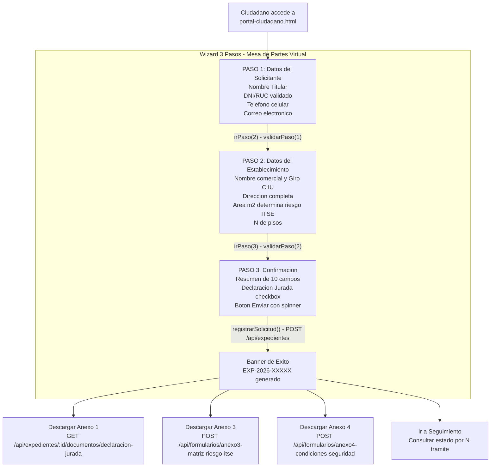

# Modelo de Arquitectura C4 — Sistema de Gestión de Licencias de Funcionamiento
### Municipalidad Provincial de Huamanga (MuniHuamanga)
> **Marco Normativo:** Ley N° 28976 / TUO D.S. N° 046-2017-PCM / D.S. N° 002-2018-PCM / D.S. N° 163-2020-PCM  
> **Versión de Arquitectura:** Fase 04 Completada — Seguridad JWT RBAC, Notificaciones Email, Formato Oficial y TUPA Dinámico  
> **Modelo:** C4 Model (Contexto, Contenedores, Componentes y Diagrama de Clases de Dominio)

---

## 1. Nivel 1 — Diagrama de Contexto del Sistema

Describe la interacción del sistema con los usuarios clave de la municipalidad y las entidades e instancias externas del ecosistema municipal:

```mermaid
graph TD
    classDef person fill:#08427b,stroke:#073b6f,color:#fff;
    classDef system fill:#1168bd,stroke:#0b4884,color:#fff;
    classDef extSystem fill:#555555,stroke:#333333,color:#fff;

    solicitante["Ciudadano / Administrado<br>(Persona)<br>Registra solicitud en Wizard 3 pasos,<br>descarga PDFs y consulta seguimiento"]:::person
    inspectorItse["Inspector Defensa Civil<br>(Persona)<br>Aplica Matriz de Riesgo ITSE Anexo 3,<br>emite informes tecnicos via Portal Interno"]:::person
    cajeroSat["Cajero / Operador SAT<br>(Persona)<br>Liquida y valida el pago de tasas TUPA"]:::person
    funcionarioGL["Funcionario Gerencia Licencias<br>(Persona)<br>Evalua dictamenes, aprueba y emite<br>licencias definitivas con QR"]:::person
    fiscalizador["Fiscalizador / Inspectores<br>(Persona)<br>Escanea y verifica autenticidad in situ<br>mediante Codigo QR"]:::person

    sistema["Sistema de Licencias MuniHuamanga<br>(Software System)<br>Wizard ciudadano 3 pasos, generacion PDF Anexos 1/3/4,<br>maquina de estados, calculo tasas TUPA dinamico,<br>emision de licencias oficiales con QR, notificaciones<br>email asincronas, JWT RBAC y Dashboard KPI"]:::system

    sat["SAT Huamanga<br>(Sistema Externo)<br>Recaudacion de tasas,<br>vouchers y conciliacion bancaria"]:::extSystem
    defensaCivil["Subgerencia de Defensa Civil<br>(Sistema / Instancia Externa)<br>Inspecciones ITSE/ECSE"]:::extSystem
    desarrolloUrbano["Gerencia de Desarrollo Urbano<br>(Sistema / Instancia Externa)<br>Zonificacion y compatibilidad de uso del suelo"]:::extSystem
    sunarp["SUNARP / Plataforma PIDE<br>(Sistema Externo)<br>Validacion de personerias juridicas y poderes"]:::extSystem
    reniecPki["Plataforma de Firma Digital / RENIEC<br>(Sistema Externo)<br>Firma digital con validez legal y sellado de tiempo"]:::extSystem

    solicitante -->|"1. Completa wizard 3 pasos y descarga Anexos 1/3/4"| sistema
    inspectorItse -->|"2. Registra dictamen ITSE via Portal Interno"| sistema
    cajeroSat -->|"3. Valida pago y registra voucher SAT"| sistema
    funcionarioGL -->|"4. Aprueba y emite licencia oficial con QR"| sistema
    fiscalizador -->|"5. Verifica autenticidad y vigencia via QR"| sistema

    sistema -->|"Consulta y concilia recaudacion"| sat
    sistema -->|"Deriva expedientes para evaluacion de riesgo"| defensaCivil
    sistema -->|"Valida zonificacion y compatibilidad de uso"| desarrolloUrbano
    sistema -->|"Consulta vigencia de poderes y RUC"| sunarp
    sistema -->|"Aplica sellado digital y firma de documentos"| reniecPki
```

---

## 2. Nivel 2 — Diagrama de Contenedores

Ilustra la separación entre las aplicaciones web cliente, el API Gateway perimetral, los microservicios especializados del backend, el servicio de notificaciones y el almacén de datos relacional:

```mermaid
graph TD
    classDef container fill:#438dd5,stroke:#2e6295,color:#fff;
    classDef db fill:#23527c,stroke:#173752,color:#fff;
    classDef gateway fill:#08427b,stroke:#073b6f,color:#fff;
    classDef frontend fill:#63a0e2,stroke:#3b7abf,color:#fff;

    subgraph CapaPresentacion [Capa de Presentacion - Frontend Institucional]
        portalCiudadano["Portal Ciudadano<br>(HTML5 / CSS3 / Vanilla JS)<br>Wizard 3 pasos: Solicitante -> Establecimiento -> Confirmacion<br>Descarga inmediata: Anexo 1, 3 y 4<br>Seguimiento con timeline visual"]:::frontend
        portalInterno["Sistema Interno de Gestion<br>(HTML5 / CSS3 / Vanilla JS)<br>Dashboard KPI con control RBAC JWT<br>Bandeja con columna Formatos PDF y Modales<br>Mantenimiento en caliente del Tarifario TUPA"]:::frontend
        portalVerificacion["Portal Publico de Verificacion<br>(HTML5 / CSS3 / Vanilla JS)<br>Consulta publica de licencias via QR RNF-20"]:::frontend
        landing["Landing Page<br>(HTML5 / CSS3)<br>Acceso a los 4 portales del sistema"]:::frontend
    end

    gateway["API Gateway Perimetral<br>(Spring Cloud Gateway :8080)<br>Enrutamiento reactivo, CORS unificado,<br>Rate Limiting y control de concurrencia"]:::gateway

    subgraph Backend [Ecosistema de Microservicios - Java 21 / Spring Boot 3.3.4]
        servicioExpedientes["Servicio de Expedientes<br>(Spring Boot :8081)<br>Maquina de 5 estados, 22 endpoints REST,<br>Spring Security 6 + JJWT, calculo TUPA en caliente,<br>Generador Oficial PDF, Email Async con Thymeleaf"]:::container
        servicioFormularios["Servicio de Formularios PDF<br>(Spring Boot :8082)<br>7 endpoints POST de generacion documental<br>OpenPDF 2.0.3: Anexo 1, Anexo 3, Anexo 4,<br>Voucher SAT, Licencia QR"]:::container
        servicioVerificacion["Servicio de Verificacion QR<br>(Spring Boot :8083)<br>ZXing 3.5.3: PNG criptografico<br>API publica de consulta RNF-20"]:::container
        adaptadorIntegracion["Adaptador de Integracion Hexagonal<br>(Spring Boot :8084)<br>Puertos y stubs para SAT,<br>Defensa Civil y Zonificacion Urbana"]:::container
    end

    subgraph Persistencia [Capa de Datos Relacional]
        postgres[("PostgreSQL 15<br>muni_licencias_db :5432<br>Expedientes 45 atributos, Usuarios RBAC,<br>Tarifario TUPA dinamico e historial auditoria")]:::db
    end

    subgraph Externos [Servicios de Notificacion y Salida]
        smtpServer["Servidor SMTP / JavaMail<br>(Notificaciones Electronicas Async)<br>Alertas de Registro, Aprobacion con PDF y Rechazo"]:::container
    end

    portalCiudadano -->|"REST JSON - Wizard registro y descarga PDFs"| servicioExpedientes
    portalCiudadano -->|"POST fetch blob - Anexo 3 y 4 directo"| servicioFormularios
    portalInterno -->|"REST JSON con Bearer JWT - Gestion integral y TUPA"| servicioExpedientes
    portalInterno -->|"POST fetch blob - Formatos PDF internos"| servicioFormularios
    portalVerificacion -->|"GET /api/licencias/verificar/:codigo"| servicioExpedientes
    landing -->|"Navegacion"| portalCiudadano

    gateway -->|"/api/expedientes/**"| servicioExpedientes
    gateway -->|"/api/formularios/**"| servicioFormularios
    gateway -->|"/api/verificacion/**"| servicioVerificacion
    gateway -->|"/api/adaptador/**"| adaptadorIntegracion

    servicioExpedientes -->|"Spring Data JPA / JDBC"| postgres
    servicioExpedientes -->|"SMTP / JavaMail asincrono"| smtpServer
    servicioExpedientes -.->|"Delegacion PDF si necesario"| servicioFormularios
    servicioExpedientes -.->|"Notificaciones externas"| adaptadorIntegracion
```

---

## 3. Nivel 3 — Diagrama de Componentes: Servicio de Expedientes (:8081)

Detalla la arquitectura interna del microservicio central, incorporando la seguridad Spring Security 6 / JWT, la máquina de estados, el generador oficial de licencias y el mantenimiento TUPA:

```mermaid
graph TD
    classDef comp fill:#63a0e2,stroke:#3b7abf,color:#fff;
    classDef pdf fill:#d4a017,stroke:#a07812,color:#fff;
    classDef sec fill:#d9534f,stroke:#b52b27,color:#fff;
    classDef db fill:#23527c,stroke:#173752,color:#fff;
    classDef ext fill:#777777,stroke:#555555,color:#fff;
    classDef frontend fill:#2d9e6b,stroke:#1f7048,color:#fff;

    subgraph Frontend [Portales Web Institucionales]
        wizardCiudadano["Portal Ciudadano<br>(Wizard 3 pasos + descarga PDFs)"]:::frontend
        dashboardInterno["Portal Interno<br>(Dashboard KPI + RBAC + Tarifario TUPA)"]:::frontend
    end

    subgraph ServicioExpedientes [Servicio de Expedientes :8081]
        subgraph SecurityModule [Modulo de Seguridad Spring Security 6]
            secConfig["SecurityConfig<br>(SecurityFilterChain stateless)"]:::sec
            jwtFilter["JwtAuthenticationFilter<br>(Intercepta Bearer token)"]:::sec
            jwtProvider["JwtTokenProvider<br>(JJWT 0.12.6 generacion y validacion)"]:::sec
            authController["AuthController<br>(POST /api/auth/login)"]:::sec
        end

        controller["ExpedienteController<br>(REST Controller)<br>19 endpoints: Mesa de Partes, ITSE,<br>SAT, PDFs, QR, Resoluciones"]:::comp
        publicController["PublicLicenciasController<br>(REST Controller)<br>Endpoint publico /api/licencias/verificar/:codigo"]:::comp
        tupaController["TarifaTupaController<br>(REST Controller)<br>GET /api/tupa/tarifas y PUT dinamico ADMIN"]:::comp
        exceptionHandler["GlobalExceptionHandler<br>(ControllerAdvice)<br>Mapeo de excepciones HTTP"]:::comp

        service["ExpedienteService<br>(Transactional Service)<br>Orquesta la maquina de 5 estados,<br>reglas de negocio y derivaciones"]:::comp
        tupaService["TarifaTupaService<br>(Service)<br>Gestion en caliente de tasas TUPA"]:::comp
        emailService["NotificacionEmailService<br>(Async Service)<br>Envio de correos con plantillas Thymeleaf"]:::comp
        validator["EstadoExpedienteValidator<br>(Business Validator)<br>Precondiciones legales de aprobacion"]:::comp
        calculadora["CalculadoraDeTasa<br>(TUPA Component)<br>Consulta BD con fallback automatico a YAML"]:::comp
        auditoria["AuditoriaService<br>(Audit Service)<br>Log inmutable con sellado de tiempo"]:::comp
        metricas["MetricasExpedienteService<br>(Micrometer)<br>Contadores de SLAs y alertas de vencimiento"]:::comp

        subgraph PDFEngine [Motor de Generacion PDF OpenPDF 2.0.3]
            pdfService["DocumentoPdfService<br>(PDF Orchestrator)"]:::pdf
            licenciaGen["LicenciaPdfGenerator<br>(Certificado Oficial Municipal)<br>Marco ornamental, escudo, marca de agua,<br>cuadro rojo, 6 indicaciones y QR ZXing"]:::pdf
            anexo1Gen["Anexo1PdfGenerator<br>(2 paginas - Declaracion Jurada Ley 28976)"]:::pdf
            anexo3Gen["Anexo3PdfGenerator<br>(2 paginas - Matriz Riesgo ITSE CENEPRED)"]:::pdf
            anexo4Gen["Anexo4PdfGenerator<br>(4 paginas - Condiciones de Seguridad)"]:::pdf
        end

        expedienteRepo["ExpedienteRepository<br>(Spring Data JPA)"]:::comp
        tupaRepo["TarifaTupaRepository<br>(Spring Data JPA)"]:::comp
        usuarioRepo["UsuarioRepository<br>(Spring Data JPA)"]:::comp
        historialRepo["HistorialRepository<br>(Spring Data JPA)"]:::comp
    end

    postgres[("PostgreSQL 15 / H2<br>muni_licencias_db")]:::db

    wizardCiudadano -->|"POST /api/expedientes (publico)"| controller
    dashboardInterno -->|"POST /api/auth/login"| authController
    dashboardInterno -->|"Bearer JWT a endpoints protegidos"| jwtFilter
    jwtFilter --> controller
    jwtFilter --> tupaController

    controller --> service
    controller --> pdfService
    tupaController --> tupaService
    tupaService --> tupaRepo
    tupaService --> calculadora

    service --> validator
    service --> calculadora
    service --> auditoria
    service --> emailService
    service --> metricas
    service --> expedienteRepo

    pdfService --> licenciaGen
    pdfService --> anexo1Gen
    pdfService --> anexo3Gen
    pdfService --> anexo4Gen

    expedienteRepo --> postgres
    tupaRepo --> postgres
    usuarioRepo --> postgres
    historialRepo --> postgres
```

---

## 4. Nivel 3 — Diagrama de Componentes: Servicio de Formularios (:8082)

```mermaid
graph TD
    classDef comp fill:#438dd5,stroke:#2e6295,color:#fff;
    classDef pdf fill:#d4a017,stroke:#a07812,color:#fff;
    classDef ext fill:#777777,stroke:#555555,color:#fff;

    portalCiudadano["Portal Ciudadano<br>(POST fetch blob)"]:::ext
    portalInterno["Portal Interno<br>(descargarFormatoInterno)"]:::ext
    servicioExpedientes["Servicio de Expedientes<br>(:8081)"]:::ext

    subgraph ServicioFormularios [Servicio de Formularios :8082]
        controller["FormulariosController<br>(REST Controller)<br>7 endpoints POST que reciben<br>ExpedienteResponseDto o VoucherDto<br>y retornan byte[] PDF"]:::comp

        genService["GeneradorDocumentoService<br>(Service Orchestrator)<br>Coordina todos los generadores<br>de documentos oficiales"]:::comp

        subgraph Generadores [Generadores OpenPDF 2.0.3]
            a1["Anexo1PdfGenerator<br>2 paginas - Ley 28976<br>Declaracion Jurada Licencia"]:::pdf
            a3["Anexo3PdfGenerator<br>2 paginas - CENEPRED<br>Matriz Riesgo ITSE<br>Colores: BAJO, MEDIO, ALTO, MUY_ALTO"]:::pdf
            a4["Anexo4PdfGenerator<br>4 paginas - D.S. 002-2018<br>Condiciones de Seguridad<br>3 ejes: Edificacion/Equipos/Evacuacion"]:::pdf
            dj["DeclaracionJuradaGenerator<br>Formato DJ estandar"]:::pdf
            voucher["VoucherSatGenerator<br>Code 128 barcode<br>Codigo SAT + monto + vigencia"]:::pdf
            licencia["LicenciaGenerator<br>Certificado oficial con QR ZXing<br>y datos de la resolucion"]:::pdf
        end
    end

    portalCiudadano -->|"POST /api/formularios/anexo3-matriz-riesgo-itse"| controller
    portalCiudadano -->|"POST /api/formularios/anexo4-condiciones-seguridad"| controller
    portalInterno -->|"POST /api/formularios/anexo1-declaracion-jurada"| controller
    portalInterno -->|"POST /api/formularios/voucher-sat"| controller
    servicioExpedientes -.->|"Delegacion documental"| controller

    controller --> genService
    genService --> a1
    genService --> a3
    genService --> a4
    genService --> dj
    genService --> voucher
    genService --> licencia
```

---

## 5. Diagrama de Clases del Dominio — Actualizado Fase 04

Estructura completa de entidades JPA, objetos embebidos (`@Embeddable`), enums normativos, DTOs y servicios:

```mermaid
classDiagram
    class Expediente {
        - UUID id
        - String numeroTramite
        - UUID solicitanteId
        - ModalidadTramite modalidadTramite
        - Integer plazoTemporalMeses
        - String tipoAnuncio
        - String numeroLicenciaPrincipal
        - TipoPersona tipoPersona
        - TipoDocumento tipoDocumento
        - String nombreTitular
        - String documentoIdentidad
        - String razonSocial
        - String correoElectronico
        - String telefono
        - Boolean autorizaNotificacion
        - String partidaSunarp
        - String asientoSunarp
        - String dniRepresentante
        - String nombreRepresentante
        - String poderSunarp
        - String nombreComercial
        - String ciiuCodigo
        - String giroNegocio
        - String actividadDetallada
        - String zonificacion
        - FuncionEdificacion funcionEdificacion
        - String direccionEstablecimiento
        - String tipoVia
        - String nombreVia
        - String numeroVivienda
        - String interior
        - String manzana
        - String lote
        - String urbanizacion
        - String distrito
        - String provincia
        - String departamento
        - String referenciaUbicacion
        - BigDecimal areaMetrosCuadrados
        - BigDecimal areaTerreno
        - BigDecimal areaTechadaTotal
        - BigDecimal areaOcupadaTotal
        - Integer aforoPersonas
        - Integer numeroPisos
        - Integer antiguedadEdificacion
        - Integer antiguedadGiro
        - Boolean requiereAutorizacionSectorial
        - String sectorEntidad
        - String sectorDenominacion
        - String sectorFecha
        - String sectorNumero
        - EstadoExpediente estado
        - NivelRiesgo nivelRiesgo
        - BigDecimal montoTasa
        - String voucherId
        - String licenciaQrCode
        - String numeroLicencia
        - String categoriaEstablecimiento
        - String horaInicio
        - String horaFin
        - LocalDateTime fechaAprobacion
        - String numeroInformeItse
        - LocalDateTime fechaInformeItse
        - String numeroOperacionSat
        - LocalDateTime fechaPagoSat
        - Anexo4Condiciones anexo4Condiciones
        - LocalDateTime fechaCreacion
        - LocalDateTime fechaLimite
        + getTipoItse() String
        + cambiarEstado(EstadoExpediente) void
    }

    class TarifaTupa {
        - Long id
        - NivelRiesgo nivelRiesgo
        - BigDecimal monto
        - String descripcion
        - LocalDateTime fechaActualizacion
    }

    class Usuario {
        - Long id
        - String username
        - String password
        - String nombreCompleto
        - RolUsuario rol
        - Boolean activo
    }

    class Anexo4Condiciones {
        - BigDecimal areaTerreno
        - BigDecimal areaTechadaTotal
        - BigDecimal areaOcupadaTotal
        - Integer aforoPersonas
        - Integer antiguedadEdificacionAnios
        - Integer antiguedadGiroAnios
        - Boolean noEnProcesoConstruccion
        - Boolean cuentaServiciosBasicos
        - Boolean cuentaMobiliarioBasico
        - Boolean tieneEquiposInstalados
        - Boolean mediosEvacuacionLibres
        - Boolean senalizacionSeguridad
        - Boolean lucesEmergenciaOperativas
        - Boolean tableroElectricoProtegido
        - Boolean interruptoresDiferenciales
        - Boolean pozoTierraVigente
        - Boolean extintoresOperativos
        - Boolean estructurasSinRiesgoColapso
        - Boolean cablesProtegidosTubosPvc
    }

    class HistorialEstado {
        - UUID id
        - UUID expedienteId
        - EstadoExpediente estadoAnterior
        - EstadoExpediente estadoNuevo
        - String usuario
        - String motivo
        - LocalDateTime fecha
    }

    class EstadoExpediente {
        <<enum>>
        FORMATOS_GENERADOS
        DOCUMENTOS_VALIDADOS
        EN_EVALUACION_FINAL
        APROBADO
        RECHAZADO
    }

    class NivelRiesgo {
        <<enum>>
        BAJO
        MEDIO
        ALTO
        MUY_ALTO
    }

    class RolUsuario {
        <<enum>>
        ROLE_ADMIN
        ROLE_EVALUADOR
        ROLE_CAJERO
    }

    class TipoPersona {
        <<enum>>
        NATURAL
        JURIDICA
    }

    class TipoDocumento {
        <<enum>>
        DNI
        RUC
        CARNET_EXTRANJERIA
    }

    class ModalidadTramite {
        <<enum>>
        LICENCIA_INDETERMINADA
        LICENCIA_TEMPORAL
        LICENCIA_CON_ANUNCIO
        LICENCIA_CESIONARIO
        LICENCIA_MERCADOS_GALERIAS
        CAMBIO_DENOMINACION
        TRANSFERENCIA_LICENCIA
        CESE_ACTIVIDADES
        OTROS
    }

    class FuncionEdificacion {
        <<enum>>
        SALUD
        ENCUENTRO
        HOSPEDAJE
        EDUCACION
        INDUSTRIAL
        OFICINAS_ADMINISTRATIVAS
        COMERCIO
        ALMACEN
    }

    class ExpedienteService {
        + crearExpediente(CrearExpedienteDto) Expediente
        + registrarClasificacionRiesgo(UUID, NivelRiesgo, String, String) void
        + generarVoucher(UUID) VoucherDto
        + registrarPago(UUID, String, String) void
        + aprobar(UUID) void
        + rechazar(UUID, String) void
        + verificarLicencia(String) VerificacionLicenciaDto
        + obtenerPorId(UUID) Expediente
        + obtenerPorNumeroTramite(String) Expediente
    }

    class CalculadoraDeTasa {
        + calcularTasa(NivelRiesgo) BigDecimal
        + calcularDesglose(NivelRiesgo) Map
    }

    class DocumentoPdfService {
        + generarAnexo1DeclaracionJurada(ExpedienteResponseDto) byte[]
        + generarAnexo3MatrizRiesgoItse(ExpedienteResponseDto) byte[]
        + generarAnexo4CondicionesSeguridad(ExpedienteResponseDto) byte[]
        + generarDeclaracionJurada(ExpedienteResponseDto) byte[]
        + generarVoucherSatPdf(VoucherDto) byte[]
        + generarLicenciaPdf(ExpedienteResponseDto) byte[]
        + generarImagenQr(String, int, int) byte[]
    }

    ExpedienteService --> Expediente : orquesta
    ExpedienteService --> CalculadoraDeTasa : calcula tasa TUPA
    Expediente *-- Anexo4Condiciones : contiene embebido
    Expediente --> EstadoExpediente : estado actual
    Expediente --> NivelRiesgo : nivelRiesgo
    Expediente --> TipoPersona : tipoPersona
    Expediente --> TipoDocumento : tipoDocumento
    Expediente --> ModalidadTramite : modalidadTramite
    Expediente --> FuncionEdificacion : funcionEdificacion
    Expediente --> HistorialEstado : tiene historial
    HistorialEstado --> EstadoExpediente : estadoAnterior
    HistorialEstado --> EstadoExpediente : estadoNuevo
    Usuario --> RolUsuario : asignado
    TarifaTupa --> NivelRiesgo : nivelRiesgo
    CalculadoraDeTasa --> TarifaTupa : consulta tasa en BD
    DocumentoPdfService ..> Expediente : lee para generar PDF
```

---

## 6. Máquina de Estados — Normativa, Actores y Documentos

| Estado C4 | Actor Responsable | Documentos Generados | Precondición Legal para Transicionar |
|-----------|-------------------|----------------------|--------------------------------------|
| **`FORMATOS_GENERADOS`** | Administrado -> Mesa de Partes | Anexo 1 (DJ) + Anexo 4 (Cond. Seguridad) + Anexo 3 (Riesgo) | Validación DNI/RUC y presunción de veracidad (Ley N° 27444 Art. 42°) |
| **`DOCUMENTOS_VALIDADOS`** | Subgerencia de Defensa Civil | Dictamen ITSE + Informe Técnico Nro. | Clasificación de riesgo asignada; tasa TUPA calculada automáticamente |
| **`EN_EVALUACION_FINAL`** | SAT Huamanga / Tesorería | Voucher SAT con Code 128 | Constancia de pago registrada con número de operación bancaria |
| **`APROBADO`** | Gerencia de Licencias | Certificado Oficial con QR + Firma Digital | Dictámenes ITSE y zonificación favorables; pago verificado |
| **`RECHAZADO`** | Gerencia de Licencias | Resolución de Denegatoria | Dictamen desfavorable o zonificación no compatible |

---

## 7. Diagrama de Flujo del Wizard Ciudadano (Fase 3 y 4)

```mermaid
graph TD
    A["Ciudadano accede a<br>portal-ciudadano.html"] --> B

    subgraph Wizard [Wizard 3 Pasos - Mesa de Partes Virtual]
        B["PASO 1: Datos del Solicitante<br>Nombre Titular<br>DNI/RUC validado<br>Telefono celular<br>Correo electronico"] -->|"irPaso(2) - validarPaso(1)"| C
        C["PASO 2: Datos del Establecimiento<br>Nombre comercial y Giro CIIU<br>Direccion completa<br>Area m2 determina riesgo ITSE<br>N de pisos"] -->|"irPaso(3) - validarPaso(2)"| D
        D["PASO 3: Confirmacion<br>Resumen de 10 campos<br>Declaracion Jurada checkbox<br>Boton Enviar con spinner"] -->|"registrarSolicitud() - POST /api/expedientes"| E
    end

    E["Banner de Exito<br>EXP-2026-XXXXX generado"] --> F
    E --> G
    E --> H

    F["Descargar Anexo 1<br>GET /api/expedientes/:id/documentos/declaracion-jurada"]
    G["Descargar Anexo 3<br>POST /api/formularios/anexo3-matriz-riesgo-itse"]
    H["Descargar Anexo 4<br>POST /api/formularios/anexo4-condiciones-seguridad"]

    E --> I["Ir a Seguimiento<br>Consultar estado por N tramite"]
```

---

## 8. Stack Tecnológico Completo

| Capa | Tecnología | Versión | Justificación |
|------|-----------|---------|---------------|
| **Lenguaje** | Java | 21 LTS | Records, sealed classes, virtual threads |
| **Framework Backend** | Spring Boot | 3.3.4 | Estabilidad enterprise, soporte largo plazo |
| **Seguridad & RBAC** | Spring Security + JJWT | 6.3 / 0.12.6 | Autenticación sin estado, RBAC por endpoint |
| **Email Asíncrono** | Spring JavaMail + Thymeleaf | 3.3.4 | Plantillas HTML dinámicas, hilo pool desacoplado |
| **ORM / Persistencia** | Spring Data JPA + Hibernate | 6.5 | Portabilidad, validaciones de integridad |
| **Base de Datos** | PostgreSQL / H2 | 15 / In-Memory | Confiabilidad, soporte JSON, tests portables |
| **Generación PDF** | OpenPDF (LibrePDF fork) | 2.0.3 | Open source, formatos oficiales idénticos |
| **Códigos QR** | ZXing | 3.5.3 | Estándar de facto para QR y Code 128 |
| **Mapeo DTO-Entity** | MapStruct | 1.5.5 | Generación en tiempo de compilación |
| **Reducción boilerplate** | Lombok | Latest SB | Builders, getters, @Slf4j |
| **API Docs** | SpringDoc OpenAPI (Swagger UI) | 2.6.0 | Integración nativa Spring Boot 3 |
| **Gateway** | Spring Cloud Gateway | 2023.0.3 | Enrutamiento reactivo, filtros |
| **Frontend** | HTML5 + CSS3 + Vanilla JS | — | Sin dependencias: máxima portabilidad |
| **Contenedores** | Docker + Docker Compose | v2 | Reproducibilidad del entorno |
| **CI/CD** | GitHub (repositorio) | — | Control de versiones + auditoría de ramas |

---

*Versión del Documento: Fase 04 — Completada el 2026-10-02*  
*Municipalidad Provincial de Huamanga — Gerencia de Licencias y Autorizaciones*
