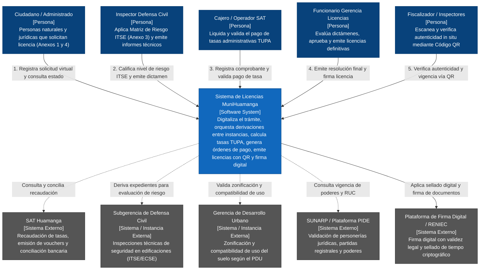
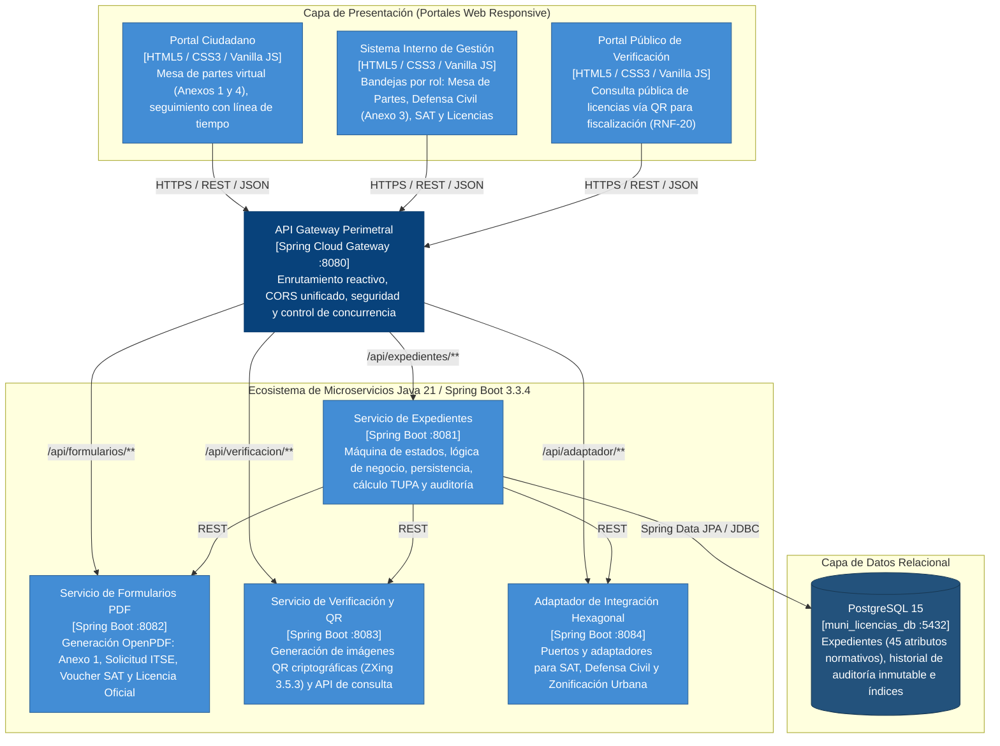
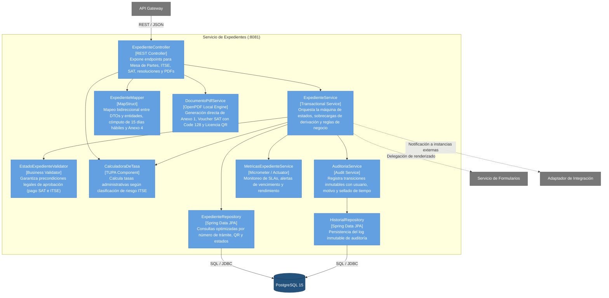
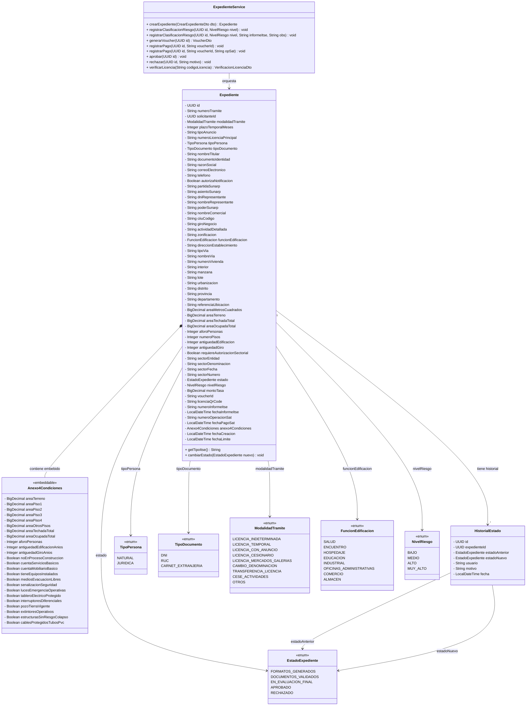

# Modelo de Arquitectura C4 — Sistema de Gestión de Licencias de Funcionamiento
### Municipalidad Provincial de Huamanga (MuniHuamanga)
> **Marco Normativo:** Ley N° 28976 / TUO D.S. N° 046-2017-PCM / D.S. N° 002-2018-PCM / D.S. N° 163-2020-PCM  
> **Versión de Arquitectura:** Fase 01 Actualizada  
> **Modelo:** C4 Model (Contexto, Contenedores, Componentes y Clases de Dominio)

---

## 1. Nivel 1 — Diagrama de Contexto del Sistema

Describe la interacción del sistema con los usuarios clave de la municipalidad y las entidades/instancias externas del ecosistema municipal:

```mermaid
graph TD
    classDef person fill:#08427b,stroke:#073b6f,color:#fff;
    classDef system fill:#1168bd,stroke:#0b4884,color:#fff;
    classDef extSystem fill:#555555,stroke:#333333,color:#fff;

    solicitante["Ciudadano / Administrado<br>[Persona]<br>Personas naturales y jurídicas que solicitan licencia (Anexos 1 y 4)"]:::person
    inspectorItse["Inspector Defensa Civil<br>[Persona]<br>Aplica Matriz de Riesgo ITSE (Anexo 3) y emite informes técnicos"]:::person
    cajeroSat["Cajero / Operador SAT<br>[Persona]<br>Liquida y valida el pago de tasas administrativas TUPA"]:::person
    funcionarioGL["Funcionario Gerencia Licencias<br>[Persona]<br>Evalúa dictámenes, aprueba y emite licencias definitivas"]:::person
    fiscalizador["Fiscalizador / Inspectores<br>[Persona]<br>Escanea y verifica autenticidad in situ mediante Código QR"]:::person

    sistema["Sistema de Licencias MuniHuamanga<br>[Software System]<br>Digitaliza el trámite, orquesta derivaciones entre instancias, calcula tasas TUPA, genera órdenes de pago, emite licencias con QR y firma digital"]:::system

    sat["SAT Huamanga<br>[Sistema Externo]<br>Recaudación de tasas, emisión de vouchers y conciliación bancaria"]:::extSystem
    defensaCivil["Subgerencia de Defensa Civil<br>[Sistema / Instancia Externa]<br>Inspecciones técnicas de seguridad en edificaciones (ITSE/ECSE)"]:::extSystem
    desarrolloUrbano["Gerencia de Desarrollo Urbano<br>[Sistema / Instancia Externa]<br>Zonificación y compatibilidad de uso del suelo según el PDU"]:::extSystem
    sunarp["SUNARP / Plataforma PIDE<br>[Sistema Externo]<br>Validación de personerías jurídicas, partidas registrales y poderes"]:::extSystem
    reniecPki["Plataforma de Firma Digital / RENIEC<br>[Sistema Externo]<br>Firma digital con validez legal y sellado de tiempo criptográfico"]:::extSystem

    solicitante -->|1. Registra solicitud virtual y consulta estado| sistema
    inspectorItse -->|2. Califica nivel de riesgo ITSE y emite dictamen| sistema
    cajeroSat -->|3. Registra comprobante y valida pago de tasa| sistema
    funcionarioGL -->|4. Emite resolución final y firma licencia| sistema
    fiscalizador -->|5. Verifica autenticidad y vigencia vía QR| sistema

    sistema -.->|Consulta y concilia recaudación| sat
    sistema -.->|Deriva expedientes para evaluación de riesgo| defensaCivil
    sistema -.->|Valida zonificación y compatibilidad de uso| desarrolloUrbano
    sistema -.->|Consulta vigencia de poderes y RUC| sunarp
    sistema -->|Aplica sellado digital y firma de documentos| reniecPki
```

---

## 2. Nivel 2 — Diagrama de Contenedores

Ilustra la separación entre las aplicaciones web cliente, el API Gateway perimetral, los microservicios especializados del backend y el almacén de datos relacional:

```mermaid
graph TD
    classDef container fill:#438dd5,stroke:#2e6295,color:#fff;
    classDef db fill:#23527c,stroke:#173752,color:#fff;
    classDef gateway fill:#08427b,stroke:#073b6f,color:#fff;

    subgraph CapaPresentacion ["Capa de Presentación (Portales Web Responsive)"]
        portalCiudadano["Portal Ciudadano<br>[HTML5 / CSS3 / Vanilla JS]<br>Mesa de partes virtual (Anexos 1 y 4), seguimiento con línea de tiempo"]:::container
        portalInterno["Sistema Interno de Gestión<br>[HTML5 / CSS3 / Vanilla JS]<br>Bandejas por rol: Mesa de Partes, Defensa Civil (Anexo 3), SAT y Licencias"]:::container
        portalVerificacion["Portal Público de Verificación<br>[HTML5 / CSS3 / Vanilla JS]<br>Consulta pública de licencias vía QR para fiscalización (RNF-20)"]:::container
    end

    gateway["API Gateway Perimetral<br>[Spring Cloud Gateway :8080]<br>Enrutamiento reactivo, CORS unificado, seguridad y control de concurrencia"]:::gateway

    subgraph Backend ["Ecosistema de Microservicios Java 21 / Spring Boot 3.3.4"]
        servicioExpedientes["Servicio de Expedientes<br>[Spring Boot :8081]<br>Máquina de estados, lógica de negocio, persistencia, cálculo TUPA y auditoría"]:::container
        servicioFormularios["Servicio de Formularios PDF<br>[Spring Boot :8082]<br>Generación OpenPDF: Anexo 1, Solicitud ITSE, Voucher SAT y Licencia Oficial"]:::container
        servicioVerificacion["Servicio de Verificación y QR<br>[Spring Boot :8083]<br>Generación de imágenes QR criptográficas (ZXing 3.5.3) y API de consulta"]:::container
        adaptadorIntegracion["Adaptador de Integración Hexagonal<br>[Spring Boot :8084]<br>Puertos y adaptadores para SAT, Defensa Civil y Zonificación Urbana"]:::container
    end

    subgraph Persistencia ["Capa de Datos Relacional"]
        postgres[("PostgreSQL 15<br>[muni_licencias_db :5432]<br>Expedientes (45 atributos normativos), historial de auditoría inmutable e índices")]:::db
    end

    portalCiudadano -->|HTTPS / REST / JSON| gateway
    portalInterno -->|HTTPS / REST / JSON| gateway
    portalVerificacion -->|HTTPS / REST / JSON| gateway

    gateway -->|/api/expedientes/**| servicioExpedientes
    gateway -->|/api/formularios/**| servicioFormularios
    gateway -->|/api/verificacion/**| servicioVerificacion
    gateway -->|/api/adaptador/**| adaptadorIntegracion

    servicioExpedientes -->|Spring Data JPA / JDBC| postgres
    servicioExpedientes -->|REST| servicioFormularios
    servicioExpedientes -->|REST| servicioVerificacion
    servicioExpedientes -->|REST| adaptadorIntegracion
```

---

## 3. Nivel 3 — Diagrama de Componentes: Servicio de Expedientes

Detalla la arquitectura interna del microservicio central `servicio-expedientes`, mostrando la separación de controladores, servicios de dominio, validadores y persistencia:

```mermaid
graph TD
    classDef comp fill:#63a0e2,stroke:#3b7abf,color:#fff;
    classDef db fill:#23527c,stroke:#173752,color:#fff;
    classDef ext fill:#777777,stroke:#555555,color:#fff;

    gateway["API Gateway"]:::ext

    subgraph ServicioExpedientes ["Servicio de Expedientes (:8081)"]
        controller["ExpedienteController<br>[REST Controller]<br>Expone endpoints para Mesa de Partes, ITSE, SAT, resoluciones y PDFs"]:::comp
        service["ExpedienteService<br>[Transactional Service]<br>Orquesta la máquina de estados, sobrecargas de derivación y reglas de negocio"]:::comp
        mapper["ExpedienteMapper<br>[MapStruct]<br>Mapeo bidireccional entre DTOs y entidades, cómputo de 15 días hábiles y Anexo 4"]:::comp
        validator["EstadoExpedienteValidator<br>[Business Validator]<br>Garantiza precondiciones legales de aprobación (pago SAT e ITSE)"]:::comp
        calculadora["CalculadoraDeTasa<br>[TUPA Component]<br>Calcula tasas administrativas según clasificación de riesgo ITSE"]:::comp
        auditoria["AuditoriaService<br>[Audit Service]<br>Registra transiciones inmutables con usuario, motivo y sellado de tiempo"]:::comp
        metricas["MetricasExpedienteService<br>[Micrometer / Actuator]<br>Monitoreo de SLAs, alertas de vencimiento y rendimiento"]:::comp
        pdfService["DocumentoPdfService<br>[OpenPDF Local Engine]<br>Generación directa de Anexo 1, Voucher SAT con Code 128 y Licencia QR"]:::comp
        expedienteRepo["ExpedienteRepository<br>[Spring Data JPA]<br>Consultas optimizadas por número de trámite, QR y estados"]:::comp
        historialRepo["HistorialRepository<br>[Spring Data JPA]<br>Persistencia del log inmutable de auditoría"]:::comp
    end

    servicioFormularios["Servicio de Formularios"]:::ext
    adaptadorIntegracion["Adaptador de Integración"]:::ext
    postgres[("PostgreSQL 15")]:::db

    gateway -->|REST / JSON| controller
    controller --> service
    controller --> mapper
    controller --> pdfService
    controller --> calculadora

    service --> validator
    service --> calculadora
    service --> auditoria
    service --> metricas
    service --> expedienteRepo
    auditoria --> historialRepo

    service -.->|Delegación de renderizado| servicioFormularios
    service -.->|Notificación a instancias externas| adaptadorIntegracion

    expedienteRepo -->|SQL / JDBC| postgres
    historialRepo -->|SQL / JDBC| postgres
```

---

## 4. Diagrama de Clases del Dominio (Fase 01)

Estructura completa de entidades JPA, objetos embebidos (`@Embeddable`), enums normativos y DTOs del sistema:

```mermaid
classDiagram
    class Expediente {
        - UUID id
        - String numeroTramite
        - UUID solicitanteId
        - ModalidadTramite modalidadTramite
        - Integer plazoTemporalMeses
        - String tipoAnuncio
        - String numeroLicenciaPrincipal
        - TipoPersona tipoPersona
        - TipoDocumento tipoDocumento
        - String nombreTitular
        - String documentoIdentidad
        - String razonSocial
        - String correoElectronico
        - String telefono
        - Boolean autorizaNotificacion
        - String partidaSunarp
        - String asientoSunarp
        - String dniRepresentante
        - String nombreRepresentante
        - String poderSunarp
        - String nombreComercial
        - String ciiuCodigo
        - String giroNegocio
        - String actividadDetallada
        - String zonificacion
        - FuncionEdificacion funcionEdificacion
        - String direccionEstablecimiento
        - String tipoVia
        - String nombreVia
        - String numeroVivienda
        - String interior
        - String manzana
        - String lote
        - String urbanizacion
        - String distrito
        - String provincia
        - String departamento
        - String referenciaUbicacion
        - BigDecimal areaMetrosCuadrados
        - BigDecimal areaTerreno
        - BigDecimal areaTechadaTotal
        - BigDecimal areaOcupadaTotal
        - Integer aforoPersonas
        - Integer numeroPisos
        - Integer antiguedadEdificacion
        - Integer antiguedadGiro
        - Boolean requiereAutorizacionSectorial
        - String sectorEntidad
        - String sectorDenominacion
        - String sectorFecha
        - String sectorNumero
        - EstadoExpediente estado
        - NivelRiesgo nivelRiesgo
        - BigDecimal montoTasa
        - String voucherId
        - String licenciaQrCode
        - String numeroInformeItse
        - LocalDateTime fechaInformeItse
        - String numeroOperacionSat
        - LocalDateTime fechaPagoSat
        - Anexo4Condiciones anexo4Condiciones
        - LocalDateTime fechaCreacion
        - LocalDateTime fechaLimite
        + getTipoItse() String
        + cambiarEstado(EstadoExpediente nuevo) void
    }

    class Anexo4Condiciones {
        <<embeddable>>
        - BigDecimal areaTerreno
        - BigDecimal areaPiso1
        - BigDecimal areaPiso2
        - BigDecimal areaPiso3
        - BigDecimal areaPiso4
        - BigDecimal areaOtrosPisos
        - BigDecimal areaTechadaTotal
        - BigDecimal areaOcupadaTotal
        - Integer aforoPersonas
        - Integer antiguedadEdificacionAnios
        - Integer antiguedadGiroAnios
        - Boolean noEnProcesoConstruccion
        - Boolean cuentaServiciosBasicos
        - Boolean cuentaMobiliarioBasico
        - Boolean tieneEquiposInstalados
        - Boolean mediosEvacuacionLibres
        - Boolean senalizacionSeguridad
        - Boolean lucesEmergenciaOperativas
        - Boolean tableroElectricoProtegido
        - Boolean interruptoresDiferenciales
        - Boolean pozoTierraVigente
        - Boolean extintoresOperativos
        - Boolean estructurasSinRiesgoColapso
        - Boolean cablesProtegidosTubosPvc
    }

    class HistorialEstado {
        - UUID id
        - UUID expedienteId
        - EstadoExpediente estadoAnterior
        - EstadoExpediente estadoNuevo
        - String usuario
        - String motivo
        - LocalDateTime fecha
    }

    class TipoPersona {
        <<enum>>
        NATURAL
        JURIDICA
    }

    class TipoDocumento {
        <<enum>>
        DNI
        RUC
        CARNET_EXTRANJERIA
    }

    class ModalidadTramite {
        <<enum>>
        LICENCIA_INDETERMINADA
        LICENCIA_TEMPORAL
        LICENCIA_CON_ANUNCIO
        LICENCIA_CESIONARIO
        LICENCIA_MERCADOS_GALERIAS
        CAMBIO_DENOMINACION
        TRANSFERENCIA_LICENCIA
        CESE_ACTIVIDADES
        OTROS
    }

    class FuncionEdificacion {
        <<enum>>
        SALUD
        ENCUENTRO
        HOSPEDAJE
        EDUCACION
        INDUSTRIAL
        OFICINAS_ADMINISTRATIVAS
        COMERCIO
        ALMACEN
    }

    class NivelRiesgo {
        <<enum>>
        BAJO
        MEDIO
        ALTO
        MUY_ALTO
    }

    class EstadoExpediente {
        <<enum>>
        FORMATOS_GENERADOS
        DOCUMENTOS_VALIDADOS
        EN_EVALUACION_FINAL
        APROBADO
        RECHAZADO
    }

    class ExpedienteService {
        + crearExpediente(CrearExpedienteDto dto) Expediente
        + registrarClasificacionRiesgo(UUID id, NivelRiesgo nivel) void
        + registrarClasificacionRiesgo(UUID id, NivelRiesgo nivel, String informeItse, String obs) void
        + generarVoucher(UUID id) VoucherDto
        + registrarPago(UUID id, String voucherId) void
        + registrarPago(UUID id, String voucherId, String opSat) void
        + aprobar(UUID id) void
        + rechazar(UUID id, String motivo) void
        + verificarLicencia(String codigoLicencia) VerificacionLicenciaDto
    }

    ExpedienteService --> Expediente : orquesta
    Expediente *-- Anexo4Condiciones : contiene embebido
    Expediente --> TipoPersona : tipoPersona
    Expediente --> TipoDocumento : tipoDocumento
    Expediente --> ModalidadTramite : modalidadTramite
    Expediente --> FuncionEdificacion : funcionEdificacion
    Expediente --> NivelRiesgo : nivelRiesgo
    Expediente --> EstadoExpediente : estado
    Expediente "1" --> "*" HistorialEstado : tiene historial
    HistorialEstado --> EstadoExpediente : estadoAnterior
    HistorialEstado --> EstadoExpediente : estadoNuevo
```

---

## 5. Mapeo de la Máquina de Estados con Normativa y Actores

| Estado C4 | Actor Responsable | Formato / Documento Asociado | Precondición Legal para Transicionar |
|---|---|---|---|
| **`FORMATOS_GENERADOS`** | Administrado / Mesa de Partes | Anexo 1 (Licencia) + Anexo 4 (Condiciones de Seguridad) | Validación de identidad (DNI/RUC) y presunción de veracidad. |
| **`DOCUMENTOS_VALIDADOS`** | Subgerencia de Defensa Civil | Anexo 3 (Reporte Nivel de Riesgo ITSE) | Clasificación de riesgo asignada conforme a la Matriz ITSE y tasa TUPA calculada. |
| **`EN_EVALUACION_FINAL`** | SAT Huamanga / Tesorería | Orden de Pago / Voucher SAT con Código 128 | Constancia de pago de tasa registrada con número de operación de caja/banco. |
| **`APROBADO`** | Gerencia de Licencias | Certificado Oficial de Licencia con QR y Firma Digital | Dictámenes favorables de ITSE, Zonificación y pago verificado. |
| **`RECHAZADO`** | Gerencia de Licencias | Resolución de Denegatoria / Acta de Observaciones | Dictamen técnico desfavorable o zonificación no compatible. |
