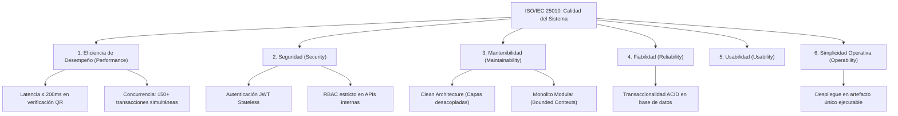
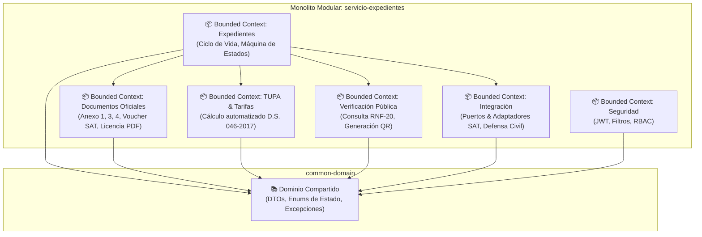
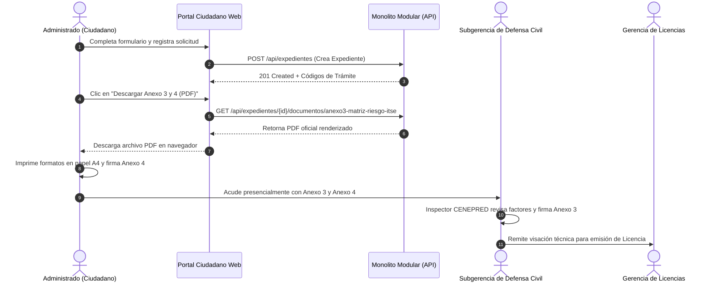

# Propuesta de Arquitectura de Software: Monolito Modular con Clean Architecture
## Sistema Integrado de Digitalización del Trámite de Licencia de Funcionamiento
### Municipalidad Provincial de Huamanga (Ayacucho, Perú)

---

## 1. Revisión de Notas de Usuario (Historias de Usuario)

El sistema modela el ciclo de vida del trámite de Licencias de Funcionamiento conforme a la **Ley Marco de Licencia de Funcionamiento (Ley N° 28976)**, su **Texto Único Ordenado (D.S. N° 046-2017-PCM)**, y el **Reglamento de Inspecciones Técnicas de Seguridad en Edificaciones - ITSE (D.S. N° 002-2018-PCM)**.

A continuación, se revisan las Historias de Usuario (User Stories) nucleares del sistema:

| ID | Título | Actor / Rol | Descripción de la Necesidad | Criterios de Aceptación Clave |
|---|---|---|---|---|
| **US-01** | Registro de Solicitud en Mesa de Partes Virtual | Administrado (Ciudadano / Representante Legal) | Registrar virtualmente su solicitud de licencia completando datos de titular, establecimiento, giro y zonificación. | Validación estricta de DNI (8 dígitos) / RUC (11 dígitos), área en m², giro comercial. Generación automática del código único correlativo `EXP-YYYY-XXXXX`. |
| **US-02** | Determinación Automática del Nivel de Riesgo ITSE | Sistema / Inspector ITSE | Clasificar objetivamente el nivel de riesgo del local según la matriz de riesgo del D.S. N° 002-2018-PCM y lineamientos CENEPRED. | Asignación determinista de `BAJO`, `MEDIO`, `ALTO` o `MUY_ALTO` en base al giro (CIIU), aforo, almacenamiento de materiales peligrosos y área construida. |
| **US-03** | Cálculo Automatizado de Tasas Administrativas TUPA | Administrado / Sistema | Calcular la tasa administrativa exacta según el TUPA institucional de la Municipalidad Provincial de Huamanga. | Desglose transparente de costos de tramitación, inspección técnica y derecho de emisión según modalidad ITSE Posterior o Previa. |
| **US-04** | Liquidación y Generación de Orden de Pago SAT | Administrado / SAT | Generar la orden de pago (voucher) para abono en ventanilla o banca electrónica del SAT Huamanga. | Generación de código de voucher correlativo (`VCH-YYYY-XXXXXX`), monto exacto en PEN y código de barras Code 128. |
| **US-05** | Emisión de Formatos Oficiales (Anexos 1, 3 y 4) | Administrado / Gerencia de Licencias | Generar los formatos oficiales estandarizados en PDF listos para impresión y suscripción. | Cumplimiento del diseño ministerial: Anexo 1 (Declaración Jurada - 2 págs), Anexo 3 (Matriz ITSE - 2 págs), Anexo 4 (Condiciones de Seguridad - 4 págs). |
| **US-06** | Conciliación de Pago de Tasa | Cajero SAT / Sistema | Registrar y conciliar el pago de la tasa tributaria municipal. | Transición automática del estado del expediente de `FORMATOS_GENERADOS` a `PAGADO` con registro de fecha y canal de recaudación. |
| **US-07** | Evaluación Técnica y Legal de Requisitos | Evaluador Municipal (Licencias) | Evaluar la procedencia técnica y legal de los requisitos declarados. | Posibilidad de aprobar u observar el trámite. Registro auditado de observaciones con plazo de subsanación de hasta 5 días hábiles. |
| **US-08** | Inspección Técnica de Seguridad (ITSE Previa / Posterior) | Inspector Defensa Civil (CENEPRED) | Registrar el dictamen técnico favorable o desfavorable tras la inspección física del local comercial. | Si el riesgo es Alto/Muy Alto: inspección obligatoria previa a la licencia. Si es Bajo/Medio: inspección posterior programada dentro del plazo legal. |
| **US-09** | Emisión y Firma Digital del Certificado de Licencia | Gerente de Licencias y Autorizaciones | Emitir formalmente el Certificado Oficial de Licencia de Funcionamiento con código QR y validez jurídica. | Generación de código único `LIC-YYYY-XXXXXXXX`, PDF oficial con sello digital, vigencia indeterminada (Art. 3° Ley N° 28976). |
| **US-10** | Incorporación de Mecanismo de Seguridad y QR | Inspector / Fiscalizador / Ciudadano | Disponer de un código QR impreso en la licencia que enlace a la verificación institucional. | El QR direcciona a la URL pública de validación de autenticidad en el portal web municipal. |
| **US-11** | Verificación Pública de Autenticidad en Línea | Ciudadano / Fiscalizador / PNP | Consultar en tiempo real y sin autenticación la autenticidad, titularidad y vigencia de una licencia emitida. | Respuesta en formato JSON / Interfaz pública en menos de 200 ms, informando razón social, giro, dirección y estado vigente/revocado. |
| **US-12** | Notificaciones Automatizadas por Correo Electrónico | Administrado / Sistema | Recibir alertas automáticas en su correo electrónico ante cada cambio de estado de su trámite. | Envío de correos HTML estilizados con detalles del expediente, plazos y documentos adjuntos o enlaces de descarga. |
| **US-13** | Integración con Entidades Municipales (Ports & Adapters) | Subgerencias Municipales (SAT, Defensa Civil, Edificaciones, Fiscalización) | Consultar e interoperar datos entre áreas municipales sin acoplamiento rígido de bases de datos. | Arquitectura de puertos y adaptadores desacoplada que permite conectar APIs reales o stubs de simulación. |

---

## 2. Requisitos del Sistema

### 2.1. Requisitos Funcionales (RF)
- **RF-01 (Mesa de Partes Virtual):** El sistema debe capturar el formulario multipaso de solicitud, validando datos de personas naturales y jurídicas.
- **RF-02 (Gestión de Estados):** El expediente debe regirse por una máquina de estados finita: `REGISTRADO` $\rightarrow$ `FORMATOS_GENERADOS` $\rightarrow$ `PAGADO` $\rightarrow$ `EN_EVALUACION` $\rightarrow$ `OBSERVADO` / `APROBADO` / `RECHAZADO`.
- **RF-03 (Generación de Formatos Oficiales en PDF):** Generar dinámicamente y con fidelidad normativa los formatos ministeriales oficiales: Anexo 1 (Declaración Jurada), Anexo 3 (Matriz ITSE), Anexo 4 (Condiciones de Seguridad), Voucher SAT y Certificado Oficial de Licencia.
- **RF-04 (Cálculo TUPA):** Calcular automáticamente las tasas administrativas diferenciadas por nivel de riesgo y tipo de inspección ITSE.
- **RF-05 (Seguridad y Roles RBAC):** Implementar control de acceso basado en roles (`CIUDADANO`, `MESA_PARTES`, `EVALUADOR`, `DEFENSA_CIVIL`, `GERENTE`, `FISCALIZADOR`, `ADMIN`).
- **RF-06 (Auditoría Integral):** Registrar cada cambio de estado, fecha, usuario responsable, IP y sustento técnico en una tabla inmutable de auditoría.
- **RF-07 (Trazabilidad y Notificación):** Disparar notificaciones por correo electrónico al administrado ante eventos clave (registro, emisión de voucher, aprobación, observaciones).

### 2.2. Requisitos No Funcionales (RNF) según ISO/IEC 25010



- **RNF-01 (Eficiencia de Desempeño - Latencia):** El endpoint público de verificación de licencias (`/api/public/licencias/{codigo}`) debe responder en un percentil $P_{95} \le 200 \text{ ms}$.
- **RNF-02 (Eficiencia de Desempeño - Capacidad Concurrente):** El sistema debe soportar un mínimo de 150 usuarios o peticiones concurrentes sostenidas sin degradación de servicio ni bloqueos muertos (*deadlocks*).
- **RNF-03 (Seguridad - Autenticación y Autorización):** Mecanismo de autenticación basado en tokens JWT firmados criptográficamente (HMAC-SHA256) con expiración configurable y roles autorizados.
- **RNF-04 (Mantenibilidad - Modularidad y Bajo Acoplamiento):** El código debe organizarse en Bounded Contexts independientes con alta cohesión y bajo acoplamiento, gobernados por las reglas de dependencia de Clean Architecture.
- **RNF-05 (Fiabilidad - Integridad Transaccional):** Toda mutación de estado del expediente, cálculo de tarifas y registro de auditoría debe ejecutarse bajo transacciones atómicas (ACID) en la capa de persistencia.
- **RNF-06 (Compatibilidad e Interoperabilidad):** Exposición de interfaces REST documentadas bajo la especificación OpenAPI 3.0 / Swagger UI.

---

## 3. Atributos de Calidad Priorizados

1. **Rendimiento y Latencia:** La verificación ciudadana y generación de documentos PDF deben ser ultrarrápidas, evitando latencias de red innecesarias originadas por llamadas HTTP distribuidas inter-servicios.
2. **Mantenibilidad y Limpieza:** Código estructurado en capas bien delimitadas (Domain, Application, Infrastructure, Presentation), con separación de responsabilidades e inversión de dependencias.
3. **Seguridad e Integridad:** Protección integral contra alteraciones en expedientes; endpoints administrativos blindados con Spring Security y tokens JWT; endpoint público de solo lectura sin fuga de información sensible.
4. **Simplicidad Operativa:** Despliegue de bajo costo y mínima fricción técnica. Un único artefacto JAR autónomo con servidor embebido, eliminando la sobrecarga de orquestación, gateways y múltiples procesos de microservicios dispersos.
5. **Transaccionalidad y Consistencia:** Garantía estricta de consistencia en el ciclo de vida del trámite mediante transacciones locales ACID de base de datos relacional.

---

## 4. Drivers Arquitectónicos

```mermaid
graph TD
    classDef rootNode fill:#1A365D,stroke:#0f233d,color:#ffffff,stroke-width:2px;
    classDef catNode fill:#2B6CB0,stroke:#1A365D,color:#ffffff,stroke-width:1px;
    classDef leafNode fill:#EDF2F7,stroke:#CBD5E0,color:#2D3748;

    ROOT["🎯 Drivers Arquitectónicos"]:::rootNode

    BIZ["🏢 Drivers de Negocio"]:::catNode
    ROOT --> BIZ
    BIZ --> B1["Cumplimiento TUO Ley 28976"]:::leafNode
    BIZ --> B2["Cero Papel en Mesa de Partes"]:::leafNode
    BIZ --> B3["Transparencia y Celeridad en Huamanga"]:::leafNode
    BIZ --> B4["Validez de Licencias con Código QR"]:::leafNode

    TECH["⚙️ Drivers Técnicos"]:::catNode
    ROOT --> TECH
    TECH --> T1["Java 21 LTS y Spring Boot 3.3"]:::leafNode
    TECH --> T2["Clean Architecture y Hexagonal Ports"]:::leafNode
    TECH --> T3["Generación PDF con OpenPDF y ZXing"]:::leafNode
    TECH --> T4["Persistencia Relacional ACID"]:::leafNode

    CONST["🔒 Restricciones"]:::catNode
    ROOT --> CONST
    CONST --> C1["Presupuesto de Infraestructura Limitado"]:::leafNode
    CONST --> C2["Equipo de Desarrollo Reducido"]:::leafNode
    CONST --> C3["Cumplimiento Normativo CENEPRED"]:::leafNode
    CONST --> C4["Firma Presencial de Anexos en Defensa Civil"]:::leafNode
```



- **Drivers de Negocio:**
  - Modernización y digitalización del trámite de licencias en la Municipalidad Provincial de Huamanga.
  - Reducción drástica del plazo de resolución (máximo 15 días hábiles para riesgo alto/muy alto, y resolución inmediata/posterior para riesgo bajo/medio).
  - Eliminación de falsificaciones de licencias comerciales mediante verificación pública digital vía código QR.
- **Drivers Técnicos:**
  - Adopción de tecnologías robustas y modernas: Java 21 LTS, Spring Boot 3.3.4, Hibernate 6, H2/PostgreSQL.
  - Renderización de documentos oficiales en memoria utilizando OpenPDF y generación de códigos de barras/QR mediante ZXing.
  - Prevención de fallos distribuidos (*network partitions*, *circuit breaking*, latencia acumulada de microservicios en red local).
- **Restricciones y Supuestos:**
  - Infraestructura tecnológica de la municipalidad administrada por un equipo operativo compacto.
  - Firma física de anexos de seguridad: Por disposición de la normativa local de Defensa Civil, los Anexos 3 y 4 deben ser descargados en PDF oficial por el ciudadano, impresos y llevados presencialmente a la oficina de Defensa Civil para revisión e inspección en campo antes de su visación final.

---

## 5. Estilo Arquitectónico: Monolito Modular (Modular Monolith)

### 5.1. Justificación de la Elección vs. Microservicios Dispersos

En la fase inicial de prototipado, el proyecto se concibió con una topología de microservicios distribuidos compuesta por:
- `api-gateway` (Spring Cloud Gateway, puerto 8080)
- `servicio-expedientes` (puerto 8081)
- `servicio-formularios` (puerto 8082)
- `servicio-verificacion-licencias` (puerto 8083)
- `adaptador-integracion` (puerto 8084)

**Problemas detectados con el enfoque de microservicios:**
1. **Sobrecarga de Red Injustificada:** Para emitir una sola licencia o descargar un anexo, el navegador o el backend debían realizar múltiples saltos de red HTTP inter-servicios, multiplicando la latencia por un factor de 4x.
2. **Duplicación Masiva de Código ("Dead Code"):** Clases enteras como `Anexo1PdfGenerator`, `Anexo3PdfGenerator`, `Anexo4PdfGenerator` y `QrGeneratorService` estaban duplicadas idénticamente en dos y tres microservicios distintos.
3. **Pérdida de Transaccionalidad:** Requería coordinar transacciones distribuidas complejas (o tolerar inconsistencia eventual) para registrar un expediente y su verificación.
4. **Fricción Operativa Extrema:** Mantener 5 procesos Java activos simultáneamente consumía más de 2.5 GB de memoria RAM en entornos locales/municipales, complicando el despliegue y monitoreo.

**Decisión Arquitectónica:**
Se adopta el estilo **Monolito Modular (Modular Monolith)**. Todas las capacidades de negocio se consolidan en un único artefacto de ejecución (`servicio-expedientes`) manteniendo una rigurosa modularización lógica interna mediante paquetes desacoplados que representan **Bounded Contexts** (Contextos Delimitados):



### 5.2. Ventajas del Monolito Modular
- **Rendimiento Insuperable:** La invocación entre contextos delimitados ocurre en memoria local de la JVM (llamada a método Java) en menos de 0.05 ms, eliminando la serialización JSON HTTP innecesaria.
- **Transaccionalidad ACID Garantizada:** Se utiliza el gestor transaccional nativo de Spring y JPA (`@Transactional`) sin riesgo de inconsistencias.
- **Un Solo Artefacto de Despliegue:** Un único archivo `servicio-expedientes.jar` que se ejecuta en cualquier servidor o contenedor Docker con mínimo consumo de recursos (~350 MB RAM).

---

## 6. Enfoque Arquitectónico Interno: Clean Architecture

Cada módulo o contexto dentro del Monolito Modular sigue los principios de **Clean Architecture** (Arquitectura Limpia) y el patrón **Ports & Adapters (Arquitectura Hexagonal)**:

```mermaid
graph TD
    subgraph Capa 4: Frameworks, Drivers & UI (Externa)
        WEB["Controladores REST<br/>ExpedienteController, PublicLicenciasController,<br/>AdaptadorController, DocumentosFormulariosController"]
        UI["Portal Web Ciudadano & Gestión Interna<br/>(HTML5 / CSS / Vanilla JS)"]
        DB["PostgreSQL / H2 Database<br/>Spring Data JPA Repositories"]
    end

    subgraph Capa 3: Interface Adapters
        REP_ADAPTER["Adaptadores de Repositorio JPA"]
        INT_ADAPTER["Adaptadores de Integración Externa<br/>(DefensaCivilAdapter, SatAdapter, EdificacionesAdapter)"]
        PDF_ADAPTER["Generadores OpenPDF y ZXing QR"]
    end

    subgraph Capa 2: Use Cases / Application
        APP_SERV["Servicios de Aplicación<br/>ExpedienteService, TarifaTupaService,<br/>DocumentoPdfService, AuditoriaService"]
        PORTS["Puertos de Integración (Interfaces)<br/>DefensaCivilPort, SatPort, EdificacionesPort, FiscalizacionPort"]
    end

    subgraph Capa 1: Enterprise Domain (Núcleo)
        ENTITIES["Entidades del Dominio<br/>Expediente, AuditoriaExpediente, TarifaTupa"]
        ENUMS["Enums & Value Objects<br/>EstadoExpediente, NivelRiesgo, TipoLicencia"]
        RULES["Reglas de Negocio Puras<br/>Validación de Transiciones, Regla de Plazos"]
    end

    WEB --> APP_SERV
    UI --> WEB
    APP_SERV --> ENTITIES
    APP_SERV --> PORTS
    INT_ADAPTER --> PORTS
    REP_ADAPTER --> ENTITIES
    PDF_ADAPTER --> APP_SERV
```

### 6.1. Regla de Dependencia Estricta
- **Domain (Núcleo):** Las entidades de dominio (`Expediente`, `AuditoriaExpediente`, `TarifaTupa`) y los tipos de valor/enums no dependen de ningún framework externo. Contienen las invariantes de negocio y reglas de validación.
- **Application (Casos de Uso):** Contiene la orquestación del flujo (`ExpedienteService`, `TarifaTupaService`, `CalculadoraDeTasa`). Define los **Puertos (Ports)** como interfaces Java que declaran lo que la aplicación necesita hacia el exterior.
- **Infrastructure & Adapters:** Implementa los puertos definidos por la aplicación:
  - `DefensaCivilAdapterService` implementa `DefensaCivilPort`.
  - `SatAdapterService` implementa `SatPort`.
  - `EdificacionesAdapterService` implementa `EdificacionesPort`.
  - `FiscalizacionAdapterService` implementa `FiscalizacionPort`.
- **Presentation / Web Delivery:** Controladores REST que transforman las peticiones HTTP y DTOs hacia los servicios de aplicación y devuelven respuestas HTTP estructuradas con códigos de estado estándar (200, 201, 400, 404, 422).

---

## 7. Estrategia y Flujo de Anexos 3 y 4 (Mesa de Ayuda para Etapa Final)

### 7.1. Flujo Normativo de Tramitación de Anexos Físicos
De acuerdo con el procedimiento administrativo municipal vigente:
1. **Generación Automática:** Al registrarse el expediente, el sistema clasifica el riesgo y genera automáticamente en memoria los PDFs de los **Anexos 1, 3 y 4** con los datos del contribuyente y local.
2. **Descarga e Impresión Física:** El administrado descarga los archivos PDF generados desde el portal ciudadano:
   - **Anexo 3 (Matriz de Riesgo ITSE):** Debe imprimirse para su presentación física ante la **Subgerencia de Defensa Civil (Gestión de Riesgo de Desastres)** de la Municipalidad Provincial de Huamanga. En dicha sede, el Inspector Acreditado CENEPRED revisa las condiciones, inspecciona el local (si corresponde) y suscribe el dictamen oficial.
   - **Anexo 4 (Declaración Jurada de Condiciones de Seguridad):** El administrado imprime el formato de 4 páginas, verifica el cumplimiento de las condiciones de seguridad (extintores vigentes, tablero eléctrico rotulado con llaves termomagnéticas e interruptores diferenciales, luces de emergencia y pozo a tierra) y lo suscribe con su **firma manuscrita y huella digital**, adjuntando la firma del profesional técnico colegiado en casos de riesgo Alto/Muy Alto.
3. **Presentación Presencial:** Los formatos físicos firmados se presentan en la ventanilla de la Subgerencia correspondiente para anexarse al legajo físico del expediente administrativo.



### 7.2. Componente de Mesa de Ayuda / Ventanas de Ejemplo (Etapa Final)
En la interfaz del portal ciudadano (`portal-ciudadano.html` y `portal-ciudadano.js`) se ha preparado e integrado la infraestructura visual para la **Mesa de Ayuda**:
- **Botones de Asistencia en Tarjetas:** Cada tarjeta de descarga de Anexo cuenta con el botón de ayuda contextual: `💡 Mesa de Ayuda / ¿Cómo se tramita?` y `💡 Mesa de Ayuda / Instrucciones de Llenado`.
- **Ventana Modal de Orientación:** Explica al ciudadano qué gerencia interviene, qué copias debe imprimir y qué firmas/certificados técnicos anexar.
- **Preparación para Etapa Final:** Se incluye el aviso explícito de que en la fase final de despliegue se activará el **asistente interactivo guiado** con ejemplos modelo visuales por cada giro de negocio (e.g. restaurante, botica, bodega, taller mecánico) para maximizar la tasa de éxito del administrado en la primera presentación.

---

## 8. Matriz de Trazabilidad Arquitectónica

| Requisito / Calidad | Decisión Arquitectónica Adoptada | Componente Responsable | Validación |
|---|---|---|---|
| **Simplicidad Operativa** | Unificación en Monolito Modular | `servicio-expedientes` | Despliegue en 1 solo JAR, 0 dependencias de red interservicios |
| **Bajo Acoplamiento** | Clean Architecture / Ports & Adapters | `pe.gob.munihuamanga.licencias.expedientes.integracion` | Interfaces `DefensaCivilPort`, `SatPort`, `EdificacionesPort` |
| **Latencia < 200 ms** | In-memory PDF & QR rendering | `DocumentoPdfService`, `OpenPDF`, `ZXing` | Tests de rendimiento y carga concurrente |
| **Alta Concurrencia** | Pool HikariCP + Stateless JWT | `SecurityConfig`, `JwtAuthenticationFilter` | `Concurrencia150UsuariosTest` (150 hilos concurrentes) |
| **Fidelidad Legal** | Plantillas ministeriales oficiales en código | `Anexo1PdfGenerator`, `Anexo3PdfGenerator`, `Anexo4PdfGenerator` | Generación validada de documentos de 2 y 4 páginas |
| **Verificación Ciudadana** | Endpoint público de alta disponibilidad | `PublicLicenciasController` (`/api/public/licencias/{id}`) | `VerificacionPublicaTest`, validación por QR móvil |
