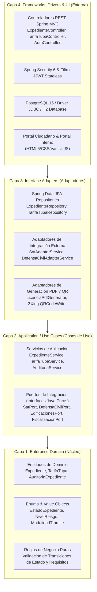
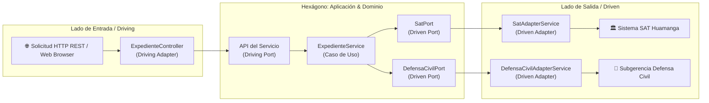

# Enfoque Arquitectónico: Clean Architecture y Ports & Adapters
## Sistema de Gestión Documentaria de Licencia de Funcionamiento
### Municipalidad Provincial de Huamanga (Ayacucho, Perú)

> **Marco Normativo:** Ley N° 28976 / TUO D.S. N° 046-2017-PCM / D.S. N° 002-2018-PCM / D.S. N° 163-2020-PCM  
> **Patrones Clave:** Clean Architecture (Robert C. Martin), Ports & Adapters / Hexagonal (Alistair Cockburn), DDD Táctico  
> **Ubicación:** `docs/arquitectura/enfoque-arquitectonico.md`

---

## 1. Definición del Enfoque Arquitectónico

Mientras que el estilo arquitectónico (Monolito Modular) define la estructura global y el modo de despliegue físico de la aplicación, el **Enfoque Arquitectónico** determina la estructura interna, las reglas de dependencia y la organización del código fuente dentro de cada módulo.

El sistema implementa **Clean Architecture (Arquitectura Limpia)** complementada con el patrón **Ports & Adapters (Arquitectura Hexagonal)**.

El objetivo central de este enfoque es construir un sistema de software que sea:
1. **Independiente de Frameworks:** La lógica de negocio y las normas municipales no dependen de la existencia de Spring Boot, Hibernate ni librerías externas.
2. **Altamente Testeable:** Las reglas de negocio pueden probarse sin necesidad de levantar bases de datos, servidores web ni redes.
3. **Independiente de la Interfaz de Usuario:** Las interfaces gráficas (Portal Ciudadano, Portal Interno) pueden modificarse o sustituirse sin alterar los casos de uso.
4. **Independiente de la Base de Datos:** Los repositorios y bases de datos son detalles de implementación intercambiables.
5. **Independiente de Entidades Externas:** Las comunicaciones con el SAT, Defensa Civil o RENIEC están aisladas mediante abstracciones (puertos).

---

## 2. La Regla de Dependencia (The Dependency Rule)

> **Regla de Oro de Clean Architecture:**  
> *Las dependencias del código fuente solo pueden apuntar hacia adentro, hacia las abstracciones de más alto nivel de negocio.*  
> Ningún elemento de una capa interna puede tener conocimiento o referencia alguna de elementos pertenecientes a una capa más externa.

---

## 3. Desglose Concéntrico de las Cuatro Capas

### 3.1. Capa 1: Dominio Empresarial (Enterprise Business Rules)
Es el núcleo central e inmutable del sistema. Modela los conceptos y reglas de negocio del trámite de Licencias de Funcionamiento conforme a la Ley N° 28976 y el TUO D.S. N° 046-2017-PCM:
- **Entidades de Dominio:** 
  - `Expediente`: Modela los 45 atributos normativos (titular, local, zonificación, aforo, matriz de riesgo ITSE, licencia emitida y estado del ciclo de vida).
  - `TarifaTupa`: Modela la tasa tributaria municipal aplicable por nivel de riesgo.
  - `AuditoriaExpediente`: Entidad inmutable que registra la trazabilidad del trámite.
- **Enums y Value Objects:**
  - `EstadoExpediente`: Define los estados legales (`FORMATOS_GENERADOS`, `DOCUMENTOS_VALIDADOS`, `EN_EVALUACION_FINAL`, `APROBADO`, `RECHAZADO`).
  - `NivelRiesgo`: Clasificación objetiva CENEPRED (`BAJO`, `MEDIO`, `ALTO`, `MUY_ALTO`).
  - `RolUsuario`: Roles RBAC (`ROLE_ADMIN`, `ROLE_EVALUADOR`, `ROLE_CAJERO`).
- **Reglas e Invariantes:** Lógica pura de validación que impide transiciones de estado ilegales o emisión de licencias sin validación de requisitos.

### 3.2. Capa 2: Casos de Uso / Aplicación (Application Business Rules)
Contiene la orquestación y flujo del software para cumplir las peticiones de los usuarios:
- **Servicios de Aplicación:**
  - `ExpedienteService`: Orquesta el registro del trámite, validación de documentos, cálculo de tasa y transición de estados.
  - `CalculadoraDeTasa`: Aplica la regla de negocio para computar la tasa municipal exacta con base en el nivel de riesgo ITSE.
  - `TarifaTupaService`: Administra el catálogo de tarifas TUPA y su actualización dinámica.
  - `NotificacionEmailService`: Coordina el envío de alertas asíncronas con plantillas HTML y adjuntos PDF.
  - `AuditoriaService`: Registra cada transición de estado con marca de tiempo, usuario y dirección IP.
- **Puertos de Salida (Driven Ports):** Interfaces puras en Java (`SatPort`, `DefensaCivilPort`, `EdificacionesPort`, `FiscalizacionPort`) que definen lo que la aplicación necesita de agentes externos.

### 3.3. Capa 3: Adaptadores de Interfaz (Interface Adapters)
Convierte la información entre el formato requerido por la capa de aplicación y el formato requerido por el mundo exterior:
- **Adaptadores de Salida (Driven Adapters):**
  - `SatAdapterService`: Implementa `SatPort` para interactuar con la recaudación del SAT Huamanga.
  - `DefensaCivilAdapterService`: Implementa `DefensaCivilPort` para registrar y consultar dictámenes ITSE.
  - `EdificacionesAdapterService`: Implementa `EdificacionesPort` para la compatibilidad de uso del suelo.
  - `FiscalizacionAdapterService`: Implementa `FiscalizacionPort` para actas de control posterior.
  - `LicenciaPdfGenerator`, `Anexo1PdfGenerator`, `Anexo3PdfGenerator`, `Anexo4PdfGenerator`: Adaptadores que traducen entidades a documentos binarios PDF mediante OpenPDF.
- **Adaptadores de Persistencia:** Implementaciones de Spring Data JPA (`ExpedienteRepository`, `TarifaTupaRepository`) que convierten entidades a sentencias SQL relacionales.

### 3.4. Capa 4: Frameworks, Drivers y Mecanismos de Entrega (Delivery Layer)
Es la capa más externa, encargada de conectar la aplicación con la infraestructura y los usuarios:
- **Controladores REST (Driving Adapters):** `ExpedienteController`, `PublicLicenciasController`, `TarifaTupaController`, `AuthController`, `DocumentosFormulariosController`.
- **Seguridad:** Spring Security 6, `JwtAuthenticationFilter`, `JwtTokenProvider` para autenticación stateless mediante JWT.
- **Base de Datos:** PostgreSQL 15 en contenedor Docker y base de datos H2 para suites de prueba automatizada.
- **Frontend Web:** Interfaces de usuario ligeras desarrolladas con HTML5 semántico, CSS moderno y JavaScript Vanilla (`portal-ciudadano.html`, `portal-interno.html`, `portal-verificacion.html`).

---

## 4. Patrón Ports & Adapters (Arquitectura Hexagonal)

La interacción entre el núcleo de la aplicación y el exterior se estructura mediante puertos y adaptadores:

### Beneficios Concretos del Patrón Hexagonal en MuniHuamanga:
1. **Desacoplamiento Absoluto de Dependencias Externas:** Si la Subgerencia de Defensa Civil moderniza su sistema interno o el SAT cambia su formato de intercambio de datos, **únicamente se modifica el adaptador correspondiente**, dejando intacto el código de expedientes y el dominio.
2. **Pruebas Automatizadas Rápidas y Confiables:** Se pueden ejecutar pruebas unitarias simulando los puertos mediante Mocks sin necesidad de contar con conexión a las bases de datos del SAT o de Defensa Civil.
3. **Modo Autónomo (Self-Contained):** En caso de caída de conectividad de la red municipal, los adaptadores pueden operar en modo de simulación o contingencia sin detener la mesa de partes virtual.

---

## 5. Matriz de Componentes del Proyecto por Capa

| Capa Clean Architecture | Componente en el Proyecto | Tipo de Componente | Rol en el Sistema |
|---|---|---|---|
| **Dominio (Capa 1)** | `Expediente.java` | Entidad JPA / Negocio | Representa el expediente con sus 45 atributos normativos. |
| **Dominio (Capa 1)** | `EstadoExpediente.java` | Enum del Dominio | Define los estados válidos de la máquina de estados. |
| **Dominio (Capa 1)** | `NivelRiesgo.java` | Enum del Dominio | Clasificación objetiva del riesgo ITSE según CENEPRED. |
| **Dominio (Capa 1)** | `TarifaTupa.java` | Entidad JPA / Negocio | Modela el tarifario administrativo municipal vigente. |
| **Aplicación (Capa 2)** | `ExpedienteService.java` | Servicio de Casos de Uso | Coordina el registro, transiciones y aprobaciones. |
| **Aplicación (Capa 2)** | `CalculadoraDeTasa.java` | Lógica de Negocio | Computa montos de pago según riesgo y TUPA. |
| **Aplicación (Capa 2)** | `SatPort.java` | Puerto Secundario (Interface) | Contrato para conciliación y validación de vouchers SAT. |
| **Aplicación (Capa 2)** | `DefensaCivilPort.java` | Puerto Secundario (Interface) | Contrato para la calificación e inspección técnica ITSE. |
| **Adaptadores (Capa 3)** | `SatAdapterService.java` | Adaptador Secundario | Implementación del puerto para validar pagos tributarios. |
| **Adaptadores (Capa 3)** | `LicenciaPdfGenerator.java` | Adaptador Tecnológico | Renderiza el PDF de licencia con OpenPDF y QR ZXing. |
| **Adaptadores (Capa 3)** | `ExpedienteRepository.java` | Adaptador de Persistencia | Repositorio Spring Data JPA para PostgreSQL. |
| **Frameworks (Capa 4)** | `ExpedienteController.java` | Adaptador Primario (REST) | Expone la API REST del expediente al portal web. |
| **Frameworks (Capa 4)** | `JwtAuthenticationFilter.java`| Filtro de Seguridad | Valida el token JWT en las solicitudes internas. |
| **Frameworks (Capa 4)** | `portal-ciudadano.js` | Frontend Cliente | Orquesta la interacción del usuario en el navegador web. |

---

## 6. Conclusiones

El **Enfoque Arquitectónico** basado en **Clean Architecture + Hexagonal** garantiza que el Sistema de Licencias de Funcionamiento de la Municipalidad Provincial de Huamanga:
- Mantenga su lógica normativa estrictamente protegida de cambios en librerías o tecnologías de persistencia.
- Permita la máxima cobertura de pruebas unitarias e integración (80 tests automatizados con 100% de éxito).
- Facilite el mantenimiento evolutivo ante futuras normativas o directivas de la Presidencia del Consejo de Ministros (PCM).
