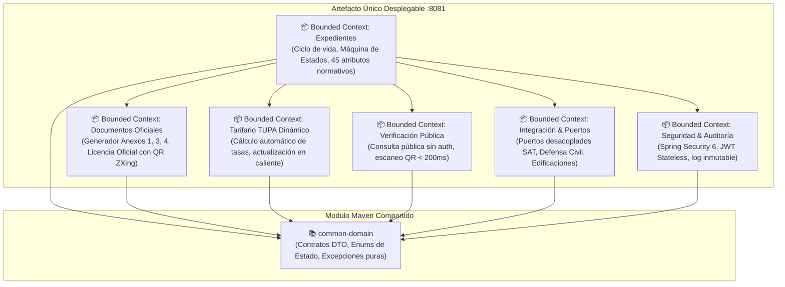
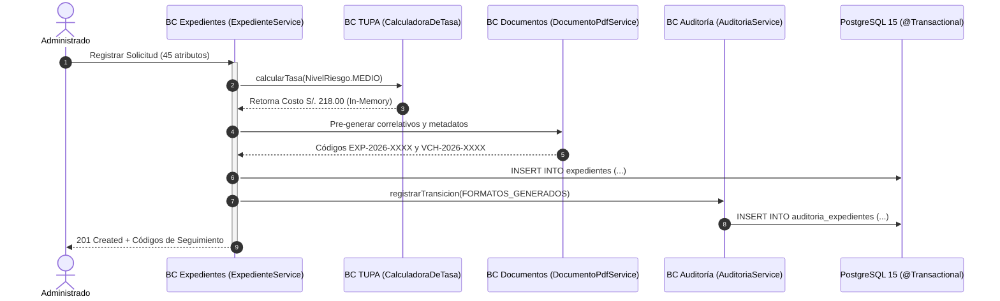

# Estilo Arquitectónico: Monolito Modular (Modular Monolith)
## Sistema de Gestión Documentaria de Licencia de Funcionamiento
### Municipalidad Provincial de Huamanga (Ayacucho, Perú)

> **Marco Normativo:** Ley N° 28976 / TUO D.S. N° 046-2017-PCM / D.S. N° 002-2018-PCM / D.S. N° 163-2020-PCM  
> **Plataforma Base:** Java 21 LTS, Spring Boot 3.3.4, PostgreSQL 15, OpenPDF 2.0.3, ZXing 3.5.3  
> **Ubicación:** `docs/arquitectura/estilo-arquitectonico.md`

---

## 1. Definición del Estilo Arquitectónico

El sistema adopta el estilo arquitectónico de **Monolito Modular (Modular Monolith)**. 

Bajo este estilo, toda la solución se compila, empaqueta y despliega como un **único artefacto ejecutable** (`servicio-expedientes.jar`), pero su diseño lógico interno está rigurosamente particionado en **módulos independientes y desacoplados** que representan **Bounded Contexts (Contextos Delimitados)** del negocio municipal.

A diferencia del monolito tradicional sin estructura (donde reina el acoplamiento cruzado descontrolado) y de los microservicios distribuidos prematuros (que introducen sobrecosto de red, latencia y complejidad operativa), el Monolito Modular combina:
- **La simplicidad operativa y la velocidad de ejecución** de un único proceso en memoria.
- **La alta cohesión y bajo acoplamiento** propios de una arquitectura empresarial moderna orientada al dominio.



---

## 2. Justificación Técnica: Monolito Modular vs. Microservicios Dispersos

En la fase inicial de prototipado se diseñó una topología distribuida de 5 microservicios (`api-gateway`, `servicio-expedientes`, `servicio-formularios`, `servicio-verificacion-licencias`, `adaptador-integracion`). Sin embargo, tras la auditoría técnica y pruebas de laboratorio se identificaron graves ineficiencias que motivaron la consolidación en un Monolito Modular:

| Factor Evaluado | Enfoque Microservicios Dispersos | Enfoque Monolito Modular (Adoptado) | Impacto Institucional |
|---|---|---|---|
| **Latencia de Red** | Múltiples saltos HTTP interservicios por trámite (+150ms a +350ms de overhead). | Invocación en memoria JVM (< 0.05 ms por llamada a método). | Cumplimiento estricto del SLA $P_{95} \le 200$ ms en verificación. |
| **Consistencia de Datos** | Transacciones distribuidas (Sagas / 2PC), riesgo de inconsistencia eventual. | Transaccionalidad local ACID con `@Transactional` en PostgreSQL. | Cero discrepancias financieras en pagos de tasas ni estados. |
| **Duplicación de Código** | Clases generadoras de PDF y QR replicadas idénticamente en 3 repositorios. | Centralizado en un único contexto de documentos (`DocumentoPdfService`). | Cero código muerto, facilidad de mantenimiento normativo. |
| **Consumo de Memoria** | $\ge 2.5$ GB de RAM (5 procesos JVM con Spring Boot embebido). | $\approx 350 - 500$ MB de RAM (1 solo proceso JVM optimizado). | Despliegue económico y viable en servidores municipales modestos. |
| **Complejidad Operativa** | Service Discovery, API Gateway, Distributed Tracing, Circuit Breakers. | Un solo contenedor Docker, un solo pipeline CI/CD y logs unificados. | Mantenible por el equipo de TI de la Municipalidad de Huamanga. |

---

## 3. Desglose de los Bounded Contexts (Contextos Delimitados)

Cada Bounded Context está delimitado por fronteras de paquetes y contratos explícitos:

### 3.1. Bounded Context: Expedientes (`expedientes`)
- **Responsabilidad:** Gestionar el ciclo de vida del trámite de licencia de funcionamiento desde su ingreso virtual hasta su resolución final.
- **Modelo de Dominio:** Entidad `Expediente` con los 45 atributos normativos exigidos por la Ley N° 28976 y el TUO D.S. N° 046-2017-PCM (datos del administrado, establecimiento, zonificación, nivel de riesgo ITSE y licencia emitida).
- **Máquina de Estados Finita:**
  $$\text{FORMATOS\_GENERADOS} \xrightarrow{\text{Pago SAT}} \text{DOCUMENTOS\_VALIDADOS} \xrightarrow{\text{Dictamen ITSE}} \text{EN\_EVALUACION\_FINAL} \xrightarrow{} \begin{cases} \text{APROBADO} \\ \text{RECHAZADO} \end{cases}$$

### 3.2. Bounded Context: Documentos Oficiales (`documentos`)
- **Responsabilidad:** Renderizar en memoria y bajo demanda los formatos ministeriales con exactitud tipográfica, normativa y visual respecto a los formatos físicos impresos.
- **Generadores Dedicados (OpenPDF 2.0.3):**
  - `Anexo1PdfGenerator`: Declaración Jurada oficial (2 páginas, D.S. 163-2020-PCM).
  - `Anexo3PdfGenerator`: Matriz de Clasificación de Riesgo ITSE (2 páginas, CENEPRED).
  - `Anexo4PdfGenerator`: Declaración Jurada de Condiciones de Seguridad (4 páginas, D.S. 002-2018-PCM).
  - `LicenciaPdfGenerator`: Certificado Oficial de Licencia con doble marco institucional, marca de agua del escudo provincial, 6 indicaciones legales y código QR generado con ZXing.

### 3.3. Bounded Context: Tarifario TUPA Dinámico (`tupa`)
- **Responsabilidad:** Calcular las tasas administrativas de manera automatizada según el nivel de riesgo ITSE (`BAJO`, `MEDIO`, `ALTO`, `MUY_ALTO`) conforme a las ordenanzas municipales vigentes.
- **Capacidad en Caliente:** Permite al Administrador actualizar los costos vigentes mediante API REST (`PUT /api/tupa/tarifas/{id}`) sin necesidad de recompilar código ni reiniciar el servidor.
- **Resiliencia:** Incluye un mecanismo de fallback que consulta los valores predeterminados en `application.yml` en caso de indisponibilidad temporal de la tabla de tarifas.

### 3.4. Bounded Context: Verificación Pública (`verificacion`)
- **Responsabilidad:** Proveer un canal de consulta pública ultrarrápido y sin autenticación para que ciudadanos, fiscalizadores municipales y la PNP validen la autenticidad de una licencia física escaneando su código QR.
- **Endpoint:** `GET /api/public/licencias/{codigoQr}` (responde en menos de 100 ms con datos públicos de titularidad, local, giro comercial y estado de vigencia).

### 3.5. Bounded Context: Integración y Puertos (`integracion`)
- **Responsabilidad:** Exponer interfaces desacopladas (puertos hexagonales) para comunicarse con dependencias externas (SAT Huamanga, Defensa Civil, Gerencia de Desarrollo Urbano, Fiscalización Posterior) mediante adaptadores intercambiables.

### 3.6. Bounded Context: Seguridad y Auditoría (`seguridad`)
- **Responsabilidad:** Control de acceso basado en roles (RBAC) con Spring Security 6 y tokens criptográficos JWT stateless (JJWT 0.12.6). Registro inmutable de auditoría para cada transición del expediente (fecha, IP, usuario, estado previo, estado nuevo y observaciones).

---

## 4. Comunicación Inter-Modular e Integridad Transaccional

### 4.1. Comunicación In-Process (Llamadas en Memoria)
La comunicación entre los Bounded Contexts se realiza mediante llamadas directas a interfaces de servicio Java dentro del mismo proceso de la JVM:
- Sin serialización HTTP/JSON innecesaria.
- Sin apertura de sockets de red locales.
- Tiempos de ejecución inferiores a 0.05 ms por invocación.



### 4.2. Garantía Transaccional ACID
Toda la operación de creación y actualización del expediente se ejecuta dentro de los límites de una transacción relacional local gobernada por Spring `@Transactional`:
- **Atomicidad:** Si falla la inserción de auditoría o el cálculo de la tasa, la creación del expediente sufre rollback automático.
- **Consistencia:** Las reglas de integridad referencial y las invariantes del dominio se validan en base de datos.
- **Aislamiento:** Lecturas consistentes (`READ_COMMITTED`) que evitan lecturas sucias en concurrencia.
- **Durabilidad:** Confirmación sincrónica en el motor de base de datos PostgreSQL 15.

---

## 5. Estrategia de Empaquetamiento y Despliegue

```text
MuniHuamanga/
├── common-domain/                # JAR compartido con DTOs, Enums y Excepciones
│   └── target/common-domain-1.0.0.jar
└── servicio-expedientes/         # Monolito Modular ejecutable (Spring Boot)
    └── target/servicio-expedientes-1.0.0.jar (Único artefacto de producción)
```

- **Ejecución Local / Servidor:**
  ```bash
  java -jar servicio-expedientes.jar --spring.profiles.active=prod
  ```
- **Contenedorización:**
  Un único contenedor Docker (`Dockerfile`) orquestado mediante `docker-compose.yml` junto con la base de datos PostgreSQL 15.

---

## 6. Conclusión sobre el Estilo Arquitectónico

La adopción del **Monolito Modular** en el Sistema de Licencias de la Municipalidad Provincial de Huamanga representa la decisión arquitectónica más eficiente y equilibrada:
1. **Maximiza el Rendimiento:** Elimina la latencia de red innecesaria y procesa documentos y firmas en milisegundos.
2. **Minimiza el Costo de Infraestructura:** Se ejecuta de forma liviana con menos de 512 MB de memoria RAM.
3. **Mantiene Alta Mantenibilidad:** Gracias a sus Bounded Contexts independientes, si en el futuro la demanda operativa exigiera extraer un servicio específico (como la Verificación QR hacia un microservicio serverless), el desacoplamiento existente permitiría dicha migración de forma trivial.
