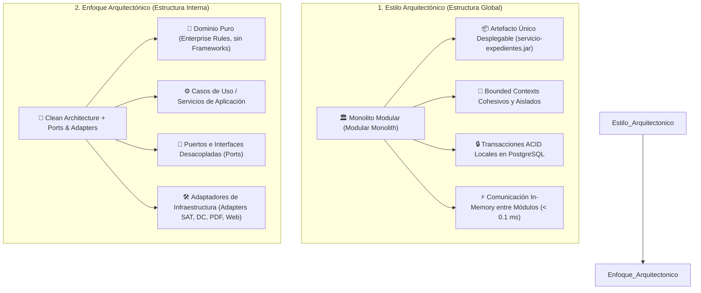
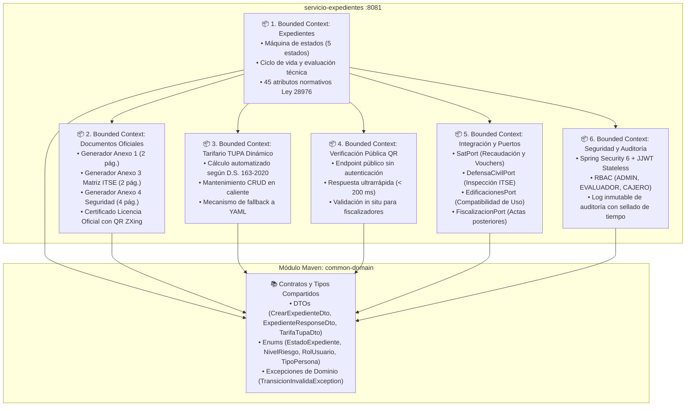
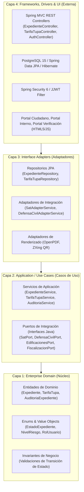
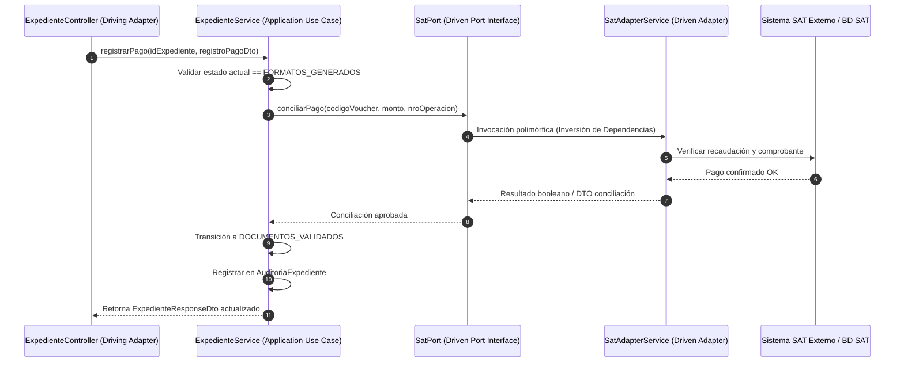

# Estilo Arquitectónico y Enfoque Arquitectónico
## Sistema de Gestión Documentaria de Licencia de Funcionamiento
### Municipalidad Provincial de Huamanga (MuniHuamanga)
> **Marco Normativo:** Ley N° 28976 / TUO D.S. N° 046-2017-PCM / D.S. N° 002-2018-PCM / D.S. N° 163-2020-PCM  
> **Plataforma Tecnológica:** Java 21 LTS, Spring Boot 3.3.4, PostgreSQL 15, OpenPDF 2.0.3, JJWT 0.12.6, ZXing 3.5.3  
> **Ubicación:** `docs/arquitectura/estilo-y-enfoque-arquitectonico.md`

---

## 1. Visión General y Alineamiento

El Sistema de Licencias de Funcionamiento de la Municipalidad Provincial de Huamanga ha sido concebido para transformar un trámite administrativo históricamente burocrático, manual y propenso a demoras o fraudes en una plataforma de gestión pública digital moderna, ágil, trazable y jurídicamente inexpugnable.

Para alcanzar estos objetivos de negocio y satisfacer los estándares del Sistema de Modernización de la Gestión Pública del Estado Peruano, la arquitectura del sistema se fundamenta en dos pilares indisociables:

1. **Estilo Arquitectónico (Estructura Global y Despliegue):** **Monolito Modular (Modular Monolith)**.
2. **Enfoque Arquitectónico (Estructura Interna y Organización del Código):** **Clean Architecture (Arquitectura Limpia)** combinada con el patrón **Hexagonal (Ports & Adapters)** y **Domain-Driven Design (DDD Táctico)**.

---

## 2. Estilo Arquitectónico: Monolito Modular (Modular Monolith)

### 2.1. Definición y Razón de Ser
El **Monolito Modular** es un estilo arquitectónico en el que toda la solución se compila, empaqueta y ejecuta como una única unidad de despliegue (un artefacto JAR ejecutable autónomo con servidor embebido Tomcat), pero cuyo código fuente está estrictamente dividido en **módulos lógicos o Bounded Contexts** con fronteras bien definidas, contratos explícitos y encapsulamiento riguroso.

A diferencia de un "monolito espagueti tradicional" donde cualquier clase accede arbitrariamente a cualquier tabla o controlador, el Monolito Modular impone barreras arquitectónicas que impiden el acoplamiento cruzado descontrolado.

### 2.2. Justificación Técnica: Monolito Modular vs. Microservicios Dispersos

Durante las etapas iniciales del proyecto se evaluó una topología distribuida de 5 microservicios (`api-gateway`, `servicio-expedientes`, `servicio-formularios`, `servicio-verificacion-licencias`, `adaptador-integracion`). El análisis empírico y de laboratorio demostró que dicha dispersión generaba los siguientes problemas:

| Dimensión de Análisis | Microservicios Dispersos (Prototipo Inicial) | Monolito Modular (Decisión Final Adoptada) | Impacto en MuniHuamanga |
|---|---|---|---|
| **Latencia de Red** | 4 saltos HTTP interservicios por trámite (~180 - 320 ms de overhead de red). | Llamadas a métodos en memoria de la JVM (< 0.05 ms). | Cumplimiento del RNF de latencia $P_{95} \le 200$ ms. |
| **Transaccionalidad** | Transacciones distribuidas (2PC / Sagas complejas, riesgo de inconsistencia). | Transacciones locales ACID nativas (`@Transactional` en PostgreSQL). | Consistencia absoluta e inmediata de expedientes y pagos. |
| **Duplicación de Código** | Módulos PDF (`Anexo1PdfGenerator`, etc.) duplicados en 3 repositorios. | Centralización en un solo contexto (`DocumentoPdfService`). | Eliminación de código muerto y reducción drástica de deuda técnica. |
| **Consumo de Recursos** | 5 procesos JVM activos consumiendo $\ge 2.5$ GB de memoria RAM. | 1 solo proceso JVM consumiendo entre 350 MB y 500 MB RAM. | Viabilidad de despliegue en infraestructura on-premise municipal. |
| **Complejidad Operativa** | Service Discovery, API Gateway, Distributed Tracing, Circuit Breakers. | Un único pipeline CI/CD, un solo contenedor Docker y logs unificados. | Mantenimiento factible por el equipo de TI municipal reducido. |

### 2.3. Bounded Contexts (Contextos Delimitados) del Sistema

El monolito modular agrupa el dominio municipal en 6 contextos funcionales cohesivos:

### 2.4. Características Clave del Monolito Modular
1. **Despliegue Atómico:** Un solo artefacto Maven empaquetado como `servicio-expedientes-1.0.0.jar`. Se despliega mediante Docker (`Dockerfile`) o como servicio systemd en Linux/Windows Server.
2. **Alta Eficiencia y Rendimiento:** La renderización de documentos PDF complejos (hasta 4 páginas con tablas de 23 ítems) y la generación de códigos QR de alta resolución ocurren en memoria volátil sin persistencia intermedia en disco, permitiendo atender a más de 150 usuarios concurrentes sin degradación.
3. **Consistencia Transaccional:** La creación de un expediente, la asignación de su número de trámite correlativo (`EXP-2026-XXXXX`), el cálculo de su tasa y el registro del evento en la tabla de auditoría inmutable se ejecutan bajo una sola transacción relacional ACID manejada por `@Transactional`.

---

## 3. Enfoque Arquitectónico: Clean Architecture + Ports & Adapters

### 3.1. Principios y Regla de Dependencia
El código interno de la aplicación se rige por los principios de **Clean Architecture** (propuesta por Robert C. Martin "Uncle Bob") combinada con la **Arquitectura Hexagonal (Ports & Adapters)** de Alistair Cockburn:

> **The Dependency Rule (Regla de Dependencia):**  
> *Las dependencias en el código fuente solo pueden apuntar hacia adentro, hacia las capas de más alto nivel de abstracción.*  
> El núcleo del negocio no conoce frameworks, librerías de persistencia, servidores web ni detalles de transporte.

### 3.2. Desglose Concéntrico de Capas

#### Capa 1: Dominio Empresarial (Enterprise Domain)
- **Ubicación:** `common-domain` y paquetes `model` / `enums`.
- **Responsabilidad:** Contiene los conceptos nucleares del negocio municipal, las entidades ricas y las reglas fundamentales que serían válidas incluso si la aplicación no tuviera computadoras.
- **Componentes:**
  - `Expediente`: Entidad raíz con los 45 atributos normativos (titular, establecimiento, zonificación, riesgo ITSE, licencia emitida).
  - `EstadoExpediente`: Enum que gobierna la máquina de estados finita (`FORMATOS_GENERADOS`, `DOCUMENTOS_VALIDADOS`, `EN_EVALUACION_FINAL`, `APROBADO`, `RECHAZADO`).
  - `NivelRiesgo`: Enum con los 4 niveles CENEPRED (`BAJO`, `MEDIO`, `ALTO`, `MUY_ALTO`).
  - `TarifaTupa`: Entidad que modela el costo del trámite por nivel de riesgo.
  - `AuditoriaExpediente`: Registro inmutable de cada cambio de estado, fecha, IP y usuario.
- **Aislamiento:** Libre de dependencias hacia Spring, JPA o APIs de terceros.

#### Capa 2: Casos de Uso / Aplicación (Application Business Rules)
- **Ubicación:** Paquetes `service` y `integracion/port`.
- **Responsabilidad:** Orquestar el flujo de datos hacia y desde las entidades del dominio para ejecutar los casos de uso específicos del negocio.
- **Componentes:**
  - `ExpedienteService`: Orquesta la creación del expediente, verificación de requisitos, transición de estados y despacho de eventos.
  - `CalculadoraDeTasa`: Lógica de cálculo dinámico de tasas con desglose y fallback.
  - `TarifaTupaService`: Gestión transaccional y validación de tarifas TUPA.
  - `NotificacionEmailService`: Coordinación asíncrona de alertas con plantillas HTML y PDFs adjuntos.
  - `DocumentoPdfService`: Coordinación de la generación de documentos oficiales en memoria.
  - **Puertos de Salida (Driven Ports):** Interfaces Java puras como `SatPort`, `DefensaCivilPort`, `EdificacionesPort` y `FiscalizacionPort`.

#### Capa 3: Adaptadores de Interfaz (Interface Adapters)
- **Ubicación:** Paquetes `integracion/adapter`, generadores PDF y repositorios.
- **Responsabilidad:** Convertir los datos del formato más conveniente para los casos de uso y entidades, al formato más conveniente para agentes externos (base de datos, red, generadores de documentos).
- **Componentes:**
  - `SatAdapterService` implementa `SatPort`.
  - `DefensaCivilAdapterService` implementa `DefensaCivilPort`.
  - `EdificacionesAdapterService` implementa `EdificacionesPort`.
  - `FiscalizacionAdapterService` implementa `FiscalizacionPort`.
  - `LicenciaPdfGenerator`, `Anexo1PdfGenerator`, `Anexo3PdfGenerator`, `Anexo4PdfGenerator`.
  - Implementaciones Spring Data JPA (`ExpedienteRepository`, `TarifaTupaRepository`).

#### Capa 4: Frameworks, Drivers y UI (Delivery Mechanism)
- **Ubicación:** Paquetes `controller`, `config`, `security` y recursos estáticos (`static/`).
- **Responsabilidad:** Mecanismo de entrada y salida técnica del sistema. Es la capa más externa y descartable.
- **Componentes:**
  - Controladores REST: `ExpedienteController`, `PublicLicenciasController`, `TarifaTupaController`, `AuthController`, `DocumentosFormulariosController`.
  - Filtros y seguridad: `SecurityConfig`, `JwtAuthenticationFilter`, `JwtTokenProvider`.
  - Base de datos física: PostgreSQL 15 en contenedor Docker / H2 in-memory para testing.
  - Frontend SPA ligero: `portal-ciudadano.html`, `portal-interno.html`, `portal-verificacion.html` (HTML5 semántico, CSS moderno con variables y Vanilla JavaScript sin dependencias pesadas).

---

## 4. Patrón Ports & Adapters (Arquitectura Hexagonal)

La integración con dependencias municipales externas ilustra la implementación del patrón Hexagonal:

### Ventajas del desacoplamiento mediante Puertos:
1. **Testeabilidad Absoluta:** Los servicios de aplicación pueden testearse unitariamente simulando los puertos mediante Mocks (`Mockito`), sin requerir conexión física con el SAT o Defensa Civil.
2. **Evolución Tecnológica Independiente:** Si la municipalidad migra de un sistema SAT propietario a una API REST gubernamental centralizada (PIDE/PCM), solo se reescribe `SatAdapterService`, manteniendo el núcleo del dominio intacto.

---

## 5. Matriz de Componentes y Correspondencia en el Código

| Capa Arquitectónica | Concepto / Rol | Paquete / Clase en Repositorio | Responsabilidad Concreta |
|---|---|---|---|
| **Dominio (Capa 1)** | Entidad de Negocio | `pe.gob.munihuamanga.licencias.expedientes.model.Expediente` | Modela los 45 campos del trámite, máquina de estados y plazos legales. |
| **Dominio (Capa 1)** | Entidad de Negocio | `pe.gob.munihuamanga.licencias.expedientes.model.TarifaTupa` | Catálogo oficial de costos por riesgo con vigencia y base legal. |
| **Dominio (Capa 1)** | Contrato Compartido | `pe.gob.munihuamanga.licencias.common.enums.EstadoExpediente` | Enum inmutable con los 5 estados del ciclo de vida. |
| **Aplicación (Capa 2)** | Caso de Uso Principal | `pe.gob.munihuamanga.licencias.expedientes.service.ExpedienteService` | Orquestador de transiciones, persistencia y eventos del expediente. |
| **Aplicación (Capa 2)** | Motor de Negocio | `pe.gob.munihuamanga.licencias.expedientes.service.CalculadoraDeTasa` | Cálculo de costos según riesgo con fallback resiliente a YAML. |
| **Aplicación (Capa 2)** | Puerto de Salida | `pe.gob.munihuamanga.licencias.expedientes.integracion.port.SatPort` | Interfaz que desacopla la validación de pagos del sistema SAT. |
| **Adaptadores (Capa 3)** | Adaptador Externo | `pe.gob.munihuamanga.licencias.expedientes.integracion.adapter.SatAdapterService` | Implementa `SatPort` con lógica de conciliación de vouchers. |
| **Adaptadores (Capa 3)** | Generador Documental | `pe.gob.munihuamanga.licencias.expedientes.service.LicenciaPdfGenerator` | Construye el PDF oficial con doble marco, escudo y código QR. |
| **Adaptadores (Capa 3)** | Persistencia JPA | `pe.gob.munihuamanga.licencias.expedientes.repository.ExpedienteRepository` | Interfaz Spring Data JPA para operaciones CRUD en PostgreSQL. |
| **Frameworks (Capa 4)** | Controlador REST | `pe.gob.munihuamanga.licencias.expedientes.controller.ExpedienteController` | Expone endpoints `/api/expedientes` con validación DTO y HTTP codes. |
| **Frameworks (Capa 4)** | Seguridad Stateless | `pe.gob.munihuamanga.licencias.expedientes.security.JwtAuthenticationFilter` | Filtro de interceptación Bearer JWT y asignación de autoridades RBAC. |
| **Frameworks (Capa 4)** | Interfaz Gráfica | `src/main/resources/static/portal-ciudadano.html` | Wizard multipaso ciudadano de 3 pasos con diseño institucional responsive. |

---

## 6. Conclusiones y Beneficios para la Municipalidad Provincial de Huamanga

La convergencia del **Monolito Modular** y **Clean Architecture** provee:
1. **Velocidad y Celeridad:** Tiempos de respuesta inferiores a 200 ms, renderizado de documentos al instante y reducción drástica de tiempos burocráticos.
2. **Cero Complejidad Distribuida:** Eliminación de los problemas de fallas de red, latencias acumuladas e inconsistencias de datos propios de microservicios prematuros.
3. **Mantenibilidad y Preparación para el Futuro:** Si en el futuro el volumen de transacciones de la provincia requiriera extraer el Bounded Context de *Verificación Pública* o *Tarifas TUPA* hacia un microservicio independiente, la separación limpia por puertos y adaptadores permitirá desacoplarlo en horas sin reescribir la lógica de negocio.
4. **Respaldo Jurídico y Auditoría:** Cada acción queda registrada de manera inmutable, protegiendo la transparencia y la legalidad del procedimiento administrativo municipal.
