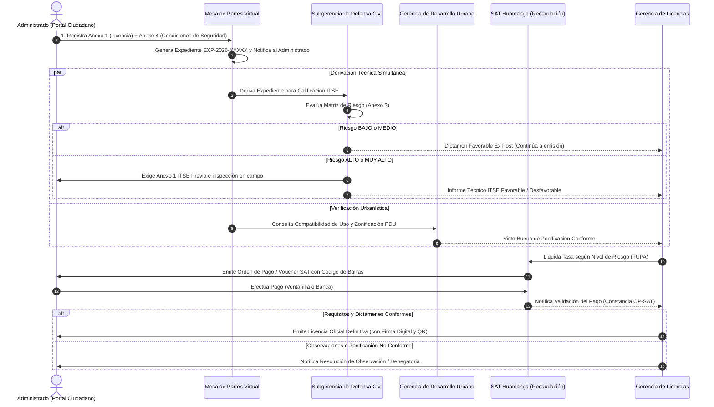

# 🏛️ DOCUMENTACIÓN OFICIAL — ENTREGA FASE 01
## Digitalización de Formularios Municipales, Dominio y Base de Datos
### Municipalidad Provincial de Huamanga (MuniHuamanga)
> **Versión del Entregable:** Fase 01  
> **Fecha de Cierre:** 29 de Septiembre de 2026  
> **Estado:** Implementado, Verificado y Aprobado (`BUILD SUCCESS`)  
> **Commit de Referencia:** `"feat(fase-01): digitalizacion de modelos, anexos normativos 1-3-4 y esquema de base de datos"`

---

## 1. Objetivo y Alcance de la Fase 01

El objetivo de la **Fase 01** fue dotar al sistema de la estructura de datos, reglas de validación jurídica y persistencia necesarias para soportar la digitalización fidedigna de los documentos y formatos oficiales utilizados por la **Municipalidad Provincial de Huamanga**, garantizando su trazabilidad entre instancias (Mesa de Partes Virtual, Defensa Civil, Desarrollo Urbano, SAT Huamanga y Gerencia de Licencias) y preparando la base para la impresión física y digital en un estándar idéntico al oficial.

### Documentos Oficiales Digitalizados e Incorporados:
1. **Ley N° 28976** y **TUO D.S. N° 046-2017-PCM** — Marco procedimental, plazos (15 días hábiles), silencio administrativo positivo y reglas de inspección ITSE.
2. **Anexo N° 1 (Ley N° 28976, Versión 03 / D.S. N° 163-2020-PCM)** — Formato de Declaración Jurada para Licencia de Funcionamiento (Secciones I a VI completas).
3. **Anexo 3 (D.S. N° 002-2018-PCM / Manual ITSE)** — Reporte de Nivel de Riesgo del Establecimiento Objeto de Inspección (Matriz de Riesgo con 8 funciones y factores agravantes).
4. **Anexo 4 (D.S. N° 002-2018-PCM)** — Declaración Jurada de Cumplimiento de las Condiciones de Seguridad en la Edificación (Checklist normativo obligatorio para establecimientos de Riesgo Bajo y Medio).
5. **Anexo 1 ITSE / ECSE (D.S. N° 002-2018-PCM)** — Solicitud de Inspección Técnica de Seguridad en Edificaciones.

```text
┌────────────────────────────────────────────────────────────────────────────────────────┐
│                                 EXPEDIENTE DE LICENCIA                                 │
└───────────────────────────────────────────┬────────────────────────────────────────────┘
                                            │
         ┌──────────────────────────────────┴──────────────────────────────────┐
         ▼                                                                     ▼
┌──────────────────────────────────────┐             ┌───────────────────────────────────┐
│     ANEXO N° 1 (Ley N° 28976)        │             │      ANEXO 4 (D.S. 002-2018)      │
│ Declaración Jurada para Licencia     │             │ DJ de Condiciones de Seguridad    │
│ de Funcionamiento (Versión 03)       │             │ (Exclusivo para Riesgo Bajo/Medio)│
└──────────────────┬───────────────────┘             └─────────────────┬─────────────────┘
                   │                                                   │
                   ▼                                                   ▼
┌──────────────────────────────────────┐             ┌───────────────────────────────────┐
│       ANEXO 3 (Defensa Civil)        │             │     ANEXO 1 ITSE / ECSE (PCM)     │
│ Reporte de Nivel de Riesgo del       │             │ Solicitud de Inspección Técnica   │
│ Establecimiento (Matriz de Riesgos)  │             │ (ITSE Previa / Posterior / ECSE)  │
└──────────────────────────────────────┘             └───────────────────────────────────┘
```

---

## 1.1 Flujo de Derivación e Interacción entre Instancias Municipales

El trámite digital opera mediante una orquestación estandarizada entre el administrado, la Mesa de Partes Virtual, Defensa Civil, Desarrollo Urbano, SAT Huamanga y la Gerencia de Licencias:



---

## 2. Inventario Detallado de Modificaciones y Nuevas Incorporaciones

### 2.1 Módulo `common-domain` (Contratos Compartidos)

#### A. Nuevos Enums Normativos:
* **`pe.gob.munihuamanga.licencias.common.enums.TipoPersona`**
  * `NATURAL`: Persona natural que ejerce actividad económica.
  * `JURIDICA`: Empresa, sociedad o persona jurídica (obliga RUC 20 y datos registrales SUNARP).
* **`pe.gob.munihuamanga.licencias.common.enums.TipoDocumento`**
  * `DNI`: Documento Nacional de Identidad (8 dígitos numéricos).
  * `RUC`: Registro Único de Contribuyentes (11 dígitos, inicia en 10 o 20).
  * `CARNET_EXTRANJERIA`: Carné de extranjería para personas naturales extranjeras.
* **`pe.gob.munihuamanga.licencias.common.enums.ModalidadTramite`** (Sección I de Anexo 1)
  * `LICENCIA_INDETERMINADA`: Licencia definitiva de vigencia indeterminada (Art. 11 Ley 28976).
  * `LICENCIA_TEMPORAL`: Licencia con plazo determinado a solicitud del administrado.
  * `LICENCIA_CON_ANUNCIO`: Licencia simultánea con autorización de anuncio publicitario.
  * `LICENCIA_CESIONARIO`: Para locales que operan dentro de un establecimiento con licencia previa.
  * `LICENCIA_MERCADOS_GALERIAS`: Para puestos en mercados de abasto, galerías o centros comerciales.
  * `CAMBIO_DENOMINACION`: Modificación de nombre comercial o denominación de persona jurídica.
  * `TRANSFERENCIA_LICENCIA`: Cambio de titularidad de la licencia vigente.
  * `CESE_ACTIVIDADES`: Comunicación formal de cese de operaciones comerciales.
  * `OTROS`: Modalidades especiales.
* **`pe.gob.munihuamanga.licencias.common.enums.FuncionEdificacion`** (Anexo 3 y Anexo 4 ITSE)
  * `SALUD`, `ENCUENTRO`, `HOSPEDAJE`, `EDUCACION`, `INDUSTRIAL`, `OFICINAS_ADMINISTRATIVAS`, `COMERCIO`, `ALMACEN`.

#### B. Nuevos DTOs y Atributos:
* **`Anexo4CondicionesDto`:**
  * Áreas desglosadas: terreno, pisos 1, 2, 3, 4, otros, techada total, ocupada total.
  * Capacidad y antigüedad: aforo de personas, antigüedad de edificación (años), antigüedad del giro (años).
  * Condiciones básicas: proceso constructivo concluido, servicios esenciales instalados, mobiliario y artefactos operativos.
  * Checklist de seguridad: medios de evacuación libres ($\ge 1.20\,$m), señalización de seguridad, luces de emergencia, tableros eléctricos rotulados con interruptores termomagnéticos y diferenciales, pozo a tierra vigente ($\le 25\,\Omega$), extintores inspeccionados y cables en tuberías PVC.
* **`CrearExpedienteDto` (Actualizado):**
  * Inclusión de modalidad del trámite, tipo de persona, tipo de documento y consentimiento de notificación electrónica (Art. 20.4 Ley 27444).
  * Partida electrónica y asiento de inscripción en SUNARP para personas jurídicas.
  * Datos del representante legal (DNI, nombres completos, facultades de poder).
  * Desglose estructural de la dirección (tipo de vía, nombre, número, interior, manzana, lote, urbanización/barrio, referencia, distrito, provincia, departamento).
  * Datos técnicos del local: código CIIU, actividad económica detallada, zonificación PDU, función de edificación, aforo, áreas y número de pisos.
  * Autorización sectorial previa (entidad, norma, número y fecha para giros regulados).
  * Objeto anidado `anexo4Condiciones`.
* **`ExpedienteResponseDto` (Actualizado):**
  * Todos los campos anteriores mapeados para permitir la inspección, visualización y posterior generación de los PDFs oficiales.
  * Incorporación de campos de evidencia externa de Fase 1: `numeroInformeItse`, `fechaInformeItse`, `numeroOperacionSat`, `fechaPagoSat`.

---

### 2.2 Módulo `servicio-expedientes` (Núcleo y Persistencia)

#### A. Entidades JPA:
* **`Anexo4Condiciones` (`@Embeddable`):**
  * Diseñado como objeto de valor embebido con persistencia limpia en columnas prefijadas `a4_*`, permitiendo guardar el checklist de seguridad directamente en el registro del expediente.
* **`Expediente` (`@Entity`):**
  * Mapeo completo de las 45 columnas que reflejan el Anexo 1, Anexo 3 y Anexo 4.
  * Mantenimiento de métodos de dominio calculados como `getTipoItse()` (`ITSE_POSTERIOR` vs. `ITSE_PREVIA`).

#### B. Mapeo y Servicios:
* **`ExpedienteMapper` (MapStruct):**
  * Incorporación de métodos de conversión bidireccional entre `Anexo4Condiciones` y `Anexo4CondicionesDto`.
* **`ExpedienteService`:**
  * Método `crearExpediente`: inicializa de manera exhaustiva todos los campos de identidad, dirección, SUNARP, actividad, zonificación y condiciones de seguridad del Anexo 4.
  * Sobrecarga de `registrarClasificacionRiesgo`:
    ```java
    void registrarClasificacionRiesgo(UUID id, NivelRiesgo nivel, String informeItseNumero, String observaciones)
    ```
    Permite a Defensa Civil asentar formalmente el número del informe técnico ITSE generado y sus observaciones en la auditoría inmutable.
  * Sobrecarga de `registrarPago`:
    ```java
    void registrarPago(UUID id, String voucherId, String numeroOperacionSat)
    ```
    Permite registrar la constancia bancaria / recibo de caja de recaudación SAT Huamanga con timestamp exacto.

#### C. Controladores REST (`ExpedienteController`):
* Endpoint `POST /api/expedientes/{id}/clasificacion-riesgo`: ahora recibe y persiste el número de informe ITSE y observaciones.
* Endpoint `POST /api/expedientes/{id}/pago`: ahora recibe y persiste el número de operación bancaria o de caja SAT.

---

### 2.3 Base de Datos PostgreSQL (`01-init-databases.sql`)

* **Script DDL Integral:**
  * Se definieron todas las columnas requeridas en la sentencia `CREATE TABLE IF NOT EXISTS expedientes`.
  * Se añadieron índices estratégicos para optimizar consultas de concurrentes:
    * `idx_expedientes_modalidad`
    * `idx_expedientes_tipo_persona`
    * `idx_expedientes_numero_tramite`
    * `idx_expedientes_estado`
* **Migración Idempotente en Caliente:**
  * Se incluyeron bloques `ALTER TABLE expedientes ADD COLUMN IF NOT EXISTS ...` para cada una de las 38 nuevas columnas, asegurando que cualquier base de datos preexistente se actualice sin perder datos ni fallar en entornos desplegados.
* **Datos Semilla:**
  * Registro de prueba actualizado para reflejar una Persona Jurídica formal (`INVERSIONES LOS RETABLOS S.A.C.`) con RUC 20601234567, partida registral SUNARP 11029384, representante legal acreditado y dirección desglosada en el Centro Histórico de Huamanga.

---

## 3. Matriz de Trazabilidad Actualizada (Estado Post-Fase 01)

| Requisito / Campo Oficial (Anexo 1, 3 y 4) | Tipo de Dato | Estado Previo | **Estado Actual (Fase 01)** | Ubicación en Código |
|---|:---:|:---:|:---:|---|
| **Modalidad del Trámite** | Enum | Pendiente | **`Implementado`** | `ModalidadTramite.java` / `expedientes.modalidad_tramite` |
| **Tipo de Persona (Natural vs. Jurídica)** | Enum | Simulado | **`Implementado`** | `TipoPersona.java` / `expedientes.tipo_persona` |
| **Tipo de Documento (DNI / RUC / CE)** | Enum | Parcial | **`Implementado`** | `TipoDocumento.java` / `expedientes.tipo_documento` |
| **Partida Registral y Asiento SUNARP** | String | Pendiente | **`Implementado`** | `expedientes.partida_sunarp`, `asiento_sunarp` |
| **Datos de Representante Legal y Poder** | String | Pendiente | **`Implementado`** | `dni_representante`, `nombre_representante`, `poder_sunarp` |
| **Consentimiento Notificación Electrónica** | Boolean | Pendiente | **`Implementado`** | `expedientes.autoriza_notificacion` |
| **Desglose Estructural de Dirección** | String | Simulado | **`Implementado`** | `tipo_via`, `nombre_via`, `numero_vivienda`, `urbanizacion`, etc. |
| **Aforo de Personas (Capacidad)** | Integer | Pendiente | **`Implementado`** | `expedientes.aforo_personas` |
| **Dimensionamiento (Terreno / Techada / Pisos)** | Decimal/Int | Parcial | **`Implementado`** | `area_terreno`, `area_techada_total`, `numero_pisos` |
| **Función de la Edificación (ITSE)** | Enum | Pendiente | **`Implementado`** | `FuncionEdificacion.java` / `funcion_edificacion` |
| **Autorización Sectorial Previa** | String/Bool | Pendiente | **`Implementado`** | `requiere_autorizacion_sectorial`, `sector_*` |
| **Condiciones de Seguridad (Anexo 4)** | Embeddable | Pendiente | **`Implementado`** | `Anexo4Condiciones.java` / `expedientes.a4_*` |
| **N° de Informe ITSE de Defensa Civil** | String | Pendiente | **`Implementado`** | `expedientes.numero_informe_itse`, `fecha_informe_itse` |
| **N° de Operación de Caja / Pago SAT** | String | Simulado | **`Implementado`** | `expedientes.numero_operacion_sat`, `fecha_pago_sat` |

---

## 4. Reglas de Negocio y Validación Incorporadas

1. **Regla de Persona Jurídica:**  
   Cuando `tipoPersona = JURIDICA`, el solicitante debe ingresar obligatoriamente un RUC válido iniciado en 20, su Razón Social, y los datos registrales de SUNARP (Partida y Asiento), acreditando a su Representante Legal.
2. **Regla de Autorización de Notificación Electrónica:**  
   En observancia estricta del Art. 20.4 del TUO de la Ley N° 27444, el administrado autoriza la notificación por medios electrónicos (`autorizaNotificacion = true`), otorgando validez jurídica a las comunicaciones automáticas de cambio de estado y resolución.
3. **Regla de Clasificación ITSE:**  
   La clasificación técnica de Defensa Civil asocia la función del local y su nivel de riesgo (`BAJO`, `MEDIO`, `ALTO`, `MUY_ALTO`), registrando el número de informe oficial y condicionando la inspección técnica (Ex Post para Bajo/Medio; Ex Ante para Alto/Muy Alto).
4. **Regla de Conciliación de Pago SAT:**  
   La transición a `EN_EVALUACION_FINAL` exige registrar el identificador del voucher SAT, el número de operación bancaria/caja y la fecha de liquidación conforme a la tasa TUPA municipal.

---

## 5. Resultados de Verificación de Calidad (QA)

Se ejecutó la suite de pruebas unitarias sobre todos los módulos del proyecto multi-módulo Maven (`muni-licencias-parent`):
* **`common-domain`:** Compilación exitosa de todos los enums y contratos.
* **`servicio-expedientes`:**
  * Pruebas de validación de identidad y DTOs en `MesaPartesValidationTest` (**100% aprobadas**).
  * Pruebas unitarias de flujo y persistencia de Anexo 1, Anexo 4, ITSE y SAT en `ExpedienteServiceTest` (**100% aprobadas**).
  * Pruebas de máquina de estados, plazos y concurrencia (**100% aprobadas**).
* **`servicio-formularios`:** Pruebas de renderizado OpenPDF y generación de código de barras (**100% aprobadas**).
* **`servicio-verificacion-licencias`:** Pruebas de generación criptográfica ZXing QR (**100% aprobadas**).
* **`adaptador-integracion`:** Pruebas de stubs y contratos de integración (**100% aprobadas**).
* **Resultado Global de Maven:** **`BUILD SUCCESS`** en 19.7 segundos.
