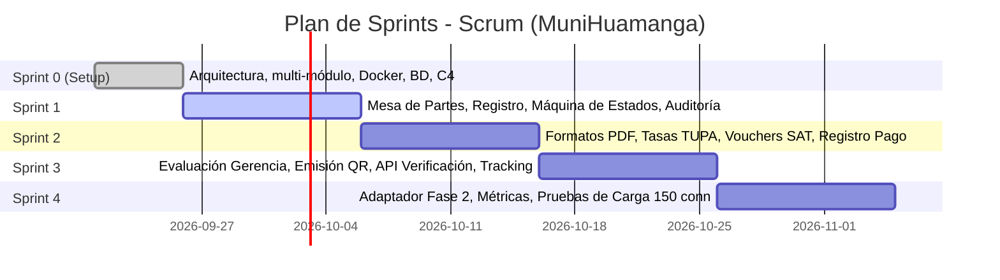

# Product Backlog — Sistema de Gestión Documentaria de Licencias de Funcionamiento
### Municipalidad Provincial de Huamanga (MuniHuamanga)
**Marco Legal:** Ley N° 28976 (TUO D.S. N° 046-2017-PCM)  
**Metodología:** Ágil (Scrum) | **Ciclos:** Sprints de 2 semanas  

---

## 1. Estructura de Épicas

| Épica | Nombre | Descripción |
|---|---|---|
| **EP-01** | **Mesa de Partes Virtual y Registro** | Captura y validación inicial de solicitudes de licencia presentadas por los administrados. |
| **EP-02** | **Máquina de Estados y Auditoría** | Control estricto de transiciones de estado del expediente y trazabilidad cronológica inmutable. |
| **EP-03** | **Generación de Formatos y Firma Digital** | Autogeneración de Declaración Jurada, formulario de Defensa Civil y soporte para firma digital. |
| **EP-04** | **Tasas TUPA y Conciliación SAT** | Cálculo automático del costo según nivel de riesgo, generación de vouchers y registro de pago. |
| **EP-05** | **Evaluación y Emisión con Código QR** | Resolución del expediente por la Gerencia de Licencias y verificación pública por QR. |
| **EP-06** | **Adaptador de Integración Fase 2** | Puntos de extensión desacoplados para Defensa Civil, Edificaciones, SAT y Fiscalización. |

---

## 2. Historias de Usuario Priorizadas

| ID | Historia de Usuario | Criterios de Aceptación | Puntos (SP) | Sprint |
|---|---|---|:---:|:---:|
| **US-01** | **Setup del Entorno y Arquitectura Base** *Como equipo de desarrollo, quiero una estructura multi-módulo Maven y Docker Compose para iniciar el desarrollo sin bloqueos.* | - Proyecto compila con Java 21 y Spring Boot 3. - Contenedor PostgreSQL inicializado con DDL. - Estructura de módulos (`common-domain`, `servicio-expedientes`, etc.) creada. | 5 | Sprint 0 (Completado) |
| **US-02** | **Registro Digital de Solicitud (Mesa de Partes)** *Como ciudadano/administrado, quiero registrar mi solicitud con mis datos y giro para iniciar el trámite.* | - Valida DNI/RUC, dirección, giro y área en m². - Genera correlativo único `EXP-AAAA-XXXXX`. - Asigna fecha límite de 15 días hábiles. | 8 | Sprint 1 (Completado) |
| **US-03** | **Máquina de Estados y Validador de Transiciones** *Como sistema, quiero asegurar que un expediente solo avance por estados permitidos según la Ley N° 28976.* | - Estados: `FORMATOS_GENERADOS` ➔ `DOCUMENTOS_VALIDADOS` ➔ `EN_EVALUACION_FINAL` ➔ `APROBADO` / `RECHAZADO`. - Lanza `TransicionInvalidaException` ante saltos no permitidos. | 8 | Sprint 1 (Completado) |
| **US-04** | **Auditoría Inmutable de Transiciones** *Como auditor/jefe de licencias, quiero ver el historial completo de cada cambio de estado con usuario, fecha y motivo.* | - Guarda en `historial_estados` cada transición. - Expone endpoint `/api/expedientes/{id}/historial`. | 5 | Sprint 1 (Completado) |
| **US-05** | **Generación de Formato de Declaración Jurada** *Como solicitante, quiero descargar mi Declaración Jurada generada automáticamente en PDF para firmarla.* | - PDF generado con OpenPDF respetando el formato Anexo 1 del D.S. N° 046-2017-PCM. - Incluye datos del establecimiento y espacio de firma. | 5 | Sprint 2 (Completado) |
| **US-06** | **Cálculo de Tasa según Nivel de Riesgo ITSE** *Como funcionario, quiero que el sistema calcule el monto exacto de la tasa según el riesgo determinado por Defensa Civil.* | - Riesgo Bajo: S/. 154.50, Medio: S/. 218.00, Alto: S/. 345.20, Muy Alto: S/. 480.00. - Configurable en `application.yml` sin nuevo despliegue (RNF-17). | 5 | Sprint 2 (Completado) |
| **US-07** | **Generación de Voucher de Pago SAT** *Como solicitante, quiero obtener un voucher con código de barras para realizar el pago de la tasa en ventanilla SAT.* | - Genera identificador `VCH-AAAA-XXXXXX` con vigencia de 5 días. - Contiene concepto oficial y código de barras. | 5 | Sprint 2 (Completado) |
| **US-08** | **Registro y Validación de Pago** *Como funcionario de caja, quiero registrar el pago del voucher para que el expediente pase a evaluación final.* | - Transiciona el expediente de `DOCUMENTOS_VALIDADOS` a `EN_EVALUACION_FINAL`. - Registra número de operación bancaria/caja. | 5 | Sprint 2 (Completado) |
| **US-09** | **Dictamen y Aprobación de Licencia** *Como evaluador de la Gerencia de Licencias, quiero aprobar el expediente si cumple con los requisitos para emitir la licencia.* | - Valida que el pago esté registrado. - Genera código QR único `LIC-AAAA-XXXXXXXX`. - Transiciona a estado `APROBADO`. | 8 | Sprint 3 (Completado) |
| **US-10** | **Generación de Código QR e Imagen** *Como sistema, quiero generar la imagen gráfica del código QR para estamparla en la licencia digital.* | - Genera PNG mediante librería ZXing (RNF-13). - Apunta a la URL pública de verificación municipal. | 5 | Sprint 3 (Completado) |
| **US-11** | **Portal Público de Verificación de Licencia** *Como fiscalizador o ciudadano, quiero escanear el QR y consultar la autenticidad de la licencia en tiempo real.* | - Endpoint público `/api/public/licencias/{codigo}` (RNF-20). - Responde en < 3 segundos (RNF-02). - Expone únicamente datos públicos de vigencia. | 5 | Sprint 3 (Completado) |
| **US-12** | **Seguimiento Ciudadano en Línea** *Como solicitante, quiero consultar en qué estado se encuentra mi expediente ingresando mi número de trámite.* | - Endpoint `/api/expedientes/tramite/{numeroTramite}` (RNF-14). - Muestra días hábiles restantes y alerta si está próximo a vencer (RNF-22). | 5 | Sprint 3 (Completado) |
| **US-13** | **Adaptador de Integración Fase 2** *Como arquitecto de software, quiero un adaptador desacoplado para integrar a futuro SAT, Defensa Civil y Edificaciones.* | - Expone interfaces y stubs para simulación de dictamen ITSE y validación bancaria. - Sin modificar el código de los microservicios centrales (RNF-19). | 8 | Sprint 4 |
| **US-14** | **Monitoreo y Métricas de Rendimiento** *Como administrador del sistema, quiero métricas de salud y tiempo de atención de expedientes.* | - Actuator, Prometheus y endpoints de métricas activos (RNF-21). | 5 | Sprint 4 |
| **US-15** | **Pruebas de Carga (150 usuarios concurrentes)** *Como equipo de QA, quiero validar que el sistema soporte ≥ 150 usuarios concurrentes cumpliendo RNF-01.* | - Script de pruebas de carga con JMeter / k6. - Cobertura de pruebas unitarias ≥ 75% (RNF-18). | 5 | Sprint 4 |

---

## 3. Plan de Sprints

