# 🏛️ INFORME TÉCNICO Y MATRIZ DE TRAZABILIDAD — VERSIÓN v0.1
## Sistema de Gestión Documentaria del Trámite de Licencia de Funcionamiento
### Municipalidad Provincial de Huamanga (MuniHuamanga)

> **Documento Oficial de Entrega:** Versión v0.1  
> **Estado:** Documentado / Previo a modificación de código  
> **Fuentes Normativas y Técnicas:**
> 1. Código fuente del repositorio `MuniHuamanga` (Java 21, Spring Boot 3.3.4, PostgreSQL 15).
> 2. Documento oficial `Propuesta_Licencia_Funcionamiento.docx` (Propuesta V1.1 — Gerencia de Licencias).
> 3. **Ley N° 28976** — *Ley Marco de Licencia de Funcionamiento* y su TUO aprobado por **D.S. N° 046-2017-PCM**.
> 4. **Decreto Supremo N° 002-2018-PCM** — *Reglamento de Inspecciones Técnicas de Seguridad en Edificaciones (ITSE)*.
> 5. **Decreto Supremo N° 163-2020-PCM** — *Aprobación del Formato Único de Licencia de Funcionamiento y Declaración Jurada (Anexo 1)*.
> 6. **Ley N° 27444** — *Ley del Procedimiento Administrativo General (LPAG)*.

---

## 1. Inventario del Sistema Actual

El proyecto se encuentra organizado bajo una arquitectura multi-módulo Maven (`muni-licencias-parent`) con separación de responsabilidades:

### 1.1 Módulos del Repositorio (Monolito Modular con Clean Architecture)

| Módulo | Tipo de Artefacto | Puerto | Responsabilidad Técnica Actual |
|---|---|:---:|---|
| **`common-domain`** | JAR (Librería de Dominio) | N/A | Contratos compartidos: DTOs (`CrearExpedienteDto`, `ExpedienteResponseDto`, `VoucherDto`, `VerificacionLicenciaDto`, etc.), Enums de estado y negocio (`EstadoExpediente`, `NivelRiesgo`, `RolUsuario`), y Excepciones del dominio (`TransicionInvalidaException`, `RecursoNoEncontradoException`). |
| **`servicio-expedientes`** | JAR (Monolito Modular con Clean Architecture) | `:8081` | Aplicación principal consolidada: alberga el núcleo transaccional de expedientes (máquina de 5 estados), el motor documental OpenPDF (Anexo 1, 3, 4, Voucher SAT y Licencia con QR), la gestión dinámica de tarifas TUPA, la autenticación JWT + RBAC, la verificación ciudadana RNF-20, los puertos y adaptadores hexagonales (`DefensaCivilPort`, `SatPort`, `EdificacionesPort`, `FiscalizacionPort`), y el servidor web de los portales estáticos (`static/`). |
| **`docker`** | Infraestructura como Código | `:5432` / `:5050` | Definición de `docker-compose.yml` para levantar PostgreSQL 15 (`muni_licencias_db`) con script DDL (`01-init-databases.sql`) e índices optimizados, más interfaz pgAdmin 4. |
| **`tests`** | Suite de Carga y QA | N/A | Scripts de prueba de estrés para $\ge 150$ usuarios concurrentes en PowerShell (`run-load-test-150.ps1`) y k6 (`k6-load-test.js`). |

---

## 2. Matriz de Trazabilidad: Formato Oficial vs. Código Actual

> **Definición de Estados de Implementación:**
> - **`Implementado`:** Existe en pantalla (UI), DTO, entidad JPA, persistencia en BD y validación funcional verificada por pruebas.
> - **`Simulado`:** Opera mediante aproximaciones, stubs o sellos visuales locales sin el flujo institucional formal (ej. sello de firma digital o conciliación bancaria directa).
> - **`Pendiente de validación`:** El sistema contiene una lógica estimada pero requiere validación formal contra el TUPA vigente o las directivas municipales de Huamanga.
> - **`Pendiente`:** Campo o requisito exigido por el Formato Oficial Anexo 1 (D.S. 046-2017-PCM / D.S. 163-2020-PCM) que no ha sido implementado aún.

| # | Campo / Requisito Oficial (Anexo 1 TUO Ley 28976) | Pantalla (UI Portal) | DTO (`common-domain`) | Entidad JPA (`Expediente`) | Validación en Código | Documento PDF Generado | Estado de Implementación |
|:---:|---|---|---|---|---|---|:---:|
| **1** | **Número de Expediente / Trámite** | Visualizado en tracking y bandeja interna | `ExpedienteResponseDto.numeroTramite` | `numero_tramite` VARCHAR(30) UNIQUE NOT NULL | Formato estricto correlativo `EXP-AAAA-XXXXX` | En encabezado de Anexo 1, Voucher y Licencia | **`Implementado`** |
| **2** | **Modalidad / Tipo de Trámite** (Sección I Anexo 1) | En formulario de registro | `modalidadTramite`, `plazoTemporalMeses`, `tipoAnuncio` | `modalidad_tramite`, `plazo_temporal_meses`, `tipo_anuncio` | Enum `ModalidadTramite` | Sección I de Anexo 1 | **`Implementado (Backend/BD)`** |
| **3** | **Tipo de Persona** (Persona Natural vs. Jurídica) | En formulario de registro | `tipoPersona` (`NATURAL`, `JURIDICA`) | `tipo_persona` VARCHAR(20) | Enum `TipoPersona` | Sección II de Anexo 1 | **`Implementado (Backend/BD)`** |
| **4** | **Nombres y Apellidos del Titular** | Input `nombreTitular` | `CrearExpedienteDto.nombreTitular` | `nombre_titular` VARCHAR(150) NOT NULL | `@NotBlank`, longitud $\le 150$ | Sección II de Anexo 1 | **`Implementado`** |
| **5** | **Documento de Identidad** (DNI / RUC / CE) | Input `documentoIdentidad` | `tipoDocumento`, `documentoIdentidad` | `tipo_documento`, `documento_identidad` VARCHAR(20) | Regex validado DNI/RUC | Sección II de Anexo 1 | **`Implementado`** |
| **6** | **Razón Social** (Persona Jurídica) | Input `razonSocial` | `CrearExpedienteDto.razonSocial` | `razon_social` VARCHAR(150) NULL | Obligatorio si persona jurídica | Sección II de Anexo 1 | **`Implementado`** |
| **7** | **Partida Electrónica y Asiento SUNARP** (Persona Jurídica) | En formulario de registro | `partidaSunarp`, `asientoSunarp` | `partida_sunarp`, `asiento_sunarp` VARCHAR(50) | Validado para persona jurídica | Sección III de Anexo 1 | **`Implementado (Backend/BD)`** |
| **8** | **Datos del Representante Legal** (DNI, nombres, poder SUNARP) | En formulario de registro | `dniRepresentante`, `nombreRepresentante`, `poderSunarp` | `dni_representante`, `nombre_representante`, `poder_sunarp` | Validado en modelo | Sección III de Anexo 1 | **`Implementado (Backend/BD)`** |
| **9** | **Teléfono Celular de Contacto** | Input `telefono` | `CrearExpedienteDto.telefono` | `telefono` VARCHAR(20) | Regex: 9 dígitos iniciando en 9 (`^9\d{8}$`) | Sección II de Anexo 1 | **`Implementado`** |
| **10** | **Correo Electrónico para Notificaciones** | Input `correoElectronico` | `CrearExpedienteDto.correoElectronico` | `correo_electronico` VARCHAR(120) | `@Email` | Sección II de Anexo 1 | **`Implementado`** |
| **11** | **Autorización Expresa de Notificación Electrónica** (Art. 20.4 Ley 27444) | Checkbox de consentimiento | `autorizaNotificacion` (Boolean) | `autoriza_notificacion` BOOLEAN | Captura de consentimiento legal | Sección II de Anexo 1 | **`Implementado (Backend/BD)`** |
| **12** | **Nombre Comercial del Negocio** | Input `nombreComercial` | `CrearExpedienteDto.nombreComercial` | `nombre_comercial` VARCHAR(150) NOT NULL | `@NotBlank` | Sección IV de Anexo 1 y Licencia | **`Implementado`** |
| **13** | **Giro o Actividad Económica** | Input `giroNegocio`, `actividadDetallada`, `ciiuCodigo` | `giroNegocio`, `actividadDetallada`, `ciiuCodigo` | `giro_negocio`, `actividad_detallada`, `ciiu_codigo` | `@NotBlank` | Sección IV de Anexo 1 y Licencia | **`Implementado`** |
| **14** | **Dirección del Establecimiento** (Desglose formal: Vía, N°, Urb., Ref.) | Input estructurado | `tipoVia`, `nombreVia`, `numeroVivienda`, `interior`, `manzana`, `lote`, `urbanizacion`, etc. | Columnas `tipo_via`, `nombre_via`, `numero_vivienda`, `urbanizacion`, etc. | Desglose formal del Anexo 1 | Sección IV de Anexo 1 | **`Implementado (Backend/BD)`** |
| **15** | **Área Total del Local ($m^2$)** | Input `areaMetrosCuadrados` | `areaMetrosCuadrados` (BigDecimal) | `area_metros_cuadrados` NUMERIC(10,2) | `@NotNull`, `@DecimalMin("1.00")` | Sección IV de Anexo 1 | **`Implementado`** |
| **16** | **Capacidad de Aforo y Dimensionamiento** | Inputs aforo y áreas por piso | `aforoPersonas`, `areaTerreno`, `areaTechadaTotal` | `aforo_personas`, `area_terreno`, `area_techada_total` | Aforo y dimensionamiento | Anexo 4 y Sección IV de Anexo 1 | **`Implementado (Backend/BD)`** |
| **17** | **Zonificación y Compatibilidad de Uso (PDU)** | Input de zonificación | `zonificacion`, `funcionEdificacion` | `zonificacion`, `funcion_edificacion` | Clasificación urbanística | Sección IV de Anexo 1 | **`Implementado (Backend/BD)`** |
| **18** | **Clasificación de Riesgo ITSE** (Bajo, Medio, Alto, Muy Alto) | Modal en `portal-interno.html` | `ClasificacionRiesgoDto.nivelRiesgo` | `nivel_riesgo` VARCHAR(20) NULL | Precondición legal antes de emitir aprobación | Impreso en Anexo 1 y Licencia Oficial | **`Implementado`** |
| **19** | **N° de Informe / Acta ITSE de Defensa Civil** | Modal en gestión interna | `informeItseNumero`, `fechaInformeItse` | `numero_informe_itse`, `fecha_informe_itse` | Registrado en servicio y auditoría | Anexo 3 y Sección VI de Anexo 1 | **`Implementado (Backend/BD)`** |
| **20** | **Cálculo de Tasa Administrativa TUPA** | Visualización en modal y bandeja | `ExpedienteResponseDto.montoTasa` | `monto_tasa` NUMERIC(10,2) | `CalculadoraDeTasa.java` configurable en `application.yml` | Desglosado en Voucher SAT | **`Implementado`** |
| **21** | **Voucher / Orden de Pago SAT con Código 128** | Botón de descarga en portales | `VoucherDto.voucherId` | `voucher_id` VARCHAR(50) | Identificador `VCH-AAAA-XXXXXX` con vigencia 5 días | PDF con código de barras Code 128 legible | **`Implementado`** |
| **22** | **Constancia y N° de Operación de Pago SAT** | Modal de registro en gestión interna | `numeroOperacionSat`, `fechaPagoSat` | `numero_operacion_sat`, `fecha_pago_sat` | Valida transición a `EN_EVALUACION_FINAL` | Comprobante de pago SAT | **`Implementado (Backend/BD)`** |
| **23** | **Plazo Legal Máximo (15 días hábiles)** | Línea temporal y badges de alerta | `fechaLimite`, `alertaVencimiento` | `fecha_limite` TIMESTAMP NOT NULL | Cómputo excluyendo sábados y domingos | Trazabilidad en BD | **`Implementado`** |
| **24** | **Alerta Preventiva de Silencio Positivo** ($\le 3$ días) | Filtro de alerta en bandeja interna | `ExpedienteResponseDto.alertaVencimiento` | Consulta dinámica calculada | Evalúa días hábiles restantes $\le 3$ | Destacado visual en bandeja | **`Implementado`** |
| **25** | **Auditoría Inmutable de Estados y Motivos** | Modal de historial cronológico | `HistorialEstadoDto` | Tabla `historial_estados` con FK a expedientes | Evento auditado en cada cambio transaccional | Registro en base de datos | **`Implementado`** |
| **26** | **Firma Digital con Validez Legal** (Ley N° 27269 / PKI) | Leyenda visual en pie de página | No existe payload criptográfico CMS/PKCS#7 | No almacena certificado digital X.509 | Hash SHA-256 local | Sello visual simulado y hash de integridad | **`Simulado`** *(Requiere PKI/HSM)* |
| **27** | **Código QR Único y Verificable** (RNF-13 / RNF-20) | Renderizado en tarjetas y portal público | `VerificacionLicenciaDto` | `licencia_qr_code` VARCHAR(255) | ZXing PNG + URL pública única | Estampado en PDF de Licencia | **`Implementado`** |
| **28** | **Portal Público de Verificación de Autenticidad** | `verificar-licencia.html` | `VerificacionLicenciaDto` | Consulta indexada en BD | Solo lectura, respuesta $< 3$ seg | Vista web responsiva para celulares | **`Implementado`** |

---

## 3. Análisis de Diferencias y Brechas Técnicas (Gaps)

Tras el cotejo entre la normativa vigente, la Propuesta V1.1 y el estado real del repositorio, se identifican las siguientes brechas que deben subsanarse en las versiones planificadas:

1. **Diferenciación Estricta de Identidad:**  
   El formulario oficial exige clasificar al solicitante como **Persona Natural** o **Persona Jurídica**. En el caso de personas jurídicas, es mandatorio registrar:
   - Número de RUC institucional (iniciado en 20).
   - Número de Partida Registral y Asiento de inscripción en SUNARP.
   - Datos del Representante Legal (DNI, nombres completos y poder registral en SUNARP).
2. **Consentimiento Legal de Notificación Electrónica:**  
   Conforme al Art. 20.4 del TUO de la Ley N° 27444, para que la notificación por correo electrónico surta efecto legal, el administrado debe marcar expresamente una casilla de consentimiento: *"Autorizo expresamente a la Municipalidad Provincial de Huamanga a notificarme los actos del trámite en la casilla/correo consignado"*.
3. **Desglose Estructural de la Dirección y Aforo:**  
   Actualmente la dirección se guarda en un campo de texto plano único. La normativa municipal exige desglosarla (Tipo y nombre de vía, N°, Interior, Mz., Lote, Urbanización/Barrio y Referencia), además de registrar el **Aforo estimado** (número de personas), dato crítico para que Defensa Civil clasifique el nivel de riesgo ITSE.
4. **Evidencia Verificable del Pago SAT (Fase 1):**  
   En la Fase 1 (registro manual del pago en ventanilla del SAT), el sistema debe registrar como evidencia verificable el **Número de Operación Bancaria / Recibo de Caja SAT**, la **Fecha de Pago** y el nombre del cajero responsable.
5. **Transparencia en Firma Digital:**  
   El sistema actualmente genera un hash SHA-256 y un sello gráfico. Para respetar la regla de *"no presentar un texto o imagen como firma digital criptográfica"*, este elemento debe declararse explícitamente en el sistema y en el documento como **Sello Electrónico Municipal Preliminar**, reservando el término *Firma Digital Oficial* para cuando se conecte con el servicio PKI/RENIEC.

---

## 4. Plan de Versiones Incremental

```mermaid
graph LR
    v01["v0.1: Inventario & Matriz<br>(Completado)"] --> v02["v0.2: Identidad & Roles<br>(RBAC & Seguridad)"]
    v02 --> v03["v0.3: Formulario Oficial<br>(Anexo 1 Completo)"]
    v03 --> v04["v0.4: Riesgo & Tasas TUPA<br>(Voucher Persistente)"]
    v04 --> v05["v0.5: Evidencia de Pago<br>(Registro Manual Fase 1)"]
    v05 --> v06["v0.6: Dictamen & Licencia<br>(Firma Digital Acreditada)"]
    v06 --> v07["v0.7: Verificación QR<br>(Pruebas Integrales & Carga)"]
    v07 --> v10["v1.0: Versión Candidata<br>(Despliegue Controlado)"]
```

---

## 5. Backlog Atómico de Tareas para el Equipo (Versión v0.1)

Para abordar de manera estructurada los cambios de la siguiente iteración (**v0.2** e inicio de **v0.3**), se establecen las siguientes tareas de trabajo en equipo:

### 👨‍💻 Integrante 1: Desarrollador Backend (Dominio & Persistencia)
- **TASK-01-BE:** Modelar nuevos enums en `common-domain`: `TipoPersona` (`NATURAL`, `JURIDICA`) y `TipoDocumento` (`DNI`, `RUC`, `CARNET_EXTRANJERIA`).  
  *Estimación: 2 SP | Rama: `feature/v0.2-backend-enums`*
- **TASK-02-BE:** Diseñar el script de migración SQL para agregar las nuevas columnas a la tabla `expedientes`: `tipo_persona`, `partida_sunarp`, `asiento_sunarp`, `dni_representante`, `nombre_representante`, `poder_sunarp`, `aforo_personas`, `numero_operacion_sat`, `autoriza_notificacion`.  
  *Estimación: 3 SP | Rama: `feature/v0.2-db-schema`*
- **TASK-03-BE:** Actualizar `CrearExpedienteDto.java` y `ExpedienteResponseDto.java` incorporando las anotaciones Jakarta Validation condicionales según el tipo de persona.  
  *Estimación: 3 SP | Rama: `feature/v0.2-backend-dtos`*

### 🎨 Integrante 2: Desarrollador Frontend (Portales Web & UX)
- **TASK-04-FE:** Crear el selector interactivo "Persona Natural" vs. "Persona Jurídica" en `portal-ciudadano.html`, mostrando u ocultando dinámicamente los campos de RUC, Razón Social, Partida Registral y Representante Legal.  
  *Estimación: 3 SP | Rama: `feature/v0.2-ui-persona-switch`*
- **TASK-05-FE:** Desglosar los campos de dirección en el formulario (Tipo de Vía, Nombre, N°, Mz/Lote, Urbanización y Referencia) y añadir el campo de Aforo.  
  *Estimación: 2 SP | Rama: `feature/v0.2-ui-direccion-aforo`*
- **TASK-06-FE:** Implementar la casilla legal obligatoria de autorización de notificación electrónica con validación nativa HTML5/JS.  
  *Estimación: 1 SP | Rama: `feature/v0.2-ui-consentimiento-legal`*

### 🛡️ Integrante 3: Arquitecto de Software & Seguridad
- **TASK-07-ARQ:** Definir los contratos API REST y especificación OpenAPI para el módulo de autenticación y control de acceso basado en roles (RBAC) que se implementará en `v0.2` (`ROL_ADMIN`, `ROL_EVALUADOR`, `ROL_CAJERO_SAT`, `ROL_INSPECTOR_ITSE`, `ROL_CIUDADANO`).  
  *Estimación: 3 SP | Rama: `feature/v0.2-arq-rbac-contracts`*
- **TASK-08-ARQ:** Diseñar el contrato de datos del `AdaptadorController` para el registro manual de evidencias externas de Fase 1 (N° de informe ITSE y comprobante de caja SAT).  
  *Estimación: 2 SP | Rama: `feature/v0.2-arq-adaptador-evidencias`*

### 🧪 Integrante 4: Ingeniero de QA & Pruebas
- **TASK-09-QA:** Diseñar la matriz de casos de prueba unitaria en JUnit 5 para validar las reglas de identidad peruana (Personas Jurídicas obligadas a tener RUC iniciado en 20, titular/representante con DNI válido de 8 dígitos o CE, y aforo positivo).  
  *Estimación: 3 SP | Rama: `feature/v0.2-qa-test-matrix`*
- **TASK-10-QA:** Verificar el cumplimiento de la cobertura mínima de pruebas ($\ge 75\%$) antes de autorizar cualquier Pull Request de la versión.  
  *Estimación: 2 SP | Rama: `feature/v0.2-qa-coverage-gate`*

---

## 6. Criterios de Aceptación y Estado de la Entrega

1. **Sin Alteración de Código:** En estricto cumplimiento de las reglas del proyecto, en la versión **v0.1** **no se ha modificado ningún archivo de código fuente**, preservando limpio el árbol de Git para la creación de ramas de trabajo en equipo.
2. **Trazabilidad 100% Documentada:** Cada campo del Formato Único oficial cuenta con su estado explícito (`Implementado`, `Simulado`, `Pendiente de validación` o `Pendiente`).
3. **Base Lista para v0.2:** La estructura está preparada para iniciar la versión **v0.2** mediante ramas y Pull Requests ordenados.
